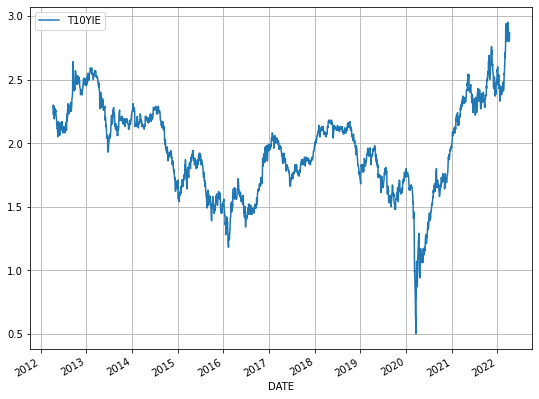
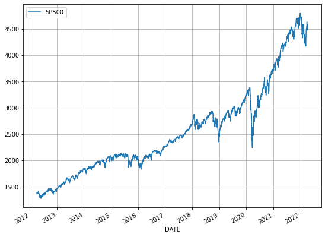
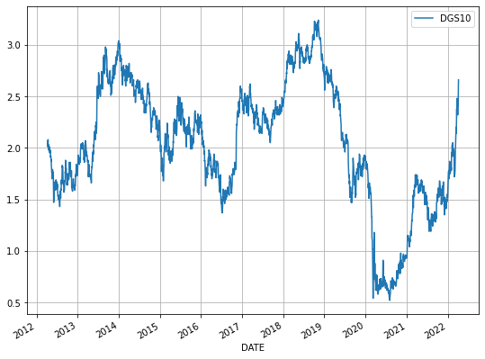
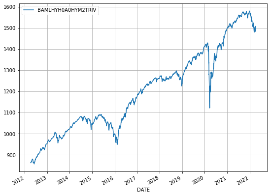
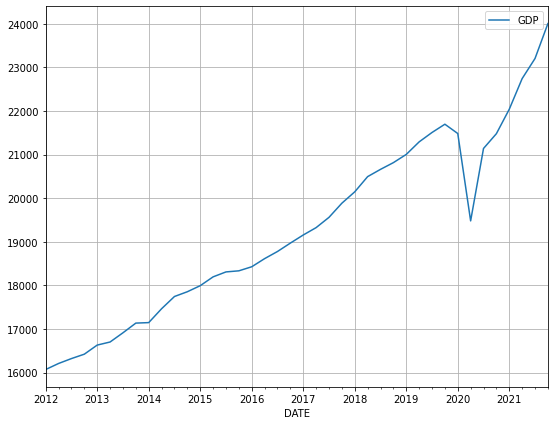
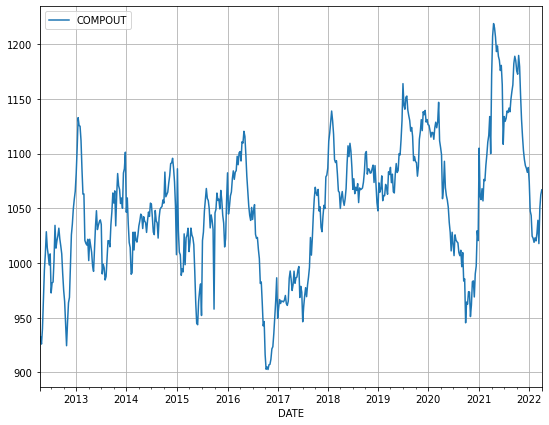
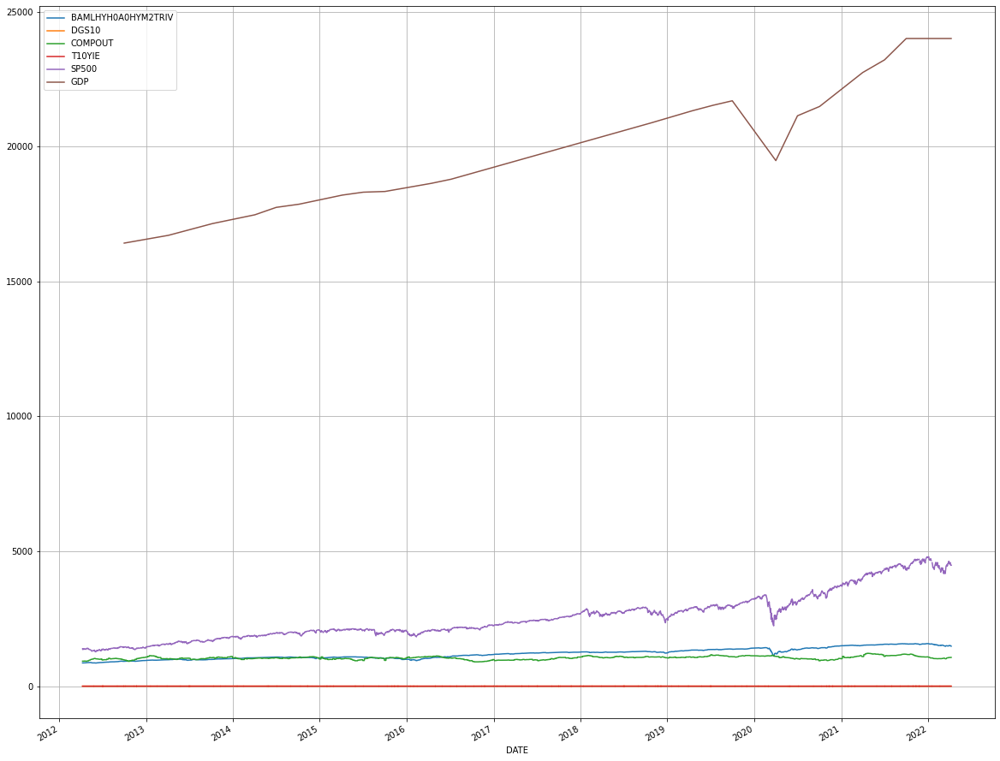

# **Protecting Your Investments (Final Project)**
## **How Economic and Market Conditions Can Predict Bond Yields And Guide Your Future Investment Decisions**

### **Introduction**
  (Note: I will be expanding on my introduction next and also including some screenshots of the Fed's statements and/or diagrams showing the impacts of inflation or the bond yield curve, but I wanted to add some preliminary thoughts first.)
  
  There have been numerous articles this year describing not only rising costs of common household purchases like poultry and vegetables, but also in the costs of bigger purchases like housing and materials that companies need to produce electronic devices.  In light of the Federal Reserve's recent decision to continue raising interest rates for the foreseeable future to help combat this inflation, the yields on short-term securities have risen to their highest levels in decades.  Typically, the yields on short-term bonds that mature within 2-5 years have lower yields than long-term bonds that mature with 10-30 years because there is less risk in investing in a security that will pay you back your money (plus interest) relatively quickly than investing in a security that will not allow you to receive the principal payment for several decades, as it is less clear what market conditions will be like in the long-term.  However, since the Federal Reserve announced its new policy to begin raising interest rates, this pattern has been inverted with yields on shorter-term bonds rising above those of 10-year+ bonds.  This indicates that investors are expecting the Federal Reserve to continue increasing interest rates into the near future and are less clear about what the value of their dollar will be in this near-term.

### **Description of Data**

  I have collected my data directly from the Federal Reserve, which provides numerous datasets on US economic indicators.  For this project, I selected daily data on the current value of the S&P 500 index, the yields on 10-year US Treasury securities which are essentially considered risk-free investments, the yield on high-yield or junk bonds which are considered higher risk investments because of the below-investment-grade credit rating (i.e., below a BBB-).  I also chose to analyze quarterly data on the current US gross domestic product (GDP) and weekly  data on commercial paper outstanding, which is essentially like a short-term corporate-issued bond that typically mature in several days or up to a year.  Each dataset begins on April 9, 2012 and continues through the present day.  From there, I merged the data into one larger dataset by joining on the date column.
  
  Since two of my initial datasets recorded data less frequently than on a daily basis, I filled in the remainder of daily data records in the merged dataset via interpolation.  For the commercial papers outstanding, I simply duplicated the weekly values in the missing spaces because I assumed that the number that would have fluctuated each day of the week would not have been of a significant magnitude to greatly impact the predictions made by the machine learning model.  For the GDP data, I used the time method of forward interpolation, as the "time" argument for the interpolate method in Pandas is designed to analyze "higher resolution data to interpolate given length of interval" and the forward interpolation ensures we are projecting data values out into future daily data entries past the quarterly dates collected.

### **Description of Methods**
  I began my analysis with data pre-processing to read the CSV data files into Pandas dataframes, interpolating the quarterly data and duplicating the weekly data into daily data, and merging each individual dataset into one larger dataframe by joining on the date column that I used as the index for the data entries.  From there, I plotted the data to get a sense of the trends and seasonality that could be easily noted visually.  I have attached screenshots of each dataset plotted against time below:
  
  1. Inflation Levels
  

  2. Value of S&P 500 Market Index
  

  3. Yields on 10-Year U.S. Treasury Securities
  

  4. Yields on Below-Investment-Grade Bonds (i.e., High-yield or junk bonds)
  

  5. U.S. GDP
  

  6. Commercial Paper Outstanding
  
  
  7. Total Dataset Merged
  

### **Discussion and Inferences**

### **Citations**
1. 
2. https://pandas.pydata.org/docs/reference/api/pandas.Series.interpolate.html
