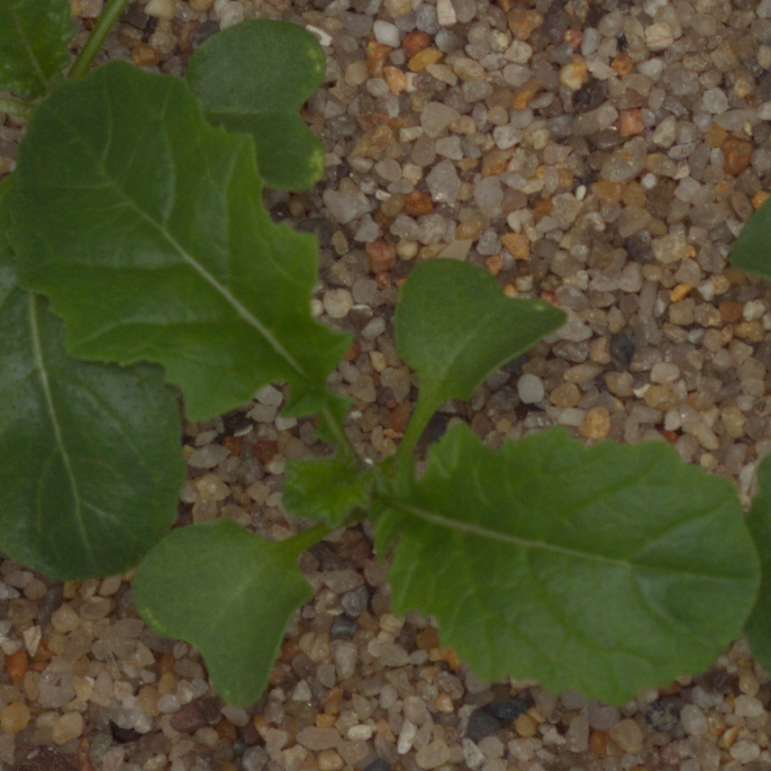
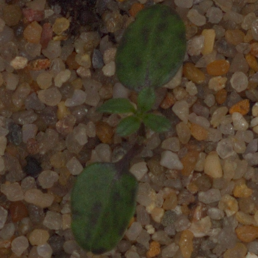
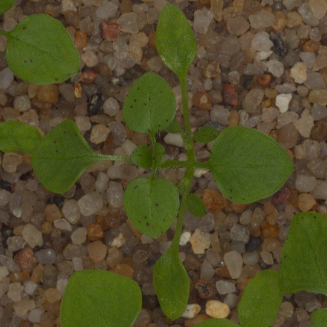
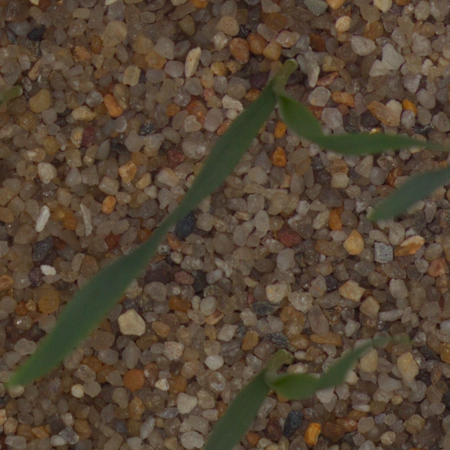
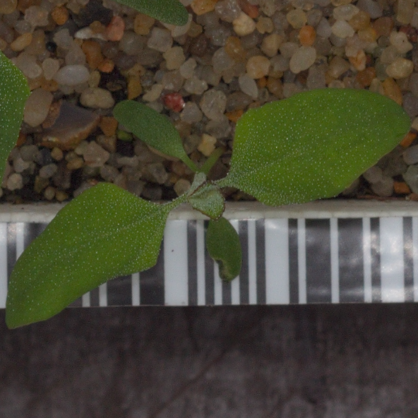
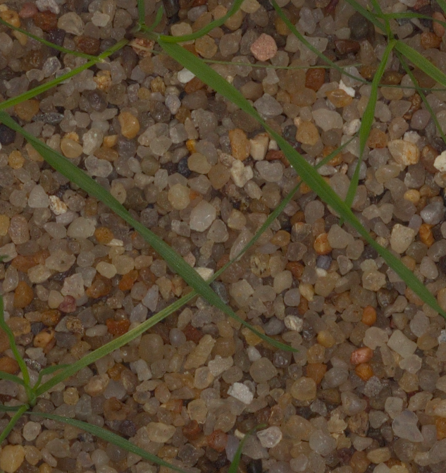
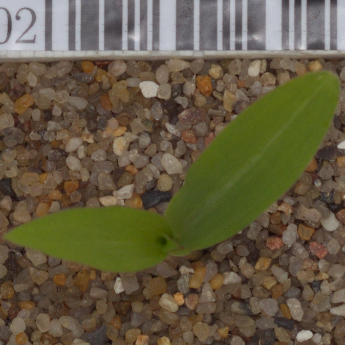
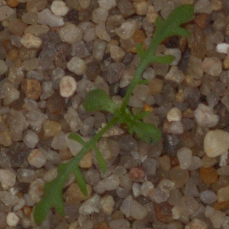
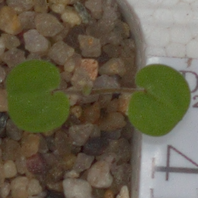
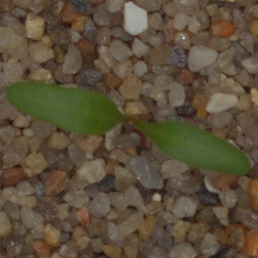

# Weeding Out The Bad Seeds
## Final Project - Image Classification Using Neural Networks to identify plant seedlings versus weeds

### Introduction

Kaggle released a competition a few years ago to determine the species of a seedling based on a picture of the sprouted plant, so as to help farmers better tend to their farms by differntiated weeds from crops.  By being able to quickly scan a field and detect weeds or other plants that do not belong in that section of farmland, farmers can take action to remove the unwelcome addition to the plot to prevent these weeds or unintended plantings from absorbing the nutrients and space necessary for the intended plant seedlings' survival and healthy yield.
It can be especially difficult to differentiate a weed from a crop seedling early on, so this is also helpful to prevent farmers from accidentally pulling up valuable crops instead of weeds when maintaining the land.

### Description of Data

The data was provided by the Aarhus University Signal Processing group and University of Southern Denmark and was posted to Kaggle as a competition to allow the public to help improve upon computer vision algorithms and contribute to the advancement of farming techniques.
The dataset contains pictures of 960 different plant seedlings shortly after sprouting that belong to one of 12 species categories:
  1. Black-grass
  2. Charlock
  3. Cleavers
  4. Common Chickweed
  5. Common Wheat
  6. Fat Hen
  7. Loose Silky-bent
  8. Maize
  9. Scentless Mayweed
  10. Shepherds Purse
  11. Small-flowered Cranesbill
  12. Sugar Beet
The images were split into a training and testing dataset, with the training images assigned to their respective species's label and the testing images having no assigned label.

For example, here is an image from each category:

  * Black-grass:
  
  
  
  * Charlock:

  
  
  * Cleavers:
  
  
  
  * Common Chickweed:
  
  
  
  * Common Wheat:
  
  
  
  * Fat Hen:
  
  
  
  * Loose Silky-bent:
  
  
  
  * Maize:
  
  
  
  * Scentless Mayweed:
  
  
  
  * Shepherds Purse:
  
  
  
  * Small-flowered Cranesbill:
 
 
  
  * Sugar Beet:
  
  

As one may note after viewing the images above, each of the images is a different size.  As such, the first step I took in my data processing was to rescale all the images to be 128x128 pixels.

###  Description of Methods

#### Data Processing

### Discussion and Inferences

### Citations
#### Convolutional Neural Network

  * Architecture

#### ResNet
  
  * Architecture

#### Dense Neural Network

  * Architecture

#### Recurrent Neural Network

  * Architecture
