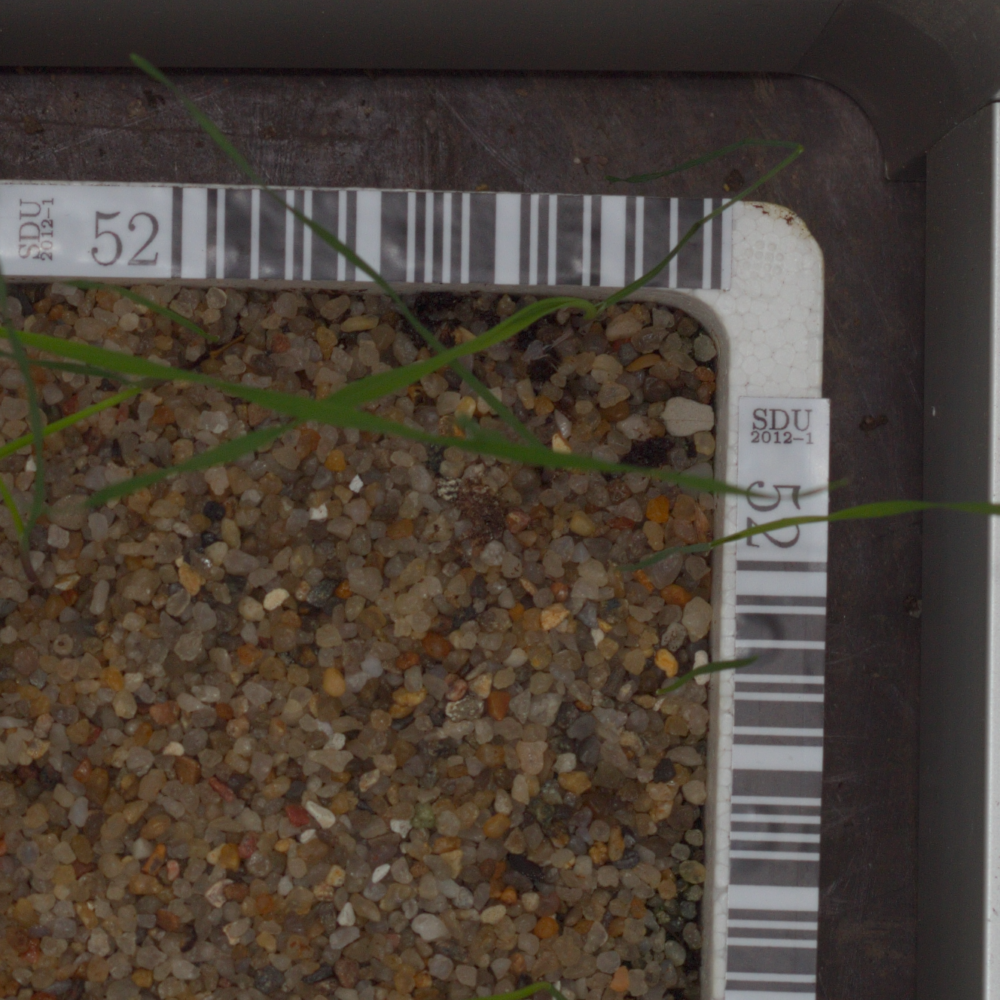
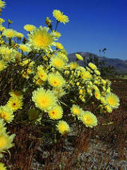
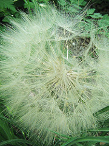
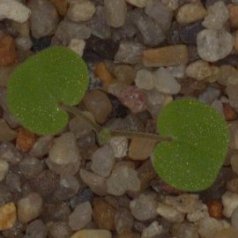

# **Weeding Out The Bad Seeds**
## **Final Project - Image Classification Using Neural Networks to identify plant seedlings versus weeds**

## **Introduction**

Kaggle released a competition a few years ago to determine the species of a seedling based on a picture of the sprouted plant, so as to help farmers better tend to their farms by differentiating weeds from crops.  By being able to quickly scan a field and detect weeds or other plants that do not belong in that section of farmland, farmers can take action to remove the unwelcome addition to the plot to prevent their growth from consuming the resources, absorbing the nutrients, and crowding the space necessary for the intended plant seedlings' survival and healthy yield.  

According to the Weed Science Society of America (WSSA), weeds were responsible for a 22.4% average yield loss on winter wheat and an average 35.3% yield loss on spring wheat in North America between 2007 and 2013 ([WSSA](https://wssa.net/wp-content/uploads/Wheat-yield-loss-POSTER.pdf)).  Their research also indicates that the estimated value loss for corn was approximately $47 billion and $16 billion ofr soybeans over this same time period ([WSSA](https://wssa.net/wssa/weed/croploss-2/)).


It can be especially difficult to differentiate a weed from a crop seedling early on, so being able to easily identify the species of a seedling in a plot of land is also helpful for farmers to preempt accidentally pulling up valuable crops instead of weeds when maintaining their acreage.  By developing a machine learning model that can identify plants and, furthermore, differentiate between weeds and crops, farmers can also easily take a picture of the land area, input the image into the model, and use its prediction to help make a more-informed decision on whether it is necessary to remove the seedling and avoid mistakenly removing valuable crops or wastefully spending money on the herbicides and labor required to remove the plants.  


To further build on this cultivation topic, I also decided to work with a dataset of various flower varieties to determine which type of flower the picture displays.  Since this dataset seemed more simplistic than the seedling dataset because it had fewer classes of vegetation and each class was more visually distinctive from the others, I did not use this as my main dataset for analysis and machine learning model evaluation.  However, I thought it paired nicely with the seedling analysis to show more applications of the neural network architectures I describe in further detail below.

## **Description of Data**

The seedling data was provided by the Aarhus University Signal Processing group and University of Southern Denmark and was posted to Kaggle as a competition to allow the public to help improve upon computer vision algorithms and contribute to the advancement of farming techniques.
The dataset contains pictures of 4,7500 different plant seedlings shortly after sprouting that belong to one of 12 species categories:
  1. Black-grass
  2. Charlock
  3. Cleavers
  4. Common Chickweed
  5. Common Wheat
  6. Fat Hen
  7. Loose Silky-bent
  8. Maize
  9. Scentless Mayweed
  10. Shepherds Purse
  11. Small-flowered Cranesbill
  12. Sugar Beet
 
 
The images were split into folders corresponding to their respective species's label.  For example, here is an image from each category:


  * **Black-grass**:
  
  
  
  
  
  * **Charlock:**


  
  
  
  * **Cleavers:**
  
  
  
  
  
  * **Common Chickweed:**
  
  
  
  
  
  * **Common Wheat:**
  
  
  
  
  
  * **Fat Hen:**
  
  
  
  
  
  * **Loose Silky-bent:**
  
  
  
  
  
  * **Maize:**
  
  
  
  
  
  * **Scentless Mayweed:**
  
  
  
  
  
  * **Shepherds Purse:**
  
  
  
  
  
  * **Small-flowered Cranesbill:**
 
 
 
 
 
  * **Sugar Beet:**
  
  
  


As one may note after viewing the images above, each of the images is a different size.  As such, the first step I took in my data processing was to rescale all the images to be 128x128 pixels.


The flower data was provided by Kaggle and the user states that each of the 4,242 pictures were collected from Google images, Yandex images, and the online photo-sharing website called Flickr.  As such, each picture is a different image size and I rescaled them to all be 128x128 pixels prior to passing them into my machine learning models.  Approximately 800 of the images fall into each of the following 5 categories:
  1. Daisy
  2. Dandelion
  3. Rose
  4. Sunflower
  5. Tulip


For example, here is an image from each category:


  * **Daisy:**
  
  
  
  
  
  
  
  
  
  I included two pictures above to show an example of the variety of images that are included in each class, as the first picture fits the most typical description of a daisy and is likely the image that one first imagines when thinking about what a daisy looks like to them.  It has a bright yellow center surrounded by many small, white petals.  However, the second picture completely differs from this image in the orange color, petal size/shape, and side-angle of the flower.


  * **Dandelion:**


  
  
  
  
  


  I also included two pictures above to show another example of the variety of images that are included in each class, as the first picture fits the most typical description of a dandelion and contains many examples of the flowers clustered together. However, the second picture completely differs from this image because it not only displays a singular dandelion, but this dandelion has also reached the end of its life and has thus turned into the fluffy, white globe of seeds.  Furthermore, this picture was taken from above, so the computer is unable to detect any stem or leaf structure associated with the dandelion.


  * **Rose:**
  
  
  
  
  
  
  


  As done previously with the daisies and dandelions, I included two rose pictures to depict the variety of images from each class due to the array of rose colors, the amount their blooms have opened, and the camera angle.


  * **Sunflower:**


  
  
  
  * **Tulip:**
  
  
  
  
  
  
  


  Similar to the rose, tulips also display a wide variety of colors and degree of flower development, which adds to the computer's difficulty successfully determining the most common characteristics of a tulip.


##  Description of Methods

### Data Processing
I began the data processing step by importing the images and their respective labels by following their respective file paths and resized the images to all be the same 128x128 pixel size.  I then ensured all of the images followed the same Red-Green-Blue (RGB) color mapping and appended the images and their class names to their respective lists.  Next, I converted the lists of image arrays and class labels into numpy arrays so that I could rescale the pixel values in the pictures by dividing by 255 to normalize them.  I also encoded each of the 12 classes in the label list into categorical values.  The image arrays containing their pixel values would then become the x-values to be input into the machine learning models and the class labels would become the y-values that the machine learning models sought to predict.  I then split the data into testing and training sets with an 80%-20% division, respectively, and passed these data into each of my models.  After analyzing the accuracy associated with these preliminary models, I passed the training images into an image data generator to augment the data.  In doing so, pictures were rotated up to 20 degrees, zoomed in and out by up to 20%, shifted vertically and horizontally by up to 30%, and flipped on both the horizontal and vertical axes to allow the models to be trained on a wide variety of image qualities they could potentially encounter.


Because I was seeking to classify images and would thus need to implement computer vision techniques, I chose to use neural networks to create a machine learning model that would predict what it saw in the picture.  A neural network is a collection of sequential layers of neurons that take an array of pixel data as input, process those pixels through forward propagation through each successive neural layer in the network, and ultimately yield an output with an estimated response.  In the case of image classification, this estimate will be the model's prediction of what class that picture belongs to/what the image depicts.  While it is the programmer's personal choice how many neurons to have in each layer, the final layer must contain the same amount of neurons as image class options.  For instance, if a neural network is trying to predict whether an image is displaying a cat or a dog, that network must have two (and only two) neurons in its final layer.  Each layer also has its own activation function which makes the determination of whether a neuron's input is a significant predictor.  For classification problems, sigmoid is is a useful activator because it outputs a probability between 0 and 1 that the input belongs to a particular class.  The weights that are calculated as the input feeds through the neural network will be back-propagated through the layers to better inform the model's learning.  The programmer will also select a learning rate for the model to provide as a parameter for the network's optimizer function.  It is the optimizer that seeks to minimize the loss of the model.  The neural network model is then compiled and fit to the data.  

For each neural network model tested, I used K-fold cross validation to ensure their respective accuracies were repeatable across multiple splits of the data.  I initially used 10 splits, but this took several hours to run and would often lead to excess RAM utilization, so I reduced the number of splits to 3 to conserve resources and yield results more quickly.


### Convolutional Neural Network

  I first chose to test a convolutional neural network model containing a series of convolutional, max pooling, and batch normalization layers.  A convolutional layer operates by applying a filter of specified dimensionality across the picture and transform the pixels in that location by setting the pixel intensity in the center of the filter equal to the sum of the pixel intensities enveloped by the filter.  If one chooses to include padding in their convolutional filter, then this will allow the filter to calculate a new pixel intensity to replace each original pixel.  Max 2D pooling layers similarly scan a collection of pixels in the image contained within a square of the specified dimensionality of the pool and creates a less granular/smaller version of the original image by setting a singular pixel intensity equal to the largest intensity value from the selection of pixels from the original picture.  This allows the model to pick out the most important and most distinctive features in a picture.  It can sometimes be helpful to include dropout layers to cut ties between neurons in a given layer and the neurons in preceding layers to prevent overfitting the model to the training data and thus negatively impacting the model's ability to accurately predict future testing pictures that it has never seen before.  
  
  Interestingly, the average accuracy with this model hovered around 12-13% on the seedling dataset.  While I expected the model would have great difficulty distinguishing between the varieties of seedlings, as even I can't tell the difference between each of the grassy varieties or each of the seedlings with rounded leaves, I was not expecting the accuracy to be this substantially low.  However, data augmentation did improve its accuracy slightly to about 15%.  It performed quite a bit better on the flower image dataset, with an average accuracy of over 25%, but this was still quite a poor job.  Accuracy did not appear to improve after later removing dropout layers either.

  #### Architecture
  
  * Seedling Code:
  
  ```
    model = Sequential()
    model.add(Conv2D(filters = 64, kernel_size = (5,5),padding = 'Same',activation ='relu', input_shape = (128,128,3)))
    model.add(MaxPooling2D(pool_size=(2,2)))

    model.add(Conv2D(filters = 128, kernel_size = (5,5),padding = 'Same',activation ='relu'))
    model.add(Conv2D(filters = 128, kernel_size = (5,5),padding = 'Same',activation ='relu'))
    model.add(Conv2D(filters = 128, kernel_size = (5,5),padding = 'Same',activation ='relu'))
    model.add(MaxPooling2D(pool_size=(2,2)))

    model.add(Flatten())
    model.add(Dense(128, activation='relu'))
    model.add(Dense(64, activation='relu'))
    model.add(Dropout(rate=0.5))
    model.add(Dense(12, activation = "softmax"))
  ```
  
    * Flower Code:
  
  ```
    model = Sequential()
    model.add(Conv2D(filters = 64, kernel_size = (5,5),padding = 'Same',activation ='relu', input_shape = (128,128,3)))
    model.add(MaxPooling2D(pool_size=(2,2)))

    model.add(Conv2D(filters = 128, kernel_size = (5,5),padding = 'Same',activation ='relu'))
    model.add(Conv2D(filters = 128, kernel_size = (5,5),padding = 'Same',activation ='relu'))
    model.add(Conv2D(filters = 128, kernel_size = (5,5),padding = 'Same',activation ='relu'))
    model.add(MaxPooling2D(pool_size=(2,2)))

    model.add(Flatten())
    model.add(Dense(128, activation='relu'))
    model.add(Dense(64, activation='relu'))
    model.add(Dropout(rate=0.5))
    model.add(Dense(5, activation = "softmax"))
  ```

### Dense Neural Network

  Next, I tested a dense neural network model containing a series of dense neural layers, which means that each neuron is connected to all neurons from the layer prior to it.  Since dense neural networks are typically used in textual analysis, I assumed that this model would not be the most accurate because it was not as well-suited to image classification.  However, I still utilized a dense neural network because I thought it would be interesting to observe its results in the context of this particular dataset.  I was shocked to find that this model actually outperformed the convolutional neural network, with average accuracy exceeding 40% and reaching 70% in individual epochs for the seedling dataset.  The results were very similar on the flower dataset, with an average accuracy around 40%.

  #### Architecture

  * Seedling Code:
 
  ```
    model = Sequential()
    model.add(Flatten())
    model.add(Dense(200))
    model.add(Dense(100))
    model.add(Dense(64))
    model.add(Dense(32)) 
    model.add(Dense(24))
    model.add(Dense(16))
    model.add(Dense(12, activation='softmax'))
  ```

  * Flower Code:
 
  ```
    model = Sequential()
    model.add(Flatten())
    model.add(Dense(200))
    model.add(Dense(100))
    model.add(Dense(64))
    model.add(Dense(32)) 
    model.add(Dense(24))
    model.add(Dense(16))
    model.add(Dense(5, activation='softmax'))
  ```

### AlexNet

  I then implemented the convolutional neural network design created by Alex Krizhevsky, as discussed in class, but with the final layer's neurons reduced to 12 to fit the context of the seedling image dataset and 5 for the flower image dataset.  This fared just as poorly as the convolutional neural network, at an average accuracy of just 12-14% for the seedlings.  The average did not noticeably improve with data augmentation.  The average accuracy improved to approximately 25% on the flower image dataset.

  #### Architecture 

  * Seedling Code:
 
  ```
    model = Sequential()
    model.add(Conv2D(filters=96, kernel_size=(11,11), strides=(4,4), activation='relu', input_shape=(128,128,3)))
    model.add(BatchNormalization())
    model.add(MaxPool2D(pool_size=(3,3), strides=(2,2)))
    model.add(Conv2D(filters=256, kernel_size=(5,5), strides=(1,1), activation='relu', padding="same"))
    model.add(BatchNormalization())
    model.add(MaxPool2D(pool_size=(3,3), strides=(2,2)))
    model.add(Conv2D(filters=384, kernel_size=(3,3), strides=(1,1), activation='relu', padding="same"))
    model.add(BatchNormalization())
    model.add(Conv2D(filters=384, kernel_size=(3,3), strides=(1,1), activation='relu', padding="same"))
    model.add(BatchNormalization())
    model.add(Conv2D(filters=256, kernel_size=(3,3), strides=(1,1), activation='relu', padding="same"))
    model.add(BatchNormalization())
    model.add(MaxPool2D(pool_size=(3,3), strides=(2,2)))
    model.add(Flatten())
    model.add(Dense(4096, activation='relu'))
    model.add(Dropout(0.5))
    model.add(Dense(4096, activation='relu'))
    model.add(Dropout(0.25)),
    model.add(Dense(12, activation='softmax'))
  ```

  * Flower Code:
 
  ```
    model = Sequential()
    model.add(Conv2D(filters=96, kernel_size=(11,11), strides=(4,4), activation='relu', input_shape=(128,128,3)))
    model.add(BatchNormalization())
    model.add(MaxPool2D(pool_size=(3,3), strides=(2,2)))
    model.add(Conv2D(filters=256, kernel_size=(5,5), strides=(1,1), activation='relu', padding="same"))
    model.add(BatchNormalization())
    model.add(MaxPool2D(pool_size=(3,3), strides=(2,2)))
    model.add(Conv2D(filters=384, kernel_size=(3,3), strides=(1,1), activation='relu', padding="same"))
    model.add(BatchNormalization())
    model.add(Conv2D(filters=384, kernel_size=(3,3), strides=(1,1), activation='relu', padding="same"))
    model.add(BatchNormalization())
    model.add(Conv2D(filters=256, kernel_size=(3,3), strides=(1,1), activation='relu', padding="same"))
    model.add(BatchNormalization())
    model.add(MaxPool2D(pool_size=(3,3), strides=(2,2)))
    model.add(Flatten())
    model.add(Dense(4096, activation='relu'))
    model.add(Dropout(0.5))
    model.add(Dense(4096, activation='relu'))
    model.add(Dropout(0.25)),
    model.add(Dense(5, activation='softmax'))
  ```
  Perhaps this model could be improved in the future by reducing the number of neurons in the final dense layers from 4,096 (to a value somewhere in the hundreds, or even smaller) since there are so few classes and thus so few neurons in the final layer.  It seems reasonable to believe that there could be problems trying to connect thousands of neurons to only 12 (or 5, in the case of the flower classification problem) and still yield accurate results.


### ResNet
  
  ResNet-50 is another alternative convolutional neural network design that contains 50 neural layers, so I implemented the keras ResNet50 architecture instantiation layer. This model proved to be the most accurate, with average accuracy reaching over 70% on the seedling images.  Average accuracy even reached 73% when the data passed to the model was augmented.  As such, I used the ResNet model to make predictions on brand new pictures for both classification problems.
  
  Here is an example of a picture that the model correctly identified as a Small-flowered Cranesbill when it was passed a brand new picture that it had never seen before from the test folder of the dataset (which I kept in reserve for predictions because these were not labeled, so I had to check the species of the seedling depicted manually).  In this case, the model was highly confident, with a probability of over 99% that the image depicted a seedling from class 10.  This corresponded to the small-flowered cranesbill:
  
  
  
  
  
  #### Architecture 

  * Seedling Code:
  
  ```
    model = Sequential()
    model.add(ResNet50(include_top=False, weights='imagenet', pooling='max'))
    model.add(Dense(64))
    model.add(Dense(32)) 
    model.add(Dense(24))
    model.add(Dense(16))
    model.add(Dense(12, activation='softmax'))  
  ```
  
  * Flower Code:
  
  ```
    model = Sequential()
    model.add(ResNet50(include_top=False, weights='imagenet', pooling='max'))
    model.add(Dense(64))
    model.add(Dense(32)) 
    model.add(Dense(24))
    model.add(Dense(16))
    model.add(Dense(5, activation='softmax'))  
  ```


## Citations and Sources Used
1. https://www.kaggle.com/competitions/plant-seedlings-classification
2. https://www.kaggle.com/datasets/alxmamaev/flowers-recognition/code
3. https://wssa.net/wp-content/uploads/Wheat-yield-loss-POSTER.pdf
4. https://wssa.net/wssa/weed/croploss-2/)
6. https://www.tensorflow.org/api_docs/python/tf/keras/applications/resnet50/ResNet50 
7. Course/lecture documents on Blackboard
