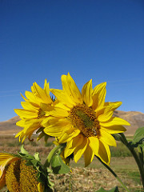

# **Weeding Out The Bad Seeds**
## **Final Project - Image Classification Using Neural Networks to identify plant seedlings versus weeds**

### **Introduction**

Kaggle released a competition a few years ago to determine the species of a seedling based on a picture of the sprouted plant, so as to help farmers better tend to their farms by differentiating weeds from crops.  By being able to quickly scan a field and detect weeds or other plants that do not belong in that section of farmland, farmers can take action to remove the unwelcome addition to the plot to prevent their growth from consuming the resources, absorbing the nutrients, and crowding the space necessary for the intended plant seedlings' survival and healthy yield.  

According to the Weed Science Society of America (WSSA), weeds were responsible for a 22.4% average yield loss on winter wheat and an average 35.3% yield loss on spring wheat in North America between 2007 and 2013 ([WSSA](https://wssa.net/wp-content/uploads/Wheat-yield-loss-POSTER.pdf)).  Their research also indicates that the estimated value loss for corn was approximately $47 billion and $16 billion ofr soybeans over this same time period ([WSSA](https://wssa.net/wssa/weed/croploss-2/)).

It can be especially difficult to differentiate a weed from a crop seedling early on, so being able to easily identify the species of a seedling in a plot of land is also helpful for farmers to preempt accidentally pulling up valuable crops instead of weeds when maintaining their acreage.  By developing a machine learning model that can identify plants and, furthermore, differentiate between weeds and crops, farmers can also easily take a picture of the land area, input the image into the model, and use its prediction to help make a more-informed decision on whether it is necessary to remove the seedling and avoid mistakenly removing valuable crops or wastefully spending money on the herbicides and labor required to remove the plants.  

To further build on this cultivation topic, I also decided to work with a dataset of various flower varieties to determine which type of flower the picture displays.  Since this dataset seemed more simplistic than the seedling dataset because it had fewer classes of vegetation and each class was more visually distinctive from the others, I did not use this as my main dataset for analysis and machine learning model evaluation.  However, I thought it paired nicely with the seedling analysis to show more applications of the neural network architectures I describe in further detail below.

### **Description of Data**

The seedling data was provided by the Aarhus University Signal Processing group and University of Southern Denmark and was posted to Kaggle as a competition to allow the public to help improve upon computer vision algorithms and contribute to the advancement of farming techniques.
The dataset contains pictures of 4,7500 different plant seedlings shortly after sprouting that belong to one of 12 species categories:
  1. Black-grass
  2. Charlock
  3. Cleavers
  4. Common Chickweed
  5. Common Wheat
  6. Fat Hen
  7. Loose Silky-bent
  8. Maize
  9. Scentless Mayweed
  10. Shepherds Purse
  11. Small-flowered Cranesbill
  12. Sugar Beet
 
 
The images were split into folders corresponding to their respective species's label.  For example, here is an image from each category:

  * **Black-grass**:
  
  
  
  
  
  * **Charlock:**

  
  
  
  * **Cleavers:**
  
  
  
  
  
  * **Common Chickweed:**
  
  
  
  
  
  * **Common Wheat:**
  
  
  
  
  
  * **Fat Hen:**
  
  
  
  
  
  * **Loose Silky-bent:**
  
  
  
  
  
  * **Maize:**
  
  
  
  
  
  * **Scentless Mayweed:**
  
  
  
  
  
  * **Shepherds Purse:**
  
  
  
  
  
  * **Small-flowered Cranesbill:**
 
 
 
 
 
  * **Sugar Beet:**
  
  
  

As one may note after viewing the images above, each of the images is a different size.  As such, the first step I took in my data processing was to rescale all the images to be 128x128 pixels.

The flower data was provided by Kaggle and the user states that each of the 4,242 pictures were collected from Google images, Yandex images, and the online photo-sharing website called Flickr.  As such, each picture is a different image size and I rescaled them to all be 128x128 pixels prior to passing them into my machine learning models.  Approximately 800 of the images fall into each of the following 5 categories:
  1. Daisy
  2. Dandelion
  3. Rose
  4. Sunflower
  5. Tulip

For example, here is an image from each category:

  * **Daisy:**
  
  
  
  
  
  
  
  
  
  I included two pictures above to show an example of the variety of images that are included in each class, as the first picture fits the most typical description of a daisy and is likely the image that one first imagines when thinking about what a daisy looks like to them.  It has a bright yellow center surrounded by many small, white petals.  However, the second picture completely differs from this image in the orange color, petal size/shape, and side-angle of the flower.

  * **Dandelion:**

  
  
  
  
  

  I also included two pictures above to show another example of the variety of images that are included in each class, as the first picture fits the most typical description of a dandelion and contains many examples of the flowers clustered together. However, the second picture completely differs from this image because it not only displays a singular dandelion, but this dandelion has also reached the end of its life and has thus turned into the fluffy, white globe of seeds.  Furthermore, this picture was taken from above, so the computer is unable to detect any stem or leaf structure associated with the dandelion.

  * **Rose:**
  
  
  
  
  
  
  

  As done previously with the daisies and dandelions, I included two rose pictures to depict the variety of images from each class due to the array of rose colors, the amount their blooms have opened, and the camera angle.

  * **Sunflower:**

  
  
  
  * **Tulip:**
  
  
  
  
  
  
  

  Similar to the rose, tulips also display a wide variety of colors and degree of flower development, which adds to the computer's difficulty successfully determining the most common characteristics of a tulip.

###  Description of Methods

#### Data Processing
I began the data processing step by importing the images and their respective labels by following their respective file paths and resized the images to all be the same 128x128 pixel size.  I then ensured all of the images followed the same Red-Green-Blue (RGB) color mapping and appended the images and their class names to their respective lists.  Next, I converted the lists of image arrays and class labels into numpy arrays so that I could rescale the pixel values in the pictures by dividing by 255 to normalize them.  I also encoded each of the 12 classes in the label list into categorical values.  The image arrays containing their pixel values would then become the x-values to be input into the machine learning models and the class labels would become the y-values that the machine learning models sought to predict.  I then split the data into testing and training sets with an 80%-20% division, respectively, and passed these data into each of my models.  After analyzing the accuracy associated with these preliminary models, I passed the training images into an image data generator to augment the data.  In doing so, pictures were rotated up to 20 degrees, zoomed in and out by up to 20%, shifted vertically and horizontally by up to 30%, and flipped on both the horizontal and vertical axes to allow the models to be trained on a wide variety of image qualities they could potentially encounter.

#### Convolutional Neural Network

  * Architecture (Note: Next, I will be inserting a screenshot of the model summary.)
  * Cross-Entropy Loss
  * Accuracy

#### Dense Neural Network

  * Architecture (Note: Next, I will be inserting a screenshot of the model summary.)
  * Cross-Entropy Loss

#### AlexNet

  * Architecture (Note: Next, I will be inserting a screenshot of the model summary.)
  * Cross-Entropy Loss
  * Accuracy

#### ResNet
  
  * Architecture (Note: Next, I will be inserting a screenshot of the model summary.)
  * Cross-Entropy Loss
  * Accuracy

### Discussion and Inferences

### Citations
