# Comparison of Locally Weighted and Random Forest Regression

## Concept of Locally Weighted Regression (LOWESS)
Locally weighted regression is a non-parametric method of regression.  As opposed to a parametric model, in which you can assume the relationship takes a certain form (like linear, quadratic, or logarithimic, to name a few such examples), a non-parametric model does not make any assumptions ahead of time.  In other words, a non-parametric model is useful when one is unsure what the relationship may be between two variables in a dataset.  I have provided an example below of a scatterplot for a dataset that appears to clearly display a negative linear relationship between y and x, where y decreases as x increases. As such, a parametric model would be well suited to this data, since we expect the relationship between x and y will be best explained by a linear model.  We can see such a model displayed in Figure 2, in which a linear regression line is fit to the data.  An example of data that would be better suited to a non-parametric model is shown in Figure 3.  After viewing this plot, it is unclear what relationship readily exists between x and y.

### Figure 1.
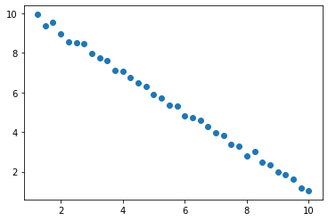

### Figure 2.
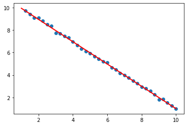

### Figure 3.
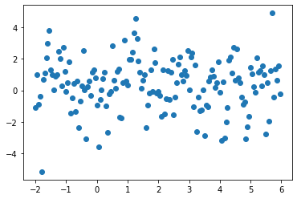


Locally weighted regression is quite similar to the method of moving averages, in that the technique uses smoothing to create a model to predict y based on a given value, x, and the points closest to x.  It essentially assumes that even though the relationship between two variables in a dataset may not be globally linear, it may be locally linear in a given region.  As such, locally weighted regression locally fits the data through a series of short linear regression lines between small increments of datapoints that could appear to still form a smooth curve on a more global scale of the entire dataset.  The small, local regions in which these lines are formed are defined by the kernels, which yield the necessary weights.  The main idea of locally weighted regression is that the predictions are a linear combination of the observed/actual dependent values from the dataset (i.e., the predicted y is a linear combination of the actual values of y).  It applies weights to each value proportional to the distance between the local datapoints, with weights closer to one the closer they are together and closer to zero the further away they are (with datapoints outside of the desired range having weights of zero), thus highlighting a particular region in the dataset.  As a result, linear regression is only performed in that particular region defined by your kernel/weights.  Linear regression stems from the following equation:

### Eq. 1
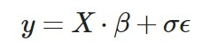

In this equation, X is a matrix with dimensionality n x p (where n is the number of independent observations and p is the number of features), y is the univariate dependent variable, and beta is a vector of weights.  Because we assume epsilon has an expected value of zero, we can exclude its product with sigma (i.e., the noise) from the equation.  When performing linear regression, the model is learning the appropriate weights in the vector beta to multiply by the matrix X. If we multiply the equation by a matrix of weights consisting of the transpose of X (i.e., the independent observations of the dataset) and solve for the beta vector, we will find that the expected value of beta is equal to the inverse of the product of X and the transpose of X, multiplied by the product of the transpose of X and y.  If we then plug this value into beta in Eq. 1, we will find that each predicted value of y is a linear combination of each actual value of y, as shown in Eq. 2 below.

### Eq. 2
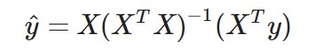

To build on this knowledge to better explain locally weighted regression, one will multiply the equation in Eq. 1 by an n x n matrix of weights, W, with each weight corresponding to each data observation, as shown in Eq. 3 below. As such, we can note that there will be n weight vector columns from matrix W connected to each n row obervation from matrix X (i.e., column 1 from W will correspond to row 1 from X).  Additionally, we can note that each row in X is in the P-dimensional space, which means the distance between each datapoint is the Euclidean distance between each row vector.  If the Euclidean distance between observations is above a particular threshold, denoted in our kernel functions by the hyperparameter tau, then the weight of that particular row vector will be set to zero.  This inclusion of close observations and exclusion of observations farther away is what makes the linear regression occur locally to a specific region of datapoints.  As mentioned previously in discussing linear regression, we will find that each predicted value of y is a linear combination of each actual value of y, and each of these linear combinations is a differently weighted combination of the actual/observed y values stemming from the local weighting approach, as displayed in Eq. 4 below.  As a result, the non-parametric model creates more accurate predictions than a parametric linear regression model because the non-parametric model is locally weighted and thus better follows the trend of the data.  

### Eq. 3
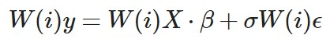

### Eq. 4
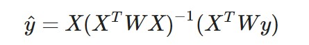

One of the hyperparameters to the kernel function, tau, determines how wide the region you wish to highlight should be - smaller values will result in choppier and more variable curves, whereas larger values will result in smoother curves.  As a result, smaller taus may result in overfitting more often than a larger tau.  On the other hand, larger taus may be so smooth that it is too underfit to the data and fails to pick up on important trends.  Thus, it is important to test varying levels of tau when performing one's data analysis to select the optimal tau to adequately minimize the model's mean squared error (MSE).  We will see this testing shown in my analysis of the data following the description of random forest regression.  To show the different degrees of smoothing caused by varying levels of tau, I have included Figure 4 below, which shows the lowest weighted regression models fit to the first dataset I analyzed using a tricubic kernel.  The yellow curve has the smallest tau at 0.01, and thus also has the highest degree of variability.  The curve with the next highest degree of volatility is the blue curve, which has a tau of 0.05, but we can see that it is slightly more smoothed than the yellow curve.  The smoothing becomes most apparent in the orange and red curves, which have taus of 0.1 and 0.5, respectively.  One may note that the red curve has the highest tau and thus is the most smooth of the models tested.  Interestingly, upon analyzing the MSEs for each curve, I determined that the most accurate tricubic model (i.e., the model with the lowest MSE) was not the smoothest curve, but in fact the second highest tau of 0.1.  This model had an MSE of approximately 35.44, as opposed to the 0.5 tau model which had a higher MSE of 36.98.  By comparison, the most variable curve with a tau of 0.01 had an even higher MSE of 45.43.

### Figure 4.
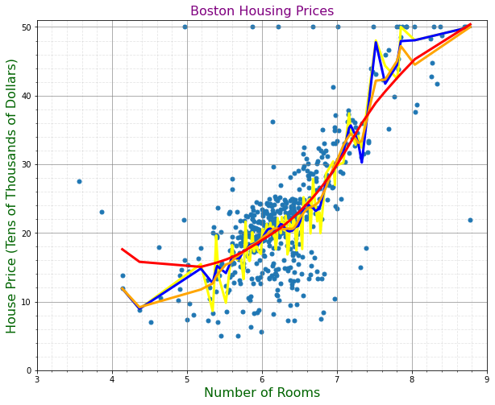

Locally weighted regression differs from random forest regression because it performs smooth surface reconstruction to give a smooth fit to the data - based on my analysis as shown in my code and plots below, I have found that locally weighted regression tends to be more accurate than random forests.

## Concept of Random Forest Regression
Random forest regression is another non-parametric model that differs from locally weighted regression because it performs predictions through ensembling.  The main idea of random forest regression is that the predictions are made by running a collection of several decision trees at once and then averaging the results of their decisions together.  A decision tree consists of a collection of nodes, with the top single node being the "root."  Each parent node then splits the data based on the criteria that the split minimizes the MSE of each of its two child nodes.  If the datapoints fall below the value that splits the parent node, they will be placed in the left child node; if the datapoints fall above the value that splits the parent node, they will be placed in the right child node.  The final set of child nodes are known as "leaves," and these leaves are the model's predictions. Subsets of the data found in the leaves are considered to be most similar to each other, and each node contains data that is more similar to each other than the data contained in another node.  In a random forest model, a collection of decision trees are created across different subsets of the overall dataset and then the results are averaged together to create a final prediction.  By averaging together the results of multiple decision trees (the number of which are specified by the user in the function call), random forest evens out the variability in results that may be found between each tree.  One of the hyperparameters for a decision tree is how many levels to let it split into, which is called its depth - if the tree is allowed to split too often then the model will be too atuned to each individaul datapoint and thus be overfit.  On the other hand, if the tree is not able to split into enough nodes, then the model will be underfit and will likewise be erroneous.  As such, one must test varying numbers of trees and depth levels in the course of developing a random forest model to determine which method leads to the most ideally minimized MSE.  We will see this testing shown in my analysis of the data below.  Each decision tree will produce no more than 2 to the dth power values, where d is the depth of the tree.


## Analysis and Visualization of Differences Between LOWESS and Random Forest Regression

To analyze the differences between locally weighted regression (LOWESS) and random forest regression, I selected three different datasets to apply these techniques to and evaluate the models' prediction accuracy.  My first dataset involved predicting the median house prices in Boston based on their number of rooms, the second dataset involved predicting a car's mileage based on its weight, and the final dataset I selected involved predicting the unemployment level based on weekly grocery store sales.  I selected these pairs of features from their respective datasets because they were all quantitative variables and seemed to be the most logically highly correlated amongst the remaining features from their dataset.  I decided to not only compare LOWESS to random forest, but also to compare various kernels and tau values amongst the LOWESS models and various numbers of trees and depths amongst the random forest models.  From there, I compared the best performing LOWESS model from each dataset to the best performing random forest model.  I based my decision for which models were best on their respective MSE values.  To best compare each model, I uilized 10 k-fold cross validation and scaled all input data prior to including them in my models when performing this validation.  First, I began my analysis by comparing three kernels - namely the tricubic, Epanechnikov, and quartic kernels - under four levels of hyperparameter tau - namely 0.01, 0.05, 0.1, and 0.5.  I then continued my analysis by comparing four different random forests: one containing 100 trees with a depth of 3, one containing 1000 trees with a depth of 5, one containing 100 trees with a depth of 3, and one containing 1000 trees with a depth of 5.  Once I determined which kernel and tau combination performed best amongst the LOWESS models, I then compared this with the best performing random forest model and plotted both models' curves atop the corresponding data.

### Boston Housing Prices Data

This dataset contains information pertaining to housing prices and potential contributing features to those price values, such as number of rooms and pupil-to-teacher ratios in local schools.  Below I have attached a screenshot of a sample of the dataset, including each of the dataset's original features.  For my analysis, I utilized rooms as the predictor and cmedv as the dependent variable.

### Figure 5.
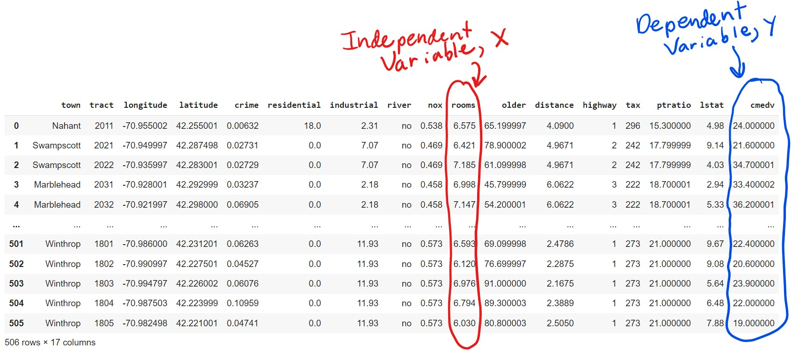

### Figure 6.
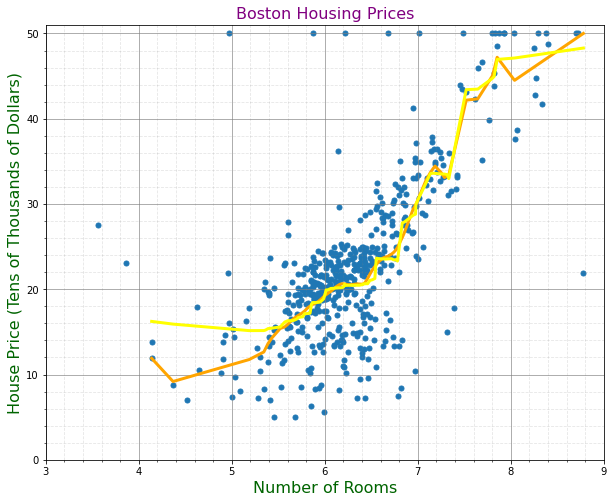

The plot above shows the LOWESS model fit to the data in orange and the random forest model fit to the data in yellow.  In this case, the LOWESS model and random forest model curves were quite similar and followed the trend of the dataset quite nicely.  However, LOWESS appears to fit it slightly better, as shown by its better ability to pick up on the trend of the data towards the bottom left between the 4 and 5 room x-values.  We will soon see that LOWESS and random forest were not quite as comparable for the remaining two datasets I analyzed.  Among kernels using a tau of 0.01, the best MSE was generated by the Epanechnikov kernel with an MSE of approximately 43.81; among kernels with a tau of 0.05, the best MSE was generated by the Epanechnikov kernel with an MSE of approximately 36.45; for a tau of 0.1, the best MSE was generated by the tricubic kernel with an MSE of approximately 35.44; and among kernels using a tau of 0.5, the best MSE was generated by the quartic kernel with an MSE of approximately 36.92.  Among random forests, the best MSE was generated by a forest of 1,000 trees and a depth of 3 with an MSE of approximately 35.88.  I then performed 10 k-fold validation to compare the top performing LOWESS model (i.e., Tricubic kernel with a tau of 0.1) with the top-performing random forest model.  Ultimately, **LOWESS won** with an MSE of approximately 35.44, as opposed to random forest's MSE of approximately 35.88.

### Cars Data

This dataset contains information pertaining to car models and their features, such as weight and mileage.  Below I have attached a screenshot of a sample of the dataset, including each of the dataset's original features.  For my analysis, I utilized WGT as the predictor and MPG as the dependent variable.

### Figure 7.
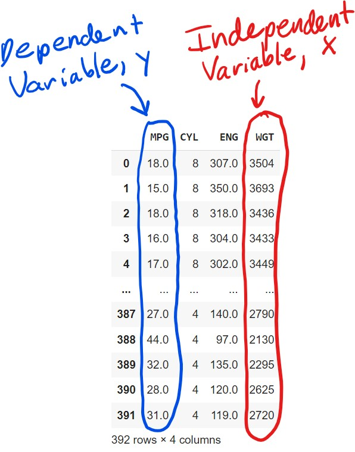

### Figure 8.
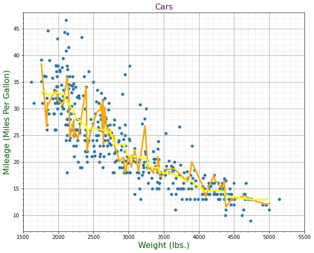

The plot above shows the LOWESS model fit to the data in orange and the random forest model fit to the data in yellow.  It becomes readily apparent that LOWESS does a much better job at following the trends of the data and matches it almost completely, whereas random forest struggles with this.  Among kernels using a tau of 0.01, the best MSE was generated by the Epanechnikov kernel with an MSE of approximately 24.32; among kernels with a tau of 0.05, the best MSE was generated by the Epanechnikov kernel with an MSE of approximately 18.48; for a tau of 0.1, the best MSE was generated by the Epanechnikov kernel with an MSE of approximately 17.81; and among kernels using a tau of 0.5, the best MSE was generated by the quartic kernel with an MSE of approximately 17.77.  Among random forests, the best MSE was generated by a forest of 1,000 trees and a depth of 3 with an MSE of approximately 17.98.  I then performed 10 k-fold validation to compare the top performing LOWESS model (i.e., Quartic kernel with a tau of 0.5) with the top-performing random forest model.  Ultimately, **LOWESS won** with an MSE of approximately 26.60, as opposed to random forest's MSE of approximately 26.93.

### Walmart Sales Data

This dataset contains information pertaining to weekly Walmart Sales data and potential contributing factors to those sales, such as whether or not it was a holiday, the temperature at that time, and the CPI.  Below I have attached a screenshot of a sample of the dataset, including each of the dataset's original features.  For my analysis, I utilized Weekly_Sales as the predictor and Unemployment as the dependent variable.

### Figure 9.
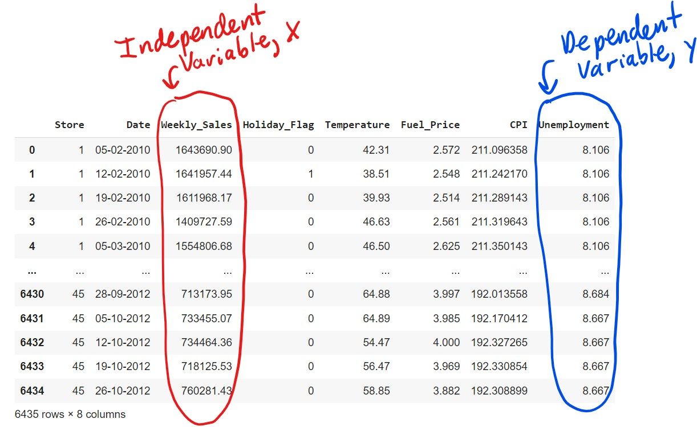

### Figure 10.
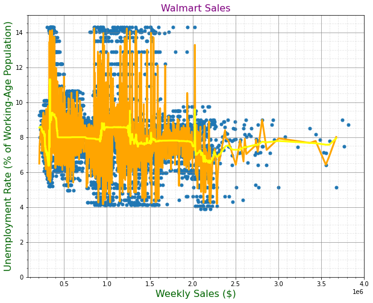

The plot above shows the LOWESS model fit to the data in orange and the random forest model fit to the data in yellow.  Out of all the plots shown for the model fits on each dataset, it is most apparent in the plot for the Walmart dataset that LOWESS does a much better job at following the trends of the data than random forest.  Among kernels using a tau of 0.01, the best MSE was generated by the Epanechnikov kernel with an MSE of approximately 3.34; among kernels with a tau of 0.05, the best MSE was generated by the quartic kernel with an MSE of approximately 3.315; for a tau of 0.1, the best MSE was generated by the quartic kernel with an MSE of approximately 3.345; and among kernels using a tau of 0.5, the best MSE was generated by the quartic kernel with an MSE of approximately 3.44.  Among random forests, the best MSE was generated by a forest of 1,000 trees and a depth of 5 with an MSE of approximately 3.31.  I then performed 10 k-fold validation to compare the top performing LOWESS model (i.e., Quartic kernel with a tau of 0.05) with the top-performing random forest model.  Ultimately, **random forest won** with an MSE of approximately 3.31, as opposed to the LOWESS MSE of approximately 3.32.


## Conclusions
As briefly mentioned previously in the description of the LOWESS model, my analysis showed that LOWESS models tended to outperform random forest regression models.  While random forest outperformed LOWESS for the Walmart sales data, its MSE was only approximately 0.002 units lower than that of LOWESS.  As such, they were practically comparable.  It was interesting to note that the best-performing LOWESS models used a variety of tau values and kernels, so there did not appear to be any particularly dominant kernel or hyperparameter value - rather, these settings were more influenced by the particular data they were fit to predict.  However, it did appear that the Epanechnikov kernel outperformed the other kernels when the tau value was small, based on the results from the Boston Housing Prices and Cars datasets.  Similarly, the quartic kernel outperformed the other kernels when the tau value was large, based on the results from all three datasets.

## Code - Making Mathematical Comparisons and Plotting Results

```
import numpy as np
import pandas as pd
from scipy import linalg
import matplotlib.pyplot as plt
from scipy.interpolate import interp1d
from sklearn.ensemble import RandomForestRegressor
from sklearn.model_selection import KFold, train_test_split as tts
from sklearn.metrics import mean_squared_error as mse
from sklearn.preprocessing import StandardScaler

def tricubic(x):
  return np.where(np.abs(x)>1,0,70/81*(1-np.abs(x)**3)**3)
def Epanechnikov(x):
  return np.where(np.abs(x)>1,0,3/4*(1-np.abs(x)**2)) 
def Quartic(x):
  return np.where(np.abs(x)>1,0,15/16*(1-np.abs(x)**2)**2) 

def lowess_reg(x, y, xnew, kern, tau):
    n = len(x)
    yest = np.zeros(n)
    
    w = np.array([kern((x - x[i])/(2*tau)) for i in range(n)])     
    
    for i in range(n):
        weights = w[:, i]
        b = np.array([np.sum(weights * y), np.sum(weights * y * x)])
        A = np.array([[np.sum(weights), np.sum(weights * x)],
                    [np.sum(weights * x), np.sum(weights * x * x)]])
        theta, res, rnk, s = linalg.lstsq(A, b)
        yest[i] = theta[0] + theta[1] * x[i] 
    f = interp1d(x, yest, fill_value='extrapolate')
    return f(xnew)
    
def lowess_kern(x, y, kern, tau):

    n = len(x)
    yest = np.zeros(n)
   
    w = np.array([kern((x - x[i])/(2*tau)) for i in range(n)])     
    
    for i in range(n):
        weights = w[:, i]
        b = np.array([np.sum(weights * y), np.sum(weights * y * x)])
        A = np.array([[np.sum(weights), np.sum(weights * x)],
                    [np.sum(weights * x), np.sum(weights * x * x)]])
        theta, res, rnk, s = linalg.lstsq(A, b)
        yest[i] = theta[0] + theta[1] * x[i] 

    return yest
    
rf = RandomForestRegressor(n_estimators=100,max_depth=3,random_state=123) 
rf2 = RandomForestRegressor(n_estimators=1000,max_depth=3,random_state=123)
rf3 = RandomForestRegressor(n_estimators=1000,max_depth=5,random_state=123)
rf4 = RandomForestRegressor(n_estimators=100,max_depth=5,random_state=123)

scale = StandardScaler()


# Boston Housing Prices Data
boston_data = pd.read_csv("Boston Housing Prices.csv")

x = boston_data["rooms"].values
y = boston_data["cmedv"].values

# Testing Kernels

# Tau = 0.01, Best kernel was Epanechnikov and an MSE of 43.809283109365026
kf = KFold(n_splits=10,shuffle=True,random_state=410)
mse_tri_b1 = []
mse_epa_b1 = []
mse_quart_b1 = []

for idxtrain, idxtest in kf.split(x):
  ytrain = y[idxtrain]
  xtrain = x[idxtrain]
  xtrain = scale.fit_transform(xtrain.reshape(-1,1))
  ytest = y[idxtest]
  xtest = x[idxtest]
  xtest = scale.transform(xtest.reshape(-1,1))
  yhat_tri = lowess_reg(xtrain.ravel(), ytrain, xtest.ravel(), tricubic, 0.01)
  yhat_epa = lowess_reg(xtrain.ravel(), ytrain, xtest.ravel(), Epanechnikov, 0.01)
  yhat_quart = lowess_reg(xtrain.ravel(), ytrain, xtest.ravel(), Quartic, 0.01)
  mse_tri_b1.append(mse(ytest,yhat_tri))
  mse_epa_b1.append(mse(ytest,yhat_epa))
  mse_quart_b1.append(mse(ytest,yhat_quart))
print("The MSE for LOWESS with the tricubic kernel is: " + str(np.mean(mse_tri_b1)))
print("The MSE for LOWESS with the Epanechnikov kernel is: " + str(np.mean(mse_epa_b1)))
print("The MSE for LOWESS with the quartic kernel is: " + str(np.mean(mse_quart_b1)))

# Tau = 0.05, Best kernel was Epanechnikov and an MSE of 36.44728316493236
kf = KFold(n_splits=10,shuffle=True,random_state=410)
mse_tri_b2 = []
mse_epa_b2 = []
mse_quart_b2 = []

for idxtrain, idxtest in kf.split(x):
  ytrain = y[idxtrain]
  xtrain = x[idxtrain]
  xtrain = scale.fit_transform(xtrain.reshape(-1,1))
  ytest = y[idxtest]
  xtest = x[idxtest]
  xtest = scale.transform(xtest.reshape(-1,1))
  yhat_tri = lowess_reg(xtrain.ravel(), ytrain, xtest.ravel(), tricubic, 0.05)
  yhat_epa = lowess_reg(xtrain.ravel(), ytrain, xtest.ravel(), Epanechnikov, 0.05)
  yhat_quart = lowess_reg(xtrain.ravel(), ytrain, xtest.ravel(), Quartic, 0.05)
  mse_tri_b2.append(mse(ytest,yhat_tri))
  mse_epa_b2.append(mse(ytest,yhat_epa))
  mse_quart_b2.append(mse(ytest,yhat_quart))
print("The MSE for LOWESS with the tricubic kernel is: " + str(np.mean(mse_tri_b2)))
print("The MSE for LOWESS with the Epanechnikov kernel is: " + str(np.mean(mse_epa_b2)))
print("The MSE for LOWESS with the quartic kernel is: " + str(np.mean(mse_quart_b2)))

# Tau = 0.1, Best kernel was tricubic and an MSE of 35.44061356471881
kf = KFold(n_splits=10,shuffle=True,random_state=410)
mse_tri_b3 = []
mse_epa_b3 = []
mse_quart_b3 = []

for idxtrain, idxtest in kf.split(x):
  ytrain = y[idxtrain]
  xtrain = x[idxtrain]
  xtrain = scale.fit_transform(xtrain.reshape(-1,1))
  ytest = y[idxtest]
  xtest = x[idxtest]
  xtest = scale.transform(xtest.reshape(-1,1))
  yhat_tri = lowess_reg(xtrain.ravel(), ytrain, xtest.ravel(), tricubic, 0.1)
  yhat_epa = lowess_reg(xtrain.ravel(), ytrain, xtest.ravel(), Epanechnikov, 0.1)
  yhat_quart = lowess_reg(xtrain.ravel(), ytrain, xtest.ravel(), Quartic, 0.1)
  mse_tri_b3.append(mse(ytest,yhat_tri))
  mse_epa_b3.append(mse(ytest,yhat_epa))
  mse_quart_b3.append(mse(ytest,yhat_quart))
print("The MSE for LOWESS with the tricubic kernel is: " + str(np.mean(mse_tri_b3)))
print("The MSE for LOWESS with the Epanechnikov kernel is: " + str(np.mean(mse_epa_b3)))
print("The MSE for LOWESS with the quartic kernel is: " + str(np.mean(mse_quart_b3)))

# Tau = 0.5, Best kernel was quartic with an MSE of 36.924548944943005
kf = KFold(n_splits=10,shuffle=True,random_state=410)
mse_tri_b4 = []
mse_epa_b4 = []
mse_quart_b4 = []

for idxtrain, idxtest in kf.split(x):
  ytrain = y[idxtrain]
  xtrain = x[idxtrain]
  xtrain = scale.fit_transform(xtrain.reshape(-1,1))
  ytest = y[idxtest]
  xtest = x[idxtest]
  xtest = scale.transform(xtest.reshape(-1,1))
  yhat_tri = lowess_reg(xtrain.ravel(), ytrain, xtest.ravel(), tricubic, 0.5)
  yhat_epa = lowess_reg(xtrain.ravel(), ytrain, xtest.ravel(), Epanechnikov, 0.5)
  yhat_quart = lowess_reg(xtrain.ravel(), ytrain, xtest.ravel(), Quartic, 0.5)
  mse_tri_b4.append(mse(ytest,yhat_tri))
  mse_epa_b4.append(mse(ytest,yhat_epa))
  mse_quart_b4.append(mse(ytest,yhat_quart))
print("The MSE for LOWESS with the tricubic kernel is: " + str(np.mean(mse_tri_b4)))
print("The MSE for LOWESS with the Epanechnikov kernel is: " + str(np.mean(mse_epa_b4)))
print("The MSE for LOWESS with the quartic kernel is: " + str(np.mean(mse_quart_b4)))

# Testing Random Forests, Best was a forest of 1000 trees with a depth of 3 and an MSE of 35.87895228710361
kf = KFold(n_splits=10,shuffle=True,random_state=410)
mse_100_3 = []
mse_100_5 = []
mse_1000_3 = []
mse_1000_5 = []

for idxtrain,idxtest in kf.split(x):
  ytrain = y[idxtrain]
  xtrain = x[idxtrain]
  xtrain = scale.fit_transform(xtrain.reshape(-1,1))
  ytest = y[idxtest]
  xtest = x[idxtest]
  xtest = scale.transform(xtest.reshape(-1,1))
  rf.fit(xtrain,ytrain)
  rf2.fit(xtrain,ytrain)
  rf3.fit(xtrain,ytrain)
  rf4.fit(xtrain,ytrain)
  yhat_rf_1003 = rf.predict(xtest)
  yhat_rf_10003 = rf2.predict(xtest)
  yhat_rf_10005 = rf3.predict(xtest)
  yhat_rf_1005 = rf4.predict(xtest)
  mse_100_3.append(mse(ytest,yhat_rf_1003))
  mse_1000_3.append(mse(ytest,yhat_rf_10003))
  mse_1000_5.append(mse(ytest,yhat_rf_10005))
  mse_100_5.append(mse(ytest,yhat_rf_1005))
print("The MSE for Random Forest with 100 trees and depth of 3: " + str(np.mean(mse_100_3)))
print("The MSE for Random Forest with 1000 trees and depth of 3: " + str(np.mean(mse_1000_3)))
print("The MSE for Random Forest with 100 trees and depth of 5: " + str(np.mean(mse_100_5)))
print("The MSE for Random Forest with 1000 trees and depth of 5: " + str(np.mean(mse_1000_5)))

# Testing Kernel vs. Random Forest, Best was Locally Weighted Regression and an MSE of 35.44061356471881
kf = KFold(n_splits=10,shuffle=True,random_state=410)
mse_lwr = []
mse_rf = []

for idxtrain,idxtest in kf.split(x):
  ytrain = y[idxtrain]
  xtrain = x[idxtrain]
  xtrain = scale.fit_transform(xtrain.reshape(-1,1))
  ytest = y[idxtest]
  xtest = x[idxtest]
  xtest = scale.transform(xtest.reshape(-1,1))
  yhat_lwr = lowess_reg(xtrain.ravel(), ytrain, xtest.ravel(), tricubic, 0.1)
  rf2.fit(xtrain,ytrain)
  yhat_rf = rf2.predict(xtest)
  mse_lwr.append(mse(ytest,yhat_lwr))
  mse_rf.append(mse(ytest,yhat_rf))
print("The MSE for Random Forest is: " + str(np.mean(mse_rf)))
print("The MSE for Locally Weighted Regression is: " + str(np.mean(mse_lwr)))

# Plot
xtrain, xtest, ytrain, ytest = tts(x.reshape(-1,1),y,test_size=0.25,random_state=123)

rf2.fit(xtrain,ytrain)
yhat = rf2.predict(xtest)

M = np.column_stack([xtest,yhat])
M = M[np.argsort(M[:,0])]

ytrain = ytrain.reshape(len(ytrain),)
ytest = ytest.reshape(len(ytest),)

dat = np.concatenate([xtrain,ytrain.reshape(-1,1)], axis=1)
dat = dat[np.argsort(dat[:, 0])]

dat_test = np.concatenate([xtest,ytest.reshape(-1,1)], axis=1)
dat_test = dat_test[np.argsort(dat_test[:, 0])]

yhat_lowess = lowess_kern(dat[:,0],dat[:,1],tricubic,0.1)
datb = np.concatenate([dat[:,0].reshape(-1,1),yhat_lowess.reshape(-1,1)], axis=1)
f = interp1d(datb[:,0], datb[:,1],fill_value='extrapolate')
yhat2 = f(dat_test[:,0])

fig, ax = plt.subplots(figsize=(10,8))
ax.set_xlim(3, 9)
ax.set_ylim(0, 51)
ax.scatter(x = boston_data['rooms'], y = boston_data['cmedv'],s=25)
ax.plot(dat_test[:,0], yhat2, color='orange',lw=3)
ax.plot(M[:,0], M[:,1], color='yellow',lw=3)
ax.set_xlabel('Number of Rooms',fontsize=16,color='Darkgreen')
ax.set_ylabel('House Price (Tens of Thousands of Dollars)',fontsize=16,color='Darkgreen')
ax.set_title('Boston Housing Prices',fontsize=16,color='purple')
ax.grid(b=True,which='major', color ='grey', linestyle='-', alpha=0.8)
ax.grid(b=True,which='minor', color ='grey', linestyle='--', alpha=0.2)
ax.minorticks_on()


# Cars Data
cars_data = pd.read_csv("cars.csv")

x_2 = cars_data['WGT'].values
y_2 = cars_data['MPG'].values

# Testing Kernels

# Tau = 0.01, Best kernel was Epanechnikov and an MSE of 24.31770096710489
kf = KFold(n_splits=10,shuffle=True,random_state=410)
mse_tri_c1 = []
mse_epa_c1 = []
mse_quart_c1 = []

for idxtrain, idxtest in kf.split(x_2):
  y2train = y_2[idxtrain]
  x2train = x_2[idxtrain]
  x2train = scale.fit_transform(x2train.reshape(-1,1))
  y2test = y_2[idxtest]
  x2test = x_2[idxtest]
  x2test = scale.transform(x2test.reshape(-1,1))
  yhat_tri = lowess_reg(x2train.ravel(), y2train, x2test.ravel(), tricubic, 0.01)
  yhat_epa = lowess_reg(x2train.ravel(), y2train, x2test.ravel(), Epanechnikov, 0.01)
  yhat_quart = lowess_reg(x2train.ravel(), y2train, x2test.ravel(), Quartic, 0.01)
  mse_tri_c1.append(mse(y2test,yhat_tri))
  mse_epa_c1.append(mse(y2test,yhat_epa))
  mse_quart_c1.append(mse(y2test,yhat_quart))
print("The MSE for LOWESS with the tricubic kernel is: " + str(np.mean(mse_tri_c1)))
print("The MSE for LOWESS with the Epanechnikov kernel is: " + str(np.mean(mse_epa_c1)))
print("The MSE for LOWESS with the quartic kernel is: " + str(np.mean(mse_quart_c1)))

# Tau = 0.05, Best kernel was Epanechnikov and an MSE of 18.48053295517476
kf = KFold(n_splits=10,shuffle=True,random_state=410)
mse_tri_c2 = []
mse_epa_c2 = []
mse_quart_c2 = []

for idxtrain, idxtest in kf.split(x_2):
  y2train = y_2[idxtrain]
  x2train = x_2[idxtrain]
  x2train = scale.fit_transform(x2train.reshape(-1,1))
  y2test = y_2[idxtest]
  x2test = x_2[idxtest]
  x2test = scale.transform(x2test.reshape(-1,1))
  yhat_tri = lowess_reg(x2train.ravel(), y2train, x2test.ravel(), tricubic, 0.05)
  yhat_epa = lowess_reg(x2train.ravel(), y2train, x2test.ravel(), Epanechnikov, 0.05)
  yhat_quart = lowess_reg(x2train.ravel(), y2train, x2test.ravel(), Quartic, 0.05)
  mse_tri_c2.append(mse(y2test,yhat_tri))
  mse_epa_c2.append(mse(y2test,yhat_epa))
  mse_quart_c2.append(mse(y2test,yhat_quart))
print("The MSE for LOWESS with the tricubic kernel is: " + str(np.mean(mse_tri_c2)))
print("The MSE for LOWESS with the Epanechnikov kernel is: " + str(np.mean(mse_epa_c2)))
print("The MSE for LOWESS with the quartic kernel is: " + str(np.mean(mse_quart_c2)))

# Tau = 0.1, Best kernel was Epanechnikov and an MSE of 17.81189365251738
kf = KFold(n_splits=10,shuffle=True,random_state=410)
mse_tri_c3 = []
mse_epa_c3 = []
mse_quart_c3 = []

for idxtrain, idxtest in kf.split(x_2):
  y2train = y_2[idxtrain]
  x2train = x_2[idxtrain]
  x2train = scale.fit_transform(x2train.reshape(-1,1))
  y2test = y_2[idxtest]
  x2test = x_2[idxtest]
  x2test = scale.transform(x2test.reshape(-1,1))
  yhat_tri = lowess_reg(x2train.ravel(), y2train, x2test.ravel(), tricubic, 0.1)
  yhat_epa = lowess_reg(x2train.ravel(), y2train, x2test.ravel(), Epanechnikov, 0.1)
  yhat_quart = lowess_reg(x2train.ravel(), y2train, x2test.ravel(), Quartic, 0.1)
  mse_tri_c3.append(mse(y2test,yhat_tri))
  mse_epa_c3.append(mse(y2test,yhat_epa))
  mse_quart_c3.append(mse(y2test,yhat_quart))
print("The MSE for LOWESS with the tricubic kernel is: " + str(np.mean(mse_tri_c3)))
print("The MSE for LOWESS with the Epanechnikov kernel is: " + str(np.mean(mse_epa_c3)))
print("The MSE for LOWESS with the quartic kernel is: " + str(np.mean(mse_quart_c3)))

# Tau = 0.5, Best kernel was Quartic and an MSE of 17.765601561138332
kf = KFold(n_splits=10,shuffle=True,random_state=410)
mse_tri_c4 = []
mse_epa_c4 = []
mse_quart_c4 = []

for idxtrain, idxtest in kf.split(x_2):
  y2train = y_2[idxtrain]
  x2train = x_2[idxtrain]
  x2train = scale.fit_transform(x2train.reshape(-1,1))
  y2test = y_2[idxtest]
  x2test = x_2[idxtest]
  x2test = scale.transform(x2test.reshape(-1,1))
  yhat_tri = lowess_reg(x2train.ravel(), y2train, x2test.ravel(), tricubic, 0.5)
  yhat_epa = lowess_reg(x2train.ravel(), y2train, x2test.ravel(), Epanechnikov, 0.5)
  yhat_quart = lowess_reg(x2train.ravel(), y2train, x2test.ravel(), Quartic, 0.5)
  mse_tri_c4.append(mse(y2test,yhat_tri))
  mse_epa_c4.append(mse(y2test,yhat_epa))
  mse_quart_c4.append(mse(y2test,yhat_quart))
print("The MSE for LOWESS with the tricubic kernel is: " + str(np.mean(mse_tri_c4)))
print("The MSE for LOWESS with the Epanechnikov kernel is: " + str(np.mean(mse_epa_c4)))
print("The MSE for LOWESS with the quartic kernel is: " + str(np.mean(mse_quart_c4)))

# Testing Random Forests, Best was a forest of 1000 trees with a depth of 3 and an MSE of 17.980882233098686
kf = KFold(n_splits=10,shuffle=True,random_state=410)
mse_100_3 = []
mse_100_5 = []
mse_1000_3 = []
mse_1000_5 = []

for idxtrain,idxtest in kf.split(x_2):
  y2train = y_2[idxtrain]
  x2train = x_2[idxtrain]
  x2train = scale.fit_transform(x2train.reshape(-1,1))
  y2test = y_2[idxtest]
  x2test = x_2[idxtest]
  x2test = scale.transform(x2test.reshape(-1,1))
  rf.fit(x2train,y2train)
  rf2.fit(x2train,y2train)
  rf3.fit(x2train,y2train)
  rf4.fit(x2train,y2train)
  yhat_rf_1003 = rf.predict(x2test)
  yhat_rf_10003 = rf2.predict(x2test)
  yhat_rf_10005 = rf3.predict(x2test)
  yhat_rf_1005 = rf4.predict(x2test)
  mse_100_3.append(mse(y2test,yhat_rf_1003))
  mse_1000_3.append(mse(y2test,yhat_rf_10003))
  mse_1000_5.append(mse(y2test,yhat_rf_10005))
  mse_100_5.append(mse(y2test,yhat_rf_1005))
print("The MSE for Random Forest with 100 trees and depth of 3: " + str(np.mean(mse_100_3)))
print("The MSE for Random Forest with 1000 trees and depth of 3: " + str(np.mean(mse_1000_3)))
print("The MSE for Random Forest with 100 trees and depth of 5: " + str(np.mean(mse_100_5)))
print("The MSE for Random Forest with 1000 trees and depth of 5: " + str(np.mean(mse_1000_5)))

# Testing Kernel vs. Random Forest, Best was Locally Weighted Regression and an MSE of 26.603107562928574
kf = KFold(n_splits=10,shuffle=True,random_state=410)
mse_lwr = []
mse_rf = []

for idxtrain,idxtest in kf.split(x_2):
  y2train = y_2[idxtrain]
  x2train = x_2[idxtrain]
  x2train = scale.fit_transform(x2train.reshape(-1,1))
  y2test = y_2[idxtest]
  x2test = x_2[idxtest]
  x2test = scale.transform(x2test.reshape(-1,1))
  yhat_lwr = lowess_reg(x2train.ravel(), y2train, x2test.ravel(), Quartic, 0.5)
  rf2.fit(x2train,y2train)
  yhat_rf = rf2.predict(x2test)
  mse_lwr.append(mse(y2test,yhat_lwr))
  mse_rf.append(mse(y2test,yhat_rf))
print("The MSE for Random Forest is: " + str(np.mean(mse_rf)))
print("The MSE for Locally Weighted Regression is: " + str(np.mean(mse_lwr)))

# Plot
xtrain, xtest, ytrain, ytest = tts(x_2.reshape(-1,1),y_2,test_size=0.25,random_state=123)

rf2.fit(xtrain,ytrain)
yhat = rf2.predict(xtest)

M = np.column_stack([xtest,yhat])
M = M[np.argsort(M[:,0])]

ytrain = ytrain.reshape(len(ytrain),)
ytest = ytest.reshape(len(ytest),)

dat = np.concatenate([xtrain,ytrain.reshape(-1,1)], axis=1)
dat = dat[np.argsort(dat[:, 0])]

dat_test = np.concatenate([xtest,ytest.reshape(-1,1)], axis=1)
dat_test = dat_test[np.argsort(dat_test[:, 0])]

yhat_lowess = lowess_kern(dat[:,0],dat[:,1],Quartic,0.5)
datc = np.concatenate([dat[:,0].reshape(-1,1),yhat_lowess.reshape(-1,1)], axis=1)
f = interp1d(datc[:,0], datc[:,1],fill_value='extrapolate')
yhat2 = f(dat_test[:,0])

fig, ax = plt.subplots(figsize=(10,8))
ax.set_xlim(1500, 5500)
ax.set_ylim(7, 48)
ax.scatter(x = cars_data['WGT'], y = cars_data['MPG'],s=25)
ax.plot(dat_test[:,0], yhat2, color='orange',lw=3)
ax.plot(M[:,0], M[:,1], color='yellow',lw=3)
ax.set_xlabel('Weight (lbs.)',fontsize=16,color='Darkgreen')
ax.set_ylabel('Mileage (Miles Per Gallon)',fontsize=16,color='Darkgreen')
ax.set_title('Cars',fontsize=16,color='purple')
ax.grid(b=True,which='major', color ='grey', linestyle='-', alpha=0.8)
ax.grid(b=True,which='minor', color ='grey', linestyle='--', alpha=0.2)
ax.minorticks_on()


# Walmart Sales Data
walmart_data = pd.read_csv("Walmart.csv")

x_3 = walmart_data["Weekly_Sales"].values
y_3 = walmart_data["Unemployment"].values

# Testing Kernels

# Tau = 0.01, Best kernel was Epanechnikov and an MSE of 3.341048269327338
kf = KFold(n_splits=10,shuffle=True,random_state=410)
mse_tri_w1 = []
mse_epa_w1 = []
mse_quart_w1 = []

for idxtrain, idxtest in kf.split(x_3):
  y3train = y_3[idxtrain]
  x3train = x_3[idxtrain]
  x3train = scale.fit_transform(x3train.reshape(-1,1))
  y3test = y_3[idxtest]
  x3test = x_3[idxtest]
  x3test = scale.transform(x3test.reshape(-1,1))
  yhat_tri = lowess_reg(x3train.ravel(), y3train, x3test.ravel(), tricubic, 0.01)
  yhat_epa = lowess_reg(x3train.ravel(), y3train, x3test.ravel(), Epanechnikov, 0.01)
  yhat_quart = lowess_reg(x3train.ravel(), y3train, x3test.ravel(), Quartic, 0.01)
  mse_tri_w1.append(mse(y3test,yhat_tri))
  mse_epa_w1.append(mse(y3test,yhat_epa))
  mse_quart_w1.append(mse(y3test,yhat_quart))
print("The MSE for LOWESS with the tricubic kernel is: " + str(np.mean(mse_tri_w1)))
print("The MSE for LOWESS with the Epanechnikov kernel is: " + str(np.mean(mse_epa_w1)))
print("The MSE for LOWESS with the quartic kernel is: " + str(np.mean(mse_quart_w1)))

# Tau = 0.05, Best kernel was quartic and an MSE of 3.315280342725468
kf = KFold(n_splits=10,shuffle=True,random_state=410)
mse_tri_w2 = []
mse_epa_w2 = []
mse_quart_w2 = []

for idxtrain, idxtest in kf.split(x_3):
  y3train = y_3[idxtrain]
  x3train = x_3[idxtrain]
  x3train = scale.fit_transform(x3train.reshape(-1,1))
  y3test = y_3[idxtest]
  x3test = x_3[idxtest]
  x3test = scale.transform(x3test.reshape(-1,1))
  yhat_tri = lowess_reg(x3train.ravel(), y3train, x3test.ravel(), tricubic, 0.05)
  yhat_epa = lowess_reg(x3train.ravel(), y3train, x3test.ravel(), Epanechnikov, 0.05)
  yhat_quart = lowess_reg(x3train.ravel(), y3train, x3test.ravel(), Quartic, 0.05)
  mse_tri_w2.append(mse(y3test,yhat_tri))
  mse_epa_w2.append(mse(y3test,yhat_epa))
  mse_quart_w2.append(mse(y3test,yhat_quart))
print("The MSE for LOWESS with the tricubic kernel is: " + str(np.mean(mse_tri_w2)))
print("The MSE for LOWESS with the Epanechnikov kernel is: " + str(np.mean(mse_epa_w2)))
print("The MSE for LOWESS with the quartic kernel is: " + str(np.mean(mse_quart_w2)))

# Tau = 0.1, Best kernel was quartic and an MSE of 3.3454153879366153
kf = KFold(n_splits=10,shuffle=True,random_state=410)
mse_tri_w3 = []
mse_epa_w3 = []
mse_quart_w3 = []

for idxtrain, idxtest in kf.split(x_3):
  y3train = y_3[idxtrain]
  x3train = x_3[idxtrain]
  x3train = scale.fit_transform(x3train.reshape(-1,1))
  y3test = y_3[idxtest]
  x3test = x_3[idxtest]
  x3test = scale.transform(x3test.reshape(-1,1))
  yhat_tri = lowess_reg(x3train.ravel(), y3train, x3test.ravel(), tricubic, 0.1)
  yhat_epa = lowess_reg(x3train.ravel(), y3train, x3test.ravel(), Epanechnikov, 0.1)
  yhat_quart = lowess_reg(x3train.ravel(), y3train, x3test.ravel(), Quartic, 0.1)
  mse_tri_w3.append(mse(y3test,yhat_tri))
  mse_epa_w3.append(mse(y3test,yhat_epa))
  mse_quart_w3.append(mse(y3test,yhat_quart))
print("The MSE for LOWESS with the tricubic kernel is: " + str(np.mean(mse_tri_w3)))
print("The MSE for LOWESS with the Epanechnikov kernel is: " + str(np.mean(mse_epa_w3)))
print("The MSE for LOWESS with the quartic kernel is: " + str(np.mean(mse_quart_w3)))

# Tau = 0.5, Best kernel was quartic and an MSE of 3.4419039724403033
kf = KFold(n_splits=10,shuffle=True,random_state=410)
mse_tri_w4 = []
mse_epa_w4 = []
mse_quart_w4 = []

for idxtrain, idxtest in kf.split(x_3):
  y3train = y_3[idxtrain]
  x3train = x_3[idxtrain]
  x3train = scale.fit_transform(x3train.reshape(-1,1))
  y3test = y_3[idxtest]
  x3test = x_3[idxtest]
  x3test = scale.transform(x3test.reshape(-1,1))
  yhat_tri = lowess_reg(x3train.ravel(), y3train, x3test.ravel(), tricubic, 0.5)
  yhat_epa = lowess_reg(x3train.ravel(), y3train, x3test.ravel(), Epanechnikov, 0.5)
  yhat_quart = lowess_reg(x3train.ravel(), y3train, x3test.ravel(), Quartic, 0.5)
  mse_tri_w4.append(mse(y3test,yhat_tri))
  mse_epa_w4.append(mse(y3test,yhat_epa))
  mse_quart_w4.append(mse(y3test,yhat_quart))
print("The MSE for LOWESS with the tricubic kernel is: " + str(np.mean(mse_tri_w4)))
print("The MSE for LOWESS with the Epanechnikov kernel is: " + str(np.mean(mse_epa_w4)))
print("The MSE for LOWESS with the quartic kernel is: " + str(np.mean(mse_quart_w4)))

# Testing Random Forests, Best was a forest of 1000 trees with a depth of 5 and an MSE of 3.3134753302710527
kf = KFold(n_splits=10,shuffle=True,random_state=410)
mse_100_3 = []
mse_100_5 = []
mse_1000_3 = []
mse_1000_5 = []

for idxtrain,idxtest in kf.split(x_3):
  y3train = y_3[idxtrain]
  x3train = x_3[idxtrain]
  x3train = scale.fit_transform(x3train.reshape(-1,1))
  y3test = y_3[idxtest]
  x3test = x_3[idxtest]
  x3test = scale.transform(x3test.reshape(-1,1))
  rf.fit(x3train,y3train)
  rf2.fit(x3train,y3train)
  rf3.fit(x3train,y3train)
  rf4.fit(x3train,y3train)
  yhat_rf_1003 = rf.predict(x3test)
  yhat_rf_10003 = rf2.predict(x3test)
  yhat_rf_10005 = rf3.predict(x3test)
  yhat_rf_1005 = rf4.predict(x3test)
  mse_100_3.append(mse(y3test,yhat_rf_1003))
  mse_1000_3.append(mse(y3test,yhat_rf_10003))
  mse_1000_5.append(mse(y3test,yhat_rf_10005))
  mse_100_5.append(mse(y3test,yhat_rf_1005))
print("The MSE for Random Forest with 100 trees and depth of 3: " + str(np.mean(mse_100_3)))
print("The MSE for Random Forest with 1000 trees and depth of 3: " + str(np.mean(mse_1000_3)))
print("The MSE for Random Forest with 100 trees and depth of 5: " + str(np.mean(mse_100_5)))
print("The MSE for Random Forest with 1000 trees and depth of 5: " + str(np.mean(mse_1000_5)))

# Testing Kernel vs. Random Forest, Best was Random Forest Regression and an MSE of 3.3134753302710527
kf = KFold(n_splits=10,shuffle=True,random_state=410)
mse_lwr = []
mse_rf = []

for idxtrain,idxtest in kf.split(x_3):
  y3train = y_3[idxtrain]
  x3train = x_3[idxtrain]
  x3train = scale.fit_transform(x3train.reshape(-1,1))
  y3test = y_3[idxtest]
  x3test = x_3[idxtest]
  x3test = scale.transform(x3test.reshape(-1,1))
  yhat_lwr = lowess_reg(x3train.ravel(), y3train, x3test.ravel(), Quartic, 0.05)
  rf3.fit(x3train,y3train)
  yhat_rf = rf3.predict(x3test)
  mse_lwr.append(mse(y3test,yhat_lwr))
  mse_rf.append(mse(y3test,yhat_rf))
print("The MSE for Random Forest is: " + str(np.mean(mse_rf)))
print("The MSE for Locally Weighted Regression is: " + str(np.mean(mse_lwr)))

# Plot
xtrain, xtest, ytrain, ytest = tts(x_3.reshape(-1,1),y_3,test_size=0.25,random_state=123)

rf3.fit(xtrain,ytrain)
yhat = rf3.predict(xtest)

M = np.column_stack([xtest,yhat])
M = M[np.argsort(M[:,0])]

ytrain = ytrain.reshape(len(ytrain),)
ytest = ytest.reshape(len(ytest),)

dat = np.concatenate([xtrain,ytrain.reshape(-1,1)], axis=1)
dat = dat[np.argsort(dat[:, 0])]

dat_test = np.concatenate([xtest,ytest.reshape(-1,1)], axis=1)
dat_test = dat_test[np.argsort(dat_test[:, 0])]

yhat_lowess = lowess_kern(dat[:,0],dat[:,1],Quartic,0.05)
datw = np.concatenate([dat[:,0].reshape(-1,1),yhat_lowess.reshape(-1,1)], axis=1)
f = interp1d(datw[:,0], datw[:,1],fill_value='extrapolate')
yhat2 = f(dat_test[:,0])

fig, ax = plt.subplots(figsize=(10,8))
ax.set_xlim(75000, 4000000)
ax.set_ylim(0, 15)
ax.scatter(x = walmart_data['Weekly_Sales'], y = walmart_data['Unemployment'],s=25)
ax.plot(dat_test[:,0], yhat2, color='orange',lw=3)
ax.plot(M[:,0], M[:,1], color='yellow',lw=3)
ax.set_xlabel('Weekly Sales ($)',fontsize=16,color='Darkgreen')
ax.set_ylabel('Unemployment Rate (% of Working-Age Population)',fontsize=16,color='Darkgreen')
ax.set_title('Walmart Sales',fontsize=16,color='purple')
ax.grid(b=True,which='major', color ='grey', linestyle='-', alpha=0.8)
ax.grid(b=True,which='minor', color ='grey', linestyle='--', alpha=0.2)
ax.minorticks_on()
```
