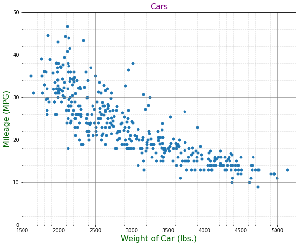
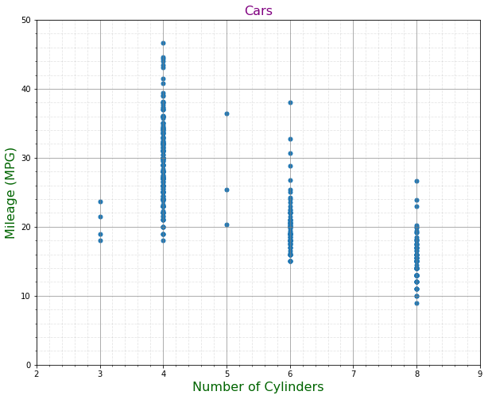
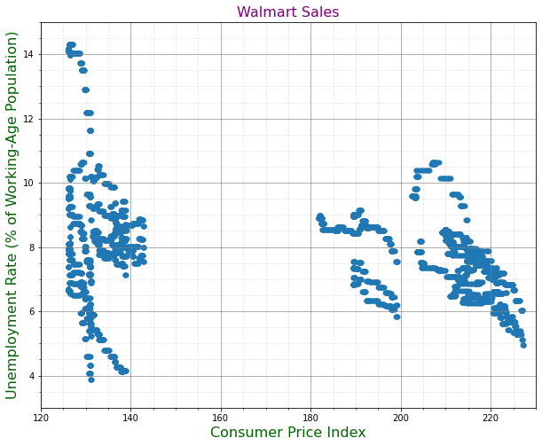
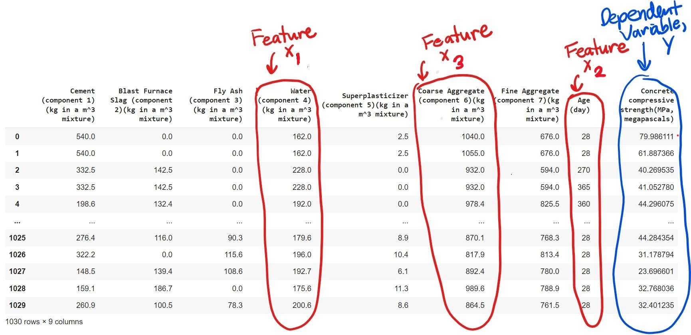
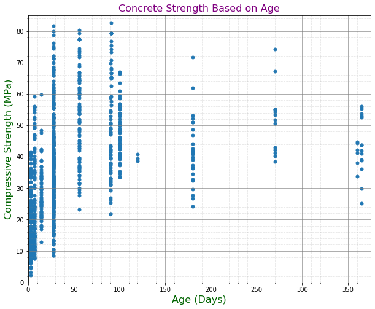

# Analyzing The Effects of Gradient Boosting on Multivariate Regression Analysis

For multivariate regression models, we are seeking to estimate the expected y based on the values for each of the p features of X which are fed as inputs into the regressor model F selected.

### Concept of Multivariate Regression Analysis
Similar to univariate locally weighted (LOWESS) regression, we want to use a non-parametric linear model to predict the y-values by applying weights to each observation row in X.  As discussed in Project 2, this process is performed by multiplying the nxn, diagonal matrix W by y and multiplying the same nxn, diagonal matrix W by the nxp matrix X and the beta vector of coefficients, n different times for each element of y (which is a column vector with shape nx1).  Each of the n matrices, W, are different from the others based on the Euclidean distances between the X observations they are being applied upon.  After calculating the Euclidean distance between each observation of X via the chosen kernel (i.e, tricubic, Epanechnikov, quartic, etc.), weights are appropriately applied closer to a value of 1 when the observations are closer together and closer to a value of 0 when the observations are farther apart.  This is calculated by subtracting each observation of X from X and then dividing by twice the value of tau.  Tau is the smoothing constant provided, and it creates more smoothly-shaped curves at higher values and more volatile/reactive curves at lower values.  As such, it is important to test out a variety of taus to determine an optimal tau for the data that minimizes the mean squared error (MSE) and mean absolute error (MAE).  The beta coefficients are determined by projecting the rows from the dot product of matrix W and y onto the column space of the dot product of W and X.  When you solve such a linear system in which the product of A and beta equals b, the column vector b is a linear combination of A, which is an orthogonal projection of b onto the vector subspace spanned by A's columns. The predicted values of y (which are the dot products of each observation in X and beta) will be used alongside X to interpolate additional X-values designated for testing that fall inside the convex hull of the training X-values to validate the accuracy of the model.  The convex hull is determined by the convex combination of the coordiantes of a point A and a point B, such that the convex combination is equal to the product of t and the coordinates of A, plus the product of the coordinates of B and the quantity (1-t), where t is any number between 0 and 1.  For multivariate regression, we will be determining how multiple features of X contribute to the dependent variable y, as opposed to a single X feature's contribution in univariate regression.  As a result, we will need to use a multi-dimensional interpolator.  In addition, our convex hull will contain all convex combinations of the k points in the n-dimensional Euclidean space, where k is the number of training observations we implemented and n is the number of features in our data.  A key point to make is that we must not extrapolate (and ensure that we only make predictions  within the range of X-values provided during the training of the model.  If we choose to force the model to have an intercept, then we will append a column of 1's and proceed with the remainder of the algorithm.

### Concept of Gradient Boosting
Gradient boosting builds upon the accuracy of any regressor model we choose by taking the predictions generated by the selected model and then adding on an additional component h, where h is the output of a decision tree such that h is equivalent to the inital "weak learner" regressor's prediction for each row observation of X subtracted from each actual value of y, respectively.  This process thus strengthens the initial regressors predictions and decreases the mean squared error (MSE) of the predicted y-values.  To do this, a decision tree is fit to the values of X and the values of X minus the predictions of the initial model for each respective observation of X.  This decision tree is then passed a new set of X observations to generate its final predictions.  The goal of gradient descent is to minimize the sum of squared errors for all the observations.  By taking the derivatives of the loss function (i.e., the MSE) for each observation of X with the goal of determining where the sum of the loss functions is minimized, we find that the derivatives equate to each F(X) minus each y, respectively.  As a result, we find that the residuals (i.e., y - F(X), for each y and observation X, respectively) are negative gradients.  By adding h to the initial regressor's predictions through gradient boosting, we are adding the residuals to the initial regressor model's predictions, which thus means we are adding negative gradients to the initial regressor predictions.  Since a single decision tree tends to be overfit, one may find it helpful to apply boosting with a random forest made up of an ensemble of multiple decision trees.

### Concept of Extreme Gradient Boosting (XGBoost)
In the case of extreme gradient boosting (XGB), we are applying gradient boosting to a decision tree regressor model.  The residuals are calculated and stored in the leaves of the tree for a given sample of the data after arbitrarily splitting on a value for each X feature.  The optimal split is selected by determining which split pair best minimizes the residuals, as measured by the Gain.  Gain is a measure of how much the accuracy of the model has improved for each split and incorporates lambda, a parameter that makes  the model less reactive to fluctuations in the individual data, and gamma, a parameter that provides the minimum improvement cutoff to continue splitting nodes, as hyperparameters to the function.  The split threshold is selected as the split value that maximized the Gain value.  This process continues until the model no longer can improve upon its accuracy, as reflected by smaller and smaller Gains, which ultimately become negative as further improvement is no longer possible.  The final output of the model is calculated by dividing the sum of the residuals by the sum of the number of residuals and the lambda hyperparameter.  This output is then multiplied by the learning rate of the model and added to the prediction that was generated by the initial model we chose to boost.  For a random forest, this XGB boosting process is repeated by creating as many trees specified by the number of estimators hyperparameter - in this case, the prediction adds the product of the learning rate and prediction from each decision tree to the initial prediction.
 
## Analysis and Visualization of Differences Between Multivariate Regression, Gradient Boosted Multivariate Regression, and Extreme Gradient Boosted Multivariate Regression

To analyze the differences between regular multivariate locally weighted regression (LOWESS) and boosted multivariate LOWESS, I selected four different datasets to apply these techniques to and evaluate the models' prediction accuracy.  The first three datasets I implemented were also used in Project 2.  My first dataset involved predicting the median house prices in Boston based on their number of rooms, crime level of the surrounding area, and distance from the heart of the city of Boston itself; the second dataset involved predicting a car's mileage based on its weight, number of cylinders, and engine size; and the third dataset I selected involved predicting the unemployment level based on weekly grocery store sales, the CPI, fuel prices, and temperature at that time.  The final dataset I selected involved predicting the compressive strength of concrete based on its water and course aggregate content, as well as its age.  I selected these particular sets of features from their respective datasets because they were all quantitative variables and seemed to be the most logically highly correlated with the dependet variable amongst the remaining features from their dataset.  I decided to not only compare LOWESS to gradient boosted LOWESS and extreme gradient boosting, but also to compare various kernels, tau values, and forced intercepts amongst the LOWESS models and various numbers of trees,  depths, alphas, and lambdas amongst the random forest XGB models.  From there, I compared the best performing LOWESS model from each dataset to the best performing gradient boosted and XGB models.  I based my decision for which models were best on their respective MSE and MAE values.  When comparing gradient boosted models, the best boosted model was selected based solely on its MSE to reduce the computational time required, but I returned to calculating both the MSE and MAE for comparing the gradient boosted LOWESS model with the LOWESS and XGB models.  In some situations, two kernels were the highest-performing LOWESS models because one kernel had a lower MSE, but the other kernel had a lower MAE.  In these cases, I compared both kernels for the LOWESS and gradient boosted models with the XGB models.  To best compare each model, I uilized 10 k-fold cross validation and scaled all input data prior to including them in my models when performing this validation.  First, I began my analysis by comparing five kernels - namely the tricubic, Epanechnikov, quartic, triweight, and triangular kernels - under eight levels of hyperparameter tau - namely 0.01, 0.05, 0.1, 0.5, 1, 1.25, 1.5, and 2.  I also compared each combination of the kernels and taus with and without forced intercepts.  I then continued my analysis by comparing 24 different XGB models via 10 k-fold cross-validation: I had random forests with 100 trees and 1000 trees, then I had random forests with the same number of trees but depths of 3 and 5, then I also had random forests with the same numbers of trees and levels of depth but with lambdas of 10, 20, or 50 and alphas of 1 or 5.  Once I determined which kernel, tau, and forced-intercept combinations performed best amongst the LOWESS models and which combinations of lambdas, alphas, depths, and numbers of decision trees performed best among the XGB models, I then compared them with the gradient boosted versions of the same LOWESS models.  When running these procedures on the Walmart Sales dataset, the run-time was taking seven hours and Google Colab was restricting my runtime and would not allow the code to finish running, so I had to reduce the k-fold validation splits from 10 to 2 when testing out the gradient boosted and XGB models and reduced the number of random states I looped through when comparing all three best-performing models from 100 to 2.  I also forced intercepts on all LOWESS and gradient boosted LOWESS models because these had consistently outperformed the LOWESS and gradient boosted LOWESS models on the other three datasets  Similarly, it took 5 hours to run my code for comparing out the three best-performing models and Google Colab restricted me from running the code any further, so I reduced the number of random states to 4 but kept the number of splits for the k-fold validation at 10.

### Boston Housing Prices Dataset
This dataset contains information pertaining to housing prices and potential contributing features to those price values, such as number of rooms and pupil-to-teacher ratios in local schools.  Below I have attached a screenshot of a sample of the dataset, including each of the dataset's original features.  For my multivariate analysis, I utilized rooms, crime level, and distance as the predictors and cmedv as the dependent variable.  I have also included graphs depicting each of the features against y (cmedv).

#### Features


#### Number of Rooms


#### Crime Rating


#### Distance from Boston


When testing kernels at a tau of 0.1, I also found a pair of kernels that showed a similar pattern of one being competitive on the MSE but not the MAE and vice versa.  In this case, the quartic kernel had an MSE of 31.23 and a smaller MAE of 3.41, but triweight had a lower MSE of 30.99 and an MAE of 3.39 Among random forests, the best MSE was generated by a forest of 1,000 trees and a depth of 3 with an MSE of approximately 35.88. 

While testing LOWESS models with a tau of 0.01, I found that the best kernel was Epanechnikov with an MSE of 32.34672116741398 and an MAE of 3.526820482364922; among kernels with a tau of 0.05, the best result was Epanechnikov with an MSE of 34.17 and an MAE of 3.486; for a tau of 0.1, the best kernel was also Epanechnikov with an MSE of 33.55 and an MAE of 3.42.  Interestingly, the best kernel was no longer Epanechnikov after increasing the tau further and the triweight kernel began to take the lead.  For example, among kernels using a tau of 0.5, the best MSE was generated by the triangular kernel with an MSE of 30.73 and an MAE of 3.326, but the kernel with the best MAE was triweight with a slightly larger MSE of 30.96 and an MAE of just 3.31.  When testing kernels at a tau of 1, the triweight kernel had the lowest MSE of 30.99 and an MAE of 3.39.  For models with a tau of 1.25, the best kernel was triweight with an MSE of 31.32 and an MAE of 3.43; with a tau of 1.5, triweight yet again exceled with an MSE of 31.61 and an MAE of 3.47.  Lastly, with a tau of 2, the best-performing kernel was triweight with an MSE of 32.35 and an MAE of 3.55. 

Among the XGB models, the best MSE of 23.120172091199883 was generated by a forest of 1,000 trees and a lambda of 10, with either an alpha of 1 or 5 (as both alpha values yielded the same MSEs).  Lastly, I performed 10 k-fold cross validation on the data with 100 different randoms states to compare the best-performing pair of triweight and triangular kernels with a tau of 0.5 (since the triweight kernel had the lower MAE and the triangular kernel had the lower MSE) with the gradient boosted versions of each kernel and the best-performing XGB model.  Ultimately, the XGB model won the competition with an MSE of just 22.04 and an MAE of only 3.12.

### Cars Dataset
This dataset contains information pertaining to car models and their features, such as weight and mileage.  Below I have attached a screenshot of a sample of the dataset, including each of the dataset's original features.  For my multivariate analysis, I utilized WGT, CYL, and ENG as the predictors and MPG as the dependent variable. I have also included graphs depicting each of the features against y (MPG).

#### Features


#### Car's Weight


#### Number of Cylinders


#### Engine Size


While testing LOWESS models with a tau of 0.01, I found that the best kernel was Epanechnikov with an MSE of 21.07 and an MAE of 3.276. When testing kernels at a tau of 0.05, I also found a pair of kernels that showed a similar pattern to the LOWESS model for the Boston Housing Prices dataset with a tau of 0.1, where one kernel is competitive on the MSE but not the MAE, and vice versa.  In this case, the triangular kernel had a lower MSE of 18.6383 and an MAE of 3.128, but the triweight kernel nad an MSE of 18.80 and a lower MAE of 3.1227. For a tau of 0.1, the best kernel was triangular with an MSE of 17.70 and an MAE of 3.038.  Interestingly, the next two tau values of 0.5 and 1 also had pairs of competitive kernels.  In the case of tau = 0.5, the triangular kernel had an ever-so-slightly lower MSE of 16.948 and an MAE of 3.006, while Epanechnikov had an MSE of 16.956 and very slightly lower MAE of 3.005; in the case of tau = 1, the triangular kernel again yielded the lower MSE of 17.07 and an MAE of 3.0169, but the tricubic kernel generated an MSE of 17.099 and an MAE of just 3.007.  Among models using a tau of 1.25, 1.5, and 2, triweight continued to be the winning kernel with MSEs of 17.07, 17.11, and 17.296, respectively.  The MAEs for these same models were 3.018, 3.04, and 3.081, respectively.

Among the XGB models, the best MSE of 15.745009216537454 was generated by a forest of 100 trees with a maximum depth of 5 and a lambda of 10, with either an alpha of 1 or 5 (as both alpha values yielded the same MSEs). I then performed 10 k-fold validation to compare the top performing pair of LOWESS models (i.e., the Triangular and Epanechnikov kernels with a tau of 0.5, for which the triangular kernel had the lower MSE and Epanechnikov had the lower MAE) with the gradient boosted versions of each kernel and the best-performing XGB model.  Ultimately, the XGB model won the competition with an MSE of only 15.85 and an MAE of 2.896.

### Walmart Sales Dataset
This dataset contains information pertaining to weekly Walmart Sales data and potential contributing factors to those sales, such as whether or not it was a holiday, the temperature at that time, and the consumer price index (CPI).  Below I have attached a screenshot of a sample of the dataset, including each of the dataset's original features.  For my multivariate analysis, I utilized Weekly_Sales, CPI, Temperature, and Fuel_Prices as the predictors and Unemployment as the dependent variable. I have also included graphs depicting each of the features against y (Unemployment).

#### Features


#### Weekly Sales


#### Consumer Price Index


#### Temperature


#### Fuel Prices


While testing LOWESS models with a tau of 0.01, I found that the best kernels were Epanechnikov, which had the lower MSE of 1.3360838154798635 and an MAE of 0.7174296028963587, and triangular, which had an MSE of 1.336083815479864 and the lower MAE of 0.7174296028963585. When testing kernels at both the taus of 0.05 and 0.1, I found that the best-performing kernel was Epanechnikov with an MSE and MAE of 1.3360831 and 0.7174283 for the tau of 0.05 and an MSE and MAE of 1.331 and 0.7177 for the tau of 0.1.  However, in the case wehre tau = 0.1, I found that the triweight kernel was also highly competitive with Epanechnikov because triweight resulted in an MSE of 1.334 and a lower MAE of 0.71717.  For a tau of 0.5 and 1, triweight agin proved to be the winning kernel with MSEs of 1.63 and 2.16, respectively.  The MAEs for these same models were 0.88 and 1.02, respectively.  I needed to reduced the number of tau values I tested for the Walmart dataset because Google Colab was restricting my runtime after 5-7 hours of running single blocks of code within my analysis of Walmart's data, so I strategically selected tau values of less than 2 because any setting above 1 had not previously performed as well as the smaller tau values at reducing MSE on the Boston Housing Prices or Cars datasets.

Among the XGB models, the best MSE of 1.139079 was generated by a forest of 100 trees with a maximum depth of 5 and a lambda of 50.  To save computing time, I decided not to continue testing varying levels of alpha for the Walmart dataset because changing this setting had not previously changed the MSE of the respective XGB model's predictions. I then performed 10 k-fold validation to compare the top performing pair of LOWESS models (i.e., the Epanechnikov and triweight kernels with a tau of 0.1, for which the Epanechnikov kernel had the lower MSE and triweight had the lower MAE) with the gradient boosted versions of each kernel and the best-performing XGB model.  Ultimately, the XGB model won the competition with an MSE of just 1.12 and an MAE of 3.12.


### Concrete Strength Dataset
This dataset contains information pertaining to the compressive strength of concrete and the component materials in that particular batch of concrete, such as its age, fly ash content, and its amounts and sizes of aggregate.  Below I have attached a screenshot of a sample of the dataset, including each of the dataset's original features.  For my multivariate analysis, I utilized water content, age, and coarse aggregate content as the predictors and compressive strength as the dependent variable. I have also included graphs depicting each of the features against y (Compressive Strength).

#### Features


#### Water Content


#### Days of Age


#### Course Aggregate Content


**I will be updating the numbers below next:**
While testing LOWESS models with a tau of 0.01, I found that the best kernel was Epanechnikov with an MSE of 21.07 and an MAE of 3.276. When testing kernels at a tau of 0.05, I also found a pair of kernels that showed a similar pattern to the LOWESS model for the Boston Housing Prices dataset with a tau of 0.1, where one kernel is competitive on the MSE but not the MAE, and vice versa.  In this case, the triangular kernel had a lower MSE of 18.6383 and an MAE of 3.128, but the triweight kernel nad an MSE of 18.80 and a lower MAE of 3.1227. For a tau of 0.1, the best kernel was triangular with an MSE of 17.70 and an MAE of 3.038.  Interestingly, the next two tau values of 0.5 and 1 also had pairs of competitive kernels.  In the case of tau = 0.5, the triangular kernel had a very slightly lower MSE of 16.948 and an MAE of 3.006, while Epanechnikov had an MSE of 16.956 and very slightly lower MAE of 3.005; in the case of tau = 1, the triangular kernel again yielded the lower MSE of 17.07 and an MAE of 3.0169, but the tricubic kernel generated an MSE of 17.099 and an MAE of just 3.007.  Among models using a tau of 1.25, 1.5, and 2, triweight continued to be the winning kernel with MSEs of 17.07, 17.11, and 17.296, respectively.  The MAEs for these same models were 3.018, 3.04, and 3.081, respectively.

Among the XGB models, the best MSE of 15.745009216537454 was generated by a forest of 100 trees with a maximum depth of 5 and a lambda of 10, with either an alpha of 1 or 5 (as both alpha values yielded the same MSEs). I then performed 10 k-fold validation to compare the top performing pair of LOWESS models (i.e., the Triangular and Epanechnikov kernels with a tau of 0.5, for which the triangular kernel had the lower MSE and Epanechnikov had the lower MAE) with the gradient boosted versions of each kernel and the best-performing XGB model.  Ultimately, the XGB model won the competition with an MSE of only 15.85 and an MAE of 2.896.


### Conclusions
Interestingly, I found that forcing an intercept always led to lower MSEs and MAEs.  I also thought it was interesting to note that tuning the alpha value for the XGB models did not seem to have a discernable effect upon the accuracy of the model.  Ultimately, I found that the XGB models consistently and quite significantly outperformed the regular gradient boosted and LOWESS models.  


### Code - Making Mathematical Comparisons and Plotting Results

Note: Please see my main Github repository (entitled Adv-Machine-Learning) for the code below saved as a .ipynb file named "Project_3.ipynb"). Thank you!

```
!pip install xlrd==1.2.0

# Import Statements
import numpy as np
import pandas as pd
from scipy.linalg import lstsq
from scipy.sparse.linalg import lsmr
import matplotlib.pyplot as plt
from scipy.interpolate import interp1d, griddata, LinearNDInterpolator, NearestNDInterpolator
from sklearn.ensemble import RandomForestRegressor
from sklearn.model_selection import KFold, train_test_split as tts
from sklearn.metrics import mean_squared_error as mse
from sklearn.metrics import mean_absolute_error as mae
from sklearn.preprocessing import StandardScaler
from sklearn.tree import DecisionTreeRegressor
import matplotlib.pyplot as plt
from matplotlib import pyplot
import xgboost as xgb
from scipy import linalg

# Setting up kernels and model definitions
# Tricubic Kernel
def Tricubic(x):
  if len(x.shape) == 1:
    x = x.reshape(-1,1)
  d = np.sqrt(np.sum(x**2,axis=1))
  return np.where(d>1,0,70/81*(1-d**3)**3)

# Quartic Kernel
def Quartic(x):
  if len(x.shape) == 1:
    x = x.reshape(-1,1)
  d = np.sqrt(np.sum(x**2,axis=1))
  return np.where(d>1,0,15/16*(1-d**2)**2)

# Epanechnikov Kernel
def Epanechnikov(x):
  if len(x.shape) == 1:
    x = x.reshape(-1,1)
  d = np.sqrt(np.sum(x**2,axis=1))
  return np.where(d>1,0,3/4*(1-d**2)) 
  
# Implementing new kernels that we have not previously used in class
# Triangular Kernel
def Triangular(x):
  if len(x.shape) == 1:
    x = x.reshape(-1,1)
  d = np.sqrt(np.sum(x**2,axis=1))
  return np.where(d>1,0,(1-np.abs(d))) 

# Triweight Kernel
def Triweight(x):
  if len(x.shape) == 1:
    x = x.reshape(-1,1)
  d = np.sqrt(np.sum(x**2,axis=1))
  return np.where(d>1,0,35/32*(1-d**2)**3) 
  
# Defining the locally weighted regression model

def lw_reg(X, y, xnew, kern, tau, intercept):
    # tau is called bandwidth K((x-x[i])/(2*tau))
    n = len(X) # the number of observations
    yest = np.zeros(n)

    if len(y.shape)==1: # here we make column vectors
      y = y.reshape(-1,1)

    if len(X.shape)==1:
      X = X.reshape(-1,1)
    
    if intercept:
      X1 = np.column_stack([np.ones((len(X),1)),X])
    else:
      X1 = X

    w = np.array([kern((X - X[i])/(2*tau)) for i in range(n)])

    #Looping through all X-points
    for i in range(n):          
        W = np.diag(w[:,i])
        b = np.transpose(X1).dot(W).dot(y)
        A = np.transpose(X1).dot(W).dot(X1)
        beta, res, rnk, s = lstsq(A, b)
        yest[i] = np.dot(X1[i],beta)
    if X.shape[1]==1:
      f = interp1d(X.flatten(),yest,fill_value='extrapolate')
    else:
      f = LinearNDInterpolator(X, yest)
    output = f(xnew)
    if sum(np.isnan(output))>0:
      g = NearestNDInterpolator(X,y.ravel()) 
      output[np.isnan(output)] = g(xnew[np.isnan(output)])
    return output
 
# Defining the Gradient Boosted locally weighted regression model
def boosted_lwr(X, y, xnew, kern, tau, intercept):
  # we need decision trees
  # for training the boosted method we use X and y
  Fx = lw_reg(X,y,X,kern,tau,intercept) # we need this for training the Decision Tree
  # Now train the Decision Tree on y_i - F(x_i)
  new_y = y - Fx
  tree_model = DecisionTreeRegressor(max_depth=2, random_state=123)
  tree_model.fit(X,new_y) # new_y is the difference between y and the initial predictions
  output = tree_model.predict(xnew) + lw_reg(X,y,xnew,kern,tau,intercept) # output = h_i + F(x_i)
  return output 
  
scale = StandardScaler()
  
# Boston Housing Prices Dataset
boston = pd.read_csv('Boston Housing Prices.csv')

X = boston[['crime','rooms','distance']].values
y = boston['cmedv'].values

# Make plots to visualize each X feature
fig, ax = plt.subplots(figsize=(10,8))
ax.set_xlim(0, 100)
ax.set_ylim(0, 51)
ax.scatter(x = boston['crime'], y = boston['cmedv'],s=25)
ax.set_xlabel('Crime Rating',fontsize=16,color='Darkgreen')
ax.set_ylabel('House Price (Tens of Thousands of Dollars)',fontsize=16,color='Darkgreen')
ax.set_title('Boston Housing Prices',fontsize=16,color='purple')
ax.grid(b=True,which='major', color ='grey', linestyle='-', alpha=0.8)
ax.grid(b=True,which='minor', color ='grey', linestyle='--', alpha=0.2)
ax.minorticks_on()

fig, ax = plt.subplots(figsize=(10,8))
ax.set_xlim(2, 9)
ax.set_ylim(0, 51)
ax.scatter(x = boston['rooms'], y = boston['cmedv'],s=25)
ax.set_xlabel('Number of Rooms',fontsize=16,color='Darkgreen')
ax.set_ylabel('House Price (Tens of Thousands of Dollars)',fontsize=16,color='Darkgreen')
ax.set_title('Boston Housing Prices',fontsize=16,color='purple')
ax.grid(b=True,which='major', color ='grey', linestyle='-', alpha=0.8)
ax.grid(b=True,which='minor', color ='grey', linestyle='--', alpha=0.2)
ax.minorticks_on()

fig, ax = plt.subplots(figsize=(10,8))
ax.set_xlim(0, 14)
ax.set_ylim(0, 51)
ax.scatter(x = boston['distance'], y = boston['cmedv'],s=25)
ax.set_xlabel('Distance from Boston',fontsize=16,color='Darkgreen')
ax.set_ylabel('House Price (Tens of Thousands of Dollars)',fontsize=16,color='Darkgreen')
ax.set_title('Boston Housing Prices',fontsize=16,color='purple')
ax.grid(b=True,which='major', color ='grey', linestyle='-', alpha=0.8)
ax.grid(b=True,which='minor', color ='grey', linestyle='--', alpha=0.2)
ax.minorticks_on()

# Testing Kernels, tau = 0.01
kf = KFold(n_splits=10,shuffle=True,random_state=410)
mse_tric_b1 = []
mse_epa_b1 = []
mse_quart_b1 = []
mse_trian_b1 = []
mse_triw_b1 = []
mae_tric_b1 = []
mae_epa_b1 = []
mae_quart_b1 = []
mae_trian_b1 = []
mae_triw_b1 = []

for idxtrain, idxtest in kf.split(X):
  ytrain = y[idxtrain]
  xtrain = X[idxtrain]
  ytest = y[idxtest]
  xtest = X[idxtest]
  xtrain = scale.fit_transform(xtrain)
  xtest = scale.transform(xtest)

  yhat_tri_T = lw_reg(xtrain, ytrain, xtest, Tricubic, 0.01, intercept=True)
  yhat_tri_F = lw_reg(xtrain, ytrain, xtest, Tricubic, 0.01, intercept=False)
  yhat_epa_T = lw_reg(xtrain, ytrain, xtest, Epanechnikov, 0.01, intercept=True)
  yhat_epa_F = lw_reg(xtrain, ytrain, xtest, Epanechnikov, 0.01, intercept=False)
  yhat_quart_T = lw_reg(xtrain, ytrain, xtest, Quartic, 0.01, intercept=True)
  yhat_quart_F = lw_reg(xtrain, ytrain, xtest, Quartic, 0.01, intercept=False)
  yhat_trian_T = lw_reg(xtrain, ytrain, xtest, Triangular, 0.01, intercept=True)
  yhat_trian_F = lw_reg(xtrain, ytrain, xtest, Triangular, 0.01, intercept=False)
  yhat_triw_T = lw_reg(xtrain, ytrain, xtest, Triweight, 0.01, intercept=True)
  yhat_triw_F = lw_reg(xtrain, ytrain, xtest, Triweight, 0.01, intercept=False)

  if(mse(ytest,yhat_tri_T) < mse(ytest,yhat_tri_F)):
    mse_tric_b1.append(mse(ytest,yhat_tri_T))
  else:
    mse_tric_b1.append(mse(ytest,yhat_tri_F))

  if(mse(ytest,yhat_epa_T) < mse(ytest,yhat_epa_F)):
    mse_epa_b1.append(mse(ytest,yhat_epa_T))
  else:
    mse_epa_b1.append(mse(ytest,yhat_epa_F))

  if(mse(ytest,yhat_quart_T) < mse(ytest,yhat_quart_F)):
    mse_quart_b1.append(mse(ytest,yhat_quart_T))
  else:
    mse_quart_b1.append(mse(ytest,yhat_quart_F))

  if(mse(ytest,yhat_trian_T) < mse(ytest,yhat_trian_F)):
    mse_trian_b1.append(mse(ytest,yhat_trian_T))
  else:
    mse_trian_b1.append(mse(ytest,yhat_trian_F))
  
  if(mse(ytest,yhat_triw_T) < mse(ytest,yhat_triw_F)):
    mse_triw_b1.append(mse(ytest,yhat_triw_T))
  else:
    mse_triw_b1.append(mse(ytest,yhat_triw_F))


  if(mae(ytest,yhat_tri_T) < mae(ytest,yhat_tri_F)):
    mae_tric_b1.append(mae(ytest,yhat_tri_T))
  else:
    mae_tric_b1.append(mae(ytest,yhat_tri_F))

  if(mae(ytest,yhat_epa_T) < mae(ytest,yhat_epa_F)):
    mae_epa_b1.append(mae(ytest,yhat_epa_T))
  else:
    mae_epa_b1.append(mae(ytest,yhat_epa_F))

  if(mae(ytest,yhat_quart_T) < mae(ytest,yhat_quart_F)):
    mae_quart_b1.append(mae(ytest,yhat_quart_T))
  else:
    mae_quart_b1.append(mae(ytest,yhat_quart_F))

  if(mae(ytest,yhat_trian_T) < mae(ytest,yhat_trian_F)):
    mae_trian_b1.append(mae(ytest,yhat_trian_T))
  else:
    mae_trian_b1.append(mae(ytest,yhat_trian_F))
  
  if(mae(ytest,yhat_triw_T) < mae(ytest,yhat_triw_F)):
    mae_triw_b1.append(mae(ytest,yhat_triw_T))
  else:
    mae_triw_b1.append(mae(ytest,yhat_triw_F))

print("The MSE for LOWESS with the tricubic kernel is: " + str(np.mean(mse_tric_b1)))
print("The MSE for LOWESS with the Epanechnikov kernel is: " + str(np.mean(mse_epa_b1)))
print("The MSE for LOWESS with the quartic kernel is: " + str(np.mean(mse_quart_b1)))
print("The MSE for LOWESS with the triangular kernel is: " + str(np.mean(mse_trian_b1)))
print("The MSE for LOWESS with the triweight kernel is: " + str(np.mean(mse_triw_b1)))
print("\n")
print("The MAE for LOWESS with the tricubic kernel is: " + str(np.mean(mae_tric_b1)))
print("The MAE for LOWESS with the Epanechnikov kernel is: " + str(np.mean(mae_epa_b1)))
print("The MAE for LOWESS with the quartic kernel is: " + str(np.mean(mae_quart_b1)))
print("The MAE for LOWESS with the triangular kernel is: " + str(np.mean(mae_trian_b1)))
print("The MAE for LOWESS with the triweight kernel is: " + str(np.mean(mae_triw_b1)))

# Testing Kernels, tau = 0.05
kf = KFold(n_splits=10,shuffle=True,random_state=410)
mse_tric_b2 = []
mse_epa_b2 = []
mse_quart_b2 = []
mse_trian_b2 = []
mse_triw_b2 = []
mae_tric_b2 = []
mae_epa_b2 = []
mae_quart_b2 = []
mae_trian_b2 = []
mae_triw_b2 = []

for idxtrain, idxtest in kf.split(X):
  ytrain = y[idxtrain]
  xtrain = X[idxtrain]
  ytest = y[idxtest]
  xtest = X[idxtest]
  xtrain = scale.fit_transform(xtrain)
  xtest = scale.transform(xtest)

  yhat_tri_T = lw_reg(xtrain, ytrain, xtest, Tricubic, 0.05, intercept=True)
  yhat_tri_F = lw_reg(xtrain, ytrain, xtest, Tricubic, 0.05, intercept=False)
  yhat_epa_T = lw_reg(xtrain, ytrain, xtest, Epanechnikov, 0.05, intercept=True)
  yhat_epa_F = lw_reg(xtrain, ytrain, xtest, Epanechnikov, 0.05, intercept=False)
  yhat_quart_T = lw_reg(xtrain, ytrain, xtest, Quartic, 0.05, intercept=True)
  yhat_quart_F = lw_reg(xtrain, ytrain, xtest, Quartic, 0.05, intercept=False)
  yhat_trian_T = lw_reg(xtrain, ytrain, xtest, Triangular, 0.05, intercept=True)
  yhat_trian_F = lw_reg(xtrain, ytrain, xtest, Triangular, 0.05, intercept=False)
  yhat_triw_T = lw_reg(xtrain, ytrain, xtest, Triweight, 0.05, intercept=True)
  yhat_triw_F = lw_reg(xtrain, ytrain, xtest, Triweight, 0.05, intercept=False)

  if(mse(ytest,yhat_tri_T) < mse(ytest,yhat_tri_F)):
    mse_tric_b2.append(mse(ytest,yhat_tri_T))
  else:
    mse_tric_b2.append(mse(ytest,yhat_tri_F))

  if(mse(ytest,yhat_epa_T) < mse(ytest,yhat_epa_F)):
    mse_epa_b2.append(mse(ytest,yhat_epa_T))
  else:
    mse_epa_b2.append(mse(ytest,yhat_epa_F))

  if(mse(ytest,yhat_quart_T) < mse(ytest,yhat_quart_F)):
    mse_quart_b2.append(mse(ytest,yhat_quart_T))
  else:
    mse_quart_b2.append(mse(ytest,yhat_quart_F))

  if(mse(ytest,yhat_trian_T) < mse(ytest,yhat_trian_F)):
    mse_trian_b2.append(mse(ytest,yhat_trian_T))
  else:
    mse_trian_b2.append(mse(ytest,yhat_trian_F))
  
  if(mse(ytest,yhat_triw_T) < mse(ytest,yhat_triw_F)):
    mse_triw_b2.append(mse(ytest,yhat_triw_T))
  else:
    mse_triw_b2.append(mse(ytest,yhat_triw_F))


  if(mae(ytest,yhat_tri_T) < mae(ytest,yhat_tri_F)):
    mae_tric_b2.append(mae(ytest,yhat_tri_T))
  else:
    mae_tric_b2.append(mae(ytest,yhat_tri_F))

  if(mae(ytest,yhat_epa_T) < mae(ytest,yhat_epa_F)):
    mae_epa_b2.append(mae(ytest,yhat_epa_T))
  else:
    mae_epa_b2.append(mae(ytest,yhat_epa_F))

  if(mae(ytest,yhat_quart_T) < mae(ytest,yhat_quart_F)):
    mae_quart_b2.append(mae(ytest,yhat_quart_T))
  else:
    mae_quart_b2.append(mae(ytest,yhat_quart_F))

  if(mae(ytest,yhat_trian_T) < mae(ytest,yhat_trian_F)):
    mae_trian_b2.append(mae(ytest,yhat_trian_T))
  else:
    mae_trian_b2.append(mae(ytest,yhat_trian_F))
  
  if(mae(ytest,yhat_triw_T) < mae(ytest,yhat_triw_F)):
    mae_triw_b2.append(mae(ytest,yhat_triw_T))
  else:
    mae_triw_b2.append(mae(ytest,yhat_triw_F))

print("The MSE for LOWESS with the tricubic kernel is: " + str(np.mean(mse_tric_b2)))
print("The MSE for LOWESS with the Epanechnikov kernel is: " + str(np.mean(mse_epa_b2)))
print("The MSE for LOWESS with the quartic kernel is: " + str(np.mean(mse_quart_b2)))
print("The MSE for LOWESS with the triangular kernel is: " + str(np.mean(mse_trian_b2)))
print("The MSE for LOWESS with the triweight kernel is: " + str(np.mean(mse_triw_b2)))
print("\n")
print("The MAE for LOWESS with the tricubic kernel is: " + str(np.mean(mae_tric_b2)))
print("The MAE for LOWESS with the Epanechnikov kernel is: " + str(np.mean(mae_epa_b2)))
print("The MAE for LOWESS with the quartic kernel is: " + str(np.mean(mae_quart_b2)))
print("The MAE for LOWESS with the triangular kernel is: " + str(np.mean(mae_trian_b2)))
print("The MAE for LOWESS with the triweight kernel is: " + str(np.mean(mae_triw_b2)))

# Testing Kernels, tau = 0.1
kf = KFold(n_splits=10,shuffle=True,random_state=410)
mse_tric_b3 = []
mse_epa_b3 = []
mse_quart_b3 = []
mse_trian_b3 = []
mse_triw_b3 = []
mae_tric_b3 = []
mae_epa_b3 = []
mae_quart_b3 = []
mae_trian_b3 = []
mae_triw_b3 = []

for idxtrain, idxtest in kf.split(X):
  ytrain = y[idxtrain]
  xtrain = X[idxtrain]
  ytest = y[idxtest]
  xtest = X[idxtest]
  xtrain = scale.fit_transform(xtrain)
  xtest = scale.transform(xtest)

  yhat_tri_T = lw_reg(xtrain, ytrain, xtest, Tricubic, 0.1, intercept=True)
  yhat_tri_F = lw_reg(xtrain, ytrain, xtest, Tricubic, 0.1, intercept=False)
  yhat_epa_T = lw_reg(xtrain, ytrain, xtest, Epanechnikov, 0.1, intercept=True)
  yhat_epa_F = lw_reg(xtrain, ytrain, xtest, Epanechnikov, 0.1, intercept=False)
  yhat_quart_T = lw_reg(xtrain, ytrain, xtest, Quartic, 0.1, intercept=True)
  yhat_quart_F = lw_reg(xtrain, ytrain, xtest, Quartic, 0.1, intercept=False)
  yhat_trian_T = lw_reg(xtrain, ytrain, xtest, Triangular, 0.1, intercept=True)
  yhat_trian_F = lw_reg(xtrain, ytrain, xtest, Triangular, 0.1, intercept=False)
  yhat_triw_T = lw_reg(xtrain, ytrain, xtest, Triweight, 0.1, intercept=True)
  yhat_triw_F = lw_reg(xtrain, ytrain, xtest, Triweight, 0.1, intercept=False)

  if(mse(ytest,yhat_tri_T) < mse(ytest,yhat_tri_F)):
    mse_tric_b3.append(mse(ytest,yhat_tri_T))
  else:
    mse_tric_b3.append(mse(ytest,yhat_tri_F))

  if(mse(ytest,yhat_epa_T) < mse(ytest,yhat_epa_F)):
    mse_epa_b3.append(mse(ytest,yhat_epa_T))
  else:
    mse_epa_b3.append(mse(ytest,yhat_epa_F))

  if(mse(ytest,yhat_quart_T) < mse(ytest,yhat_quart_F)):
    mse_quart_b3.append(mse(ytest,yhat_quart_T))
  else:
    mse_quart_b3.append(mse(ytest,yhat_quart_F))

  if(mse(ytest,yhat_trian_T) < mse(ytest,yhat_trian_F)):
    mse_trian_b3.append(mse(ytest,yhat_trian_T))
  else:
    mse_trian_b3.append(mse(ytest,yhat_trian_F))
  
  if(mse(ytest,yhat_triw_T) < mse(ytest,yhat_triw_F)):
    mse_triw_b3.append(mse(ytest,yhat_triw_T))
  else:
    mse_triw_b3.append(mse(ytest,yhat_triw_F))


  if(mae(ytest,yhat_tri_T) < mae(ytest,yhat_tri_F)):
    mae_tric_b3.append(mae(ytest,yhat_tri_T))
  else:
    mae_tric_b3.append(mae(ytest,yhat_tri_F))

  if(mae(ytest,yhat_epa_T) < mae(ytest,yhat_epa_F)):
    mae_epa_b3.append(mae(ytest,yhat_epa_T))
  else:
    mae_epa_b3.append(mae(ytest,yhat_epa_F))

  if(mae(ytest,yhat_quart_T) < mae(ytest,yhat_quart_F)):
    mae_quart_b3.append(mae(ytest,yhat_quart_T))
  else:
    mae_quart_b3.append(mae(ytest,yhat_quart_F))

  if(mae(ytest,yhat_trian_T) < mae(ytest,yhat_trian_F)):
    mae_trian_b3.append(mae(ytest,yhat_trian_T))
  else:
    mae_trian_b3.append(mae(ytest,yhat_trian_F))
  
  if(mae(ytest,yhat_triw_T) < mae(ytest,yhat_triw_F)):
    mae_triw_b3.append(mae(ytest,yhat_triw_T))
  else:
    mae_triw_b3.append(mae(ytest,yhat_triw_F))

print("The MSE for LOWESS with the tricubic kernel is: " + str(np.mean(mse_tric_b3)))
print("The MSE for LOWESS with the Epanechnikov kernel is: " + str(np.mean(mse_epa_b3)))
print("The MSE for LOWESS with the quartic kernel is: " + str(np.mean(mse_quart_b3)))
print("The MSE for LOWESS with the triangular kernel is: " + str(np.mean(mse_trian_b3)))
print("The MSE for LOWESS with the triweight kernel is: " + str(np.mean(mse_triw_b3)))
print("\n")
print("The MAE for LOWESS with the tricubic kernel is: " + str(np.mean(mae_tric_b3)))
print("The MAE for LOWESS with the Epanechnikov kernel is: " + str(np.mean(mae_epa_b3)))
print("The MAE for LOWESS with the quartic kernel is: " + str(np.mean(mae_quart_b3)))
print("The MAE for LOWESS with the triangular kernel is: " + str(np.mean(mae_trian_b3)))
print("The MAE for LOWESS with the triweight kernel is: " + str(np.mean(mae_triw_b3)))

# Testing Kernels, tau = 0.5
kf = KFold(n_splits=10,shuffle=True,random_state=410)
mse_tric_b4 = []
mse_epa_b4 = []
mse_quart_b4 = []
mse_trian_b4 = []
mse_triw_b4 = []
mae_tric_b4 = []
mae_epa_b4 = []
mae_quart_b4 = []
mae_trian_b4 = []
mae_triw_b4 = []

for idxtrain, idxtest in kf.split(X):
  ytrain = y[idxtrain]
  xtrain = X[idxtrain]
  ytest = y[idxtest]
  xtest = X[idxtest]
  xtrain = scale.fit_transform(xtrain)
  xtest = scale.transform(xtest)

  yhat_tri_T = lw_reg(xtrain, ytrain, xtest, Tricubic, 0.5, intercept=True)
  yhat_tri_F = lw_reg(xtrain, ytrain, xtest, Tricubic, 0.5, intercept=False)
  yhat_epa_T = lw_reg(xtrain, ytrain, xtest, Epanechnikov, 0.5, intercept=True)
  yhat_epa_F = lw_reg(xtrain, ytrain, xtest, Epanechnikov, 0.5, intercept=False)
  yhat_quart_T = lw_reg(xtrain, ytrain, xtest, Quartic, 0.5, intercept=True)
  yhat_quart_F = lw_reg(xtrain, ytrain, xtest, Quartic, 0.5, intercept=False)
  yhat_trian_T = lw_reg(xtrain, ytrain, xtest, Triangular, 0.5, intercept=True)
  yhat_trian_F = lw_reg(xtrain, ytrain, xtest, Triangular, 0.5, intercept=False)
  yhat_triw_T = lw_reg(xtrain, ytrain, xtest, Triweight, 0.5, intercept=True)
  yhat_triw_F = lw_reg(xtrain, ytrain, xtest, Triweight, 0.5, intercept=False)

  if(mse(ytest,yhat_tri_T) < mse(ytest,yhat_tri_F)):
    mse_tric_b4.append(mse(ytest,yhat_tri_T))
  else:
    mse_tric_b4.append(mse(ytest,yhat_tri_F))

  if(mse(ytest,yhat_epa_T) < mse(ytest,yhat_epa_F)):
    mse_epa_b4.append(mse(ytest,yhat_epa_T))
  else:
    mse_epa_b4.append(mse(ytest,yhat_epa_F))

  if(mse(ytest,yhat_quart_T) < mse(ytest,yhat_quart_F)):
    mse_quart_b4.append(mse(ytest,yhat_quart_T))
  else:
    mse_quart_b4.append(mse(ytest,yhat_quart_F))

  if(mse(ytest,yhat_trian_T) < mse(ytest,yhat_trian_F)):
    mse_trian_b4.append(mse(ytest,yhat_trian_T))
  else:
    mse_trian_b4.append(mse(ytest,yhat_trian_F))
  
  if(mse(ytest,yhat_triw_T) < mse(ytest,yhat_triw_F)):
    mse_triw_b4.append(mse(ytest,yhat_triw_T))
  else:
    mse_triw_b4.append(mse(ytest,yhat_triw_F))


  if(mae(ytest,yhat_tri_T) < mae(ytest,yhat_tri_F)):
    mae_tric_b4.append(mae(ytest,yhat_tri_T))
  else:
    mae_tric_b4.append(mae(ytest,yhat_tri_F))

  if(mae(ytest,yhat_epa_T) < mae(ytest,yhat_epa_F)):
    mae_epa_b4.append(mae(ytest,yhat_epa_T))
  else:
    mae_epa_b4.append(mae(ytest,yhat_epa_F))

  if(mae(ytest,yhat_quart_T) < mae(ytest,yhat_quart_F)):
    mae_quart_b4.append(mae(ytest,yhat_quart_T))
  else:
    mae_quart_b4.append(mae(ytest,yhat_quart_F))

  if(mae(ytest,yhat_trian_T) < mae(ytest,yhat_trian_F)):
    mae_trian_b4.append(mae(ytest,yhat_trian_T))
  else:
    mae_trian_b4.append(mae(ytest,yhat_trian_F))
  
  if(mae(ytest,yhat_triw_T) < mae(ytest,yhat_triw_F)):
    mae_triw_b4.append(mae(ytest,yhat_triw_T))
  else:
    mae_triw_b4.append(mae(ytest,yhat_triw_F))

print("The MSE for LOWESS with the tricubic kernel is: " + str(np.mean(mse_tric_b4)))
print("The MSE for LOWESS with the Epanechnikov kernel is: " + str(np.mean(mse_epa_b4)))
print("The MSE for LOWESS with the quartic kernel is: " + str(np.mean(mse_quart_b4)))
print("The MSE for LOWESS with the triangular kernel is: " + str(np.mean(mse_trian_b4)))
print("The MSE for LOWESS with the triweight kernel is: " + str(np.mean(mse_triw_b4)))
print("\n")
print("The MAE for LOWESS with the tricubic kernel is: " + str(np.mean(mae_tric_b4)))
print("The MAE for LOWESS with the Epanechnikov kernel is: " + str(np.mean(mae_epa_b4)))
print("The MAE for LOWESS with the quartic kernel is: " + str(np.mean(mae_quart_b4)))
print("The MAE for LOWESS with the triangular kernel is: " + str(np.mean(mae_trian_b4)))
print("The MAE for LOWESS with the triweight kernel is: " + str(np.mean(mae_triw_b4)))

# Testing Kernels, tau = 1
kf = KFold(n_splits=10,shuffle=True,random_state=410)
mse_tric_b5 = []
mse_epa_b5 = []
mse_quart_b5 = []
mse_trian_b5 = []
mse_triw_b5 = []
mae_tric_b5 = []
mae_epa_b5 = []
mae_quart_b5 = []
mae_trian_b5 = []
mae_triw_b5 = []

for idxtrain, idxtest in kf.split(X):
  ytrain = y[idxtrain]
  xtrain = X[idxtrain]
  ytest = y[idxtest]
  xtest = X[idxtest]
  xtrain = scale.fit_transform(xtrain)
  xtest = scale.transform(xtest)

  yhat_tri_T = lw_reg(xtrain, ytrain, xtest, Tricubic, 1, intercept=True)
  yhat_tri_F = lw_reg(xtrain, ytrain, xtest, Tricubic, 1, intercept=False)
  yhat_epa_T = lw_reg(xtrain, ytrain, xtest, Epanechnikov, 1, intercept=True)
  yhat_epa_F = lw_reg(xtrain, ytrain, xtest, Epanechnikov, 1, intercept=False)
  yhat_quart_T = lw_reg(xtrain, ytrain, xtest, Quartic, 1, intercept=True)
  yhat_quart_F = lw_reg(xtrain, ytrain, xtest, Quartic, 1, intercept=False)
  yhat_trian_T = lw_reg(xtrain, ytrain, xtest, Triangular, 1, intercept=True)
  yhat_trian_F = lw_reg(xtrain, ytrain, xtest, Triangular, 1, intercept=False)
  yhat_triw_T = lw_reg(xtrain, ytrain, xtest, Triweight, 1, intercept=True)
  yhat_triw_F = lw_reg(xtrain, ytrain, xtest, Triweight, 1, intercept=False)

  if(mse(ytest,yhat_tri_T) < mse(ytest,yhat_tri_F)):
    mse_tric_b5.append(mse(ytest,yhat_tri_T))
  else:
    mse_tric_b5.append(mse(ytest,yhat_tri_F))

  if(mse(ytest,yhat_epa_T) < mse(ytest,yhat_epa_F)):
    mse_epa_b5.append(mse(ytest,yhat_epa_T))
  else:
    mse_epa_b5.append(mse(ytest,yhat_epa_F))

  if(mse(ytest,yhat_quart_T) < mse(ytest,yhat_quart_F)):
    mse_quart_b5.append(mse(ytest,yhat_quart_T))
  else:
    mse_quart_b5.append(mse(ytest,yhat_quart_F))

  if(mse(ytest,yhat_trian_T) < mse(ytest,yhat_trian_F)):
    mse_trian_b5.append(mse(ytest,yhat_trian_T))
  else:
    mse_trian_b5.append(mse(ytest,yhat_trian_F))
  
  if(mse(ytest,yhat_triw_T) < mse(ytest,yhat_triw_F)):
    mse_triw_b5.append(mse(ytest,yhat_triw_T))
  else:
    mse_triw_b5.append(mse(ytest,yhat_triw_F))


  if(mae(ytest,yhat_tri_T) < mae(ytest,yhat_tri_F)):
    mae_tric_b5.append(mae(ytest,yhat_tri_T))
  else:
    mae_tric_b5.append(mae(ytest,yhat_tri_F))

  if(mae(ytest,yhat_epa_T) < mae(ytest,yhat_epa_F)):
    mae_epa_b5.append(mae(ytest,yhat_epa_T))
  else:
    mae_epa_b5.append(mae(ytest,yhat_epa_F))

  if(mae(ytest,yhat_quart_T) < mae(ytest,yhat_quart_F)):
    mae_quart_b5.append(mae(ytest,yhat_quart_T))
  else:
    mae_quart_b5.append(mae(ytest,yhat_quart_F))

  if(mae(ytest,yhat_trian_T) < mae(ytest,yhat_trian_F)):
    mae_trian_b5.append(mae(ytest,yhat_trian_T))
  else:
    mae_trian_b5.append(mae(ytest,yhat_trian_F))
  
  if(mae(ytest,yhat_triw_T) < mae(ytest,yhat_triw_F)):
    mae_triw_b5.append(mae(ytest,yhat_triw_T))
  else:
    mae_triw_b5.append(mae(ytest,yhat_triw_F))

print("The MSE for LOWESS with the tricubic kernel is: " + str(np.mean(mse_tric_b5)))
print("The MSE for LOWESS with the Epanechnikov kernel is: " + str(np.mean(mse_epa_b5)))
print("The MSE for LOWESS with the quartic kernel is: " + str(np.mean(mse_quart_b5)))
print("The MSE for LOWESS with the triangular kernel is: " + str(np.mean(mse_trian_b5)))
print("The MSE for LOWESS with the triweight kernel is: " + str(np.mean(mse_triw_b5)))
print("\n")
print("The MAE for LOWESS with the tricubic kernel is: " + str(np.mean(mae_tric_b5)))
print("The MAE for LOWESS with the Epanechnikov kernel is: " + str(np.mean(mae_epa_b5)))
print("The MAE for LOWESS with the quartic kernel is: " + str(np.mean(mae_quart_b5)))
print("The MAE for LOWESS with the triangular kernel is: " + str(np.mean(mae_trian_b5)))
print("The MAE for LOWESS with the triweight kernel is: " + str(np.mean(mae_triw_b5)))

# Testing Kernels, tau = 1.25
kf = KFold(n_splits=10,shuffle=True,random_state=410)
mse_tric_b6 = []
mse_epa_b6 = []
mse_quart_b6 = []
mse_trian_b6 = []
mse_triw_b6 = []
mae_tric_b6 = []
mae_epa_b6 = []
mae_quart_b6 = []
mae_trian_b6 = []
mae_triw_b6 = []

for idxtrain, idxtest in kf.split(X):
  ytrain = y[idxtrain]
  xtrain = X[idxtrain]
  ytest = y[idxtest]
  xtest = X[idxtest]
  xtrain = scale.fit_transform(xtrain)
  xtest = scale.transform(xtest)

  yhat_tri_T = lw_reg(xtrain, ytrain, xtest, Tricubic, 1.25, intercept=True)
  yhat_tri_F = lw_reg(xtrain, ytrain, xtest, Tricubic, 1.25, intercept=False)
  yhat_epa_T = lw_reg(xtrain, ytrain, xtest, Epanechnikov, 1.25, intercept=True)
  yhat_epa_F = lw_reg(xtrain, ytrain, xtest, Epanechnikov, 1.25, intercept=False)
  yhat_quart_T = lw_reg(xtrain, ytrain, xtest, Quartic, 1.25, intercept=True)
  yhat_quart_F = lw_reg(xtrain, ytrain, xtest, Quartic, 1.25, intercept=False)
  yhat_trian_T = lw_reg(xtrain, ytrain, xtest, Triangular, 1.25, intercept=True)
  yhat_trian_F = lw_reg(xtrain, ytrain, xtest, Triangular, 1.25, intercept=False)
  yhat_triw_T = lw_reg(xtrain, ytrain, xtest, Triweight, 1.25, intercept=True)
  yhat_triw_F = lw_reg(xtrain, ytrain, xtest, Triweight, 1.25, intercept=False)

  if(mse(ytest,yhat_tri_T) < mse(ytest,yhat_tri_F)):
    mse_tric_b6.append(mse(ytest,yhat_tri_T))
  else:
    mse_tric_b6.append(mse(ytest,yhat_tri_F))

  if(mse(ytest,yhat_epa_T) < mse(ytest,yhat_epa_F)):
    mse_epa_b6.append(mse(ytest,yhat_epa_T))
  else:
    mse_epa_b6.append(mse(ytest,yhat_epa_F))

  if(mse(ytest,yhat_quart_T) < mse(ytest,yhat_quart_F)):
    mse_quart_b6.append(mse(ytest,yhat_quart_T))
  else:
    mse_quart_b6.append(mse(ytest,yhat_quart_F))

  if(mse(ytest,yhat_trian_T) < mse(ytest,yhat_trian_F)):
    mse_trian_b6.append(mse(ytest,yhat_trian_T))
  else:
    mse_trian_b6.append(mse(ytest,yhat_trian_F))
  
  if(mse(ytest,yhat_triw_T) < mse(ytest,yhat_triw_F)):
    mse_triw_b6.append(mse(ytest,yhat_triw_T))
  else:
    mse_triw_b6.append(mse(ytest,yhat_triw_F))


  if(mae(ytest,yhat_tri_T) < mae(ytest,yhat_tri_F)):
    mae_tric_b6.append(mae(ytest,yhat_tri_T))
  else:
    mae_tric_b6.append(mae(ytest,yhat_tri_F))

  if(mae(ytest,yhat_epa_T) < mae(ytest,yhat_epa_F)):
    mae_epa_b6.append(mae(ytest,yhat_epa_T))
  else:
    mae_epa_b6.append(mae(ytest,yhat_epa_F))

  if(mae(ytest,yhat_quart_T) < mae(ytest,yhat_quart_F)):
    mae_quart_b6.append(mae(ytest,yhat_quart_T))
  else:
    mae_quart_b6.append(mae(ytest,yhat_quart_F))

  if(mae(ytest,yhat_trian_T) < mae(ytest,yhat_trian_F)):
    mae_trian_b6.append(mae(ytest,yhat_trian_T))
  else:
    mae_trian_b6.append(mae(ytest,yhat_trian_F))
  
  if(mae(ytest,yhat_triw_T) < mae(ytest,yhat_triw_F)):
    mae_triw_b6.append(mae(ytest,yhat_triw_T))
  else:
    mae_triw_b6.append(mae(ytest,yhat_triw_F))

print("The MSE for LOWESS with the tricubic kernel is: " + str(np.mean(mse_tric_b6)))
print("The MSE for LOWESS with the Epanechnikov kernel is: " + str(np.mean(mse_epa_b6)))
print("The MSE for LOWESS with the quartic kernel is: " + str(np.mean(mse_quart_b6)))
print("The MSE for LOWESS with the triangular kernel is: " + str(np.mean(mse_trian_b6)))
print("The MSE for LOWESS with the triweight kernel is: " + str(np.mean(mse_triw_b6)))
print("\n")
print("The MAE for LOWESS with the tricubic kernel is: " + str(np.mean(mae_tric_b6)))
print("The MAE for LOWESS with the Epanechnikov kernel is: " + str(np.mean(mae_epa_b6)))
print("The MAE for LOWESS with the quartic kernel is: " + str(np.mean(mae_quart_b6)))
print("The MAE for LOWESS with the triangular kernel is: " + str(np.mean(mae_trian_b6)))
print("The MAE for LOWESS with the triweight kernel is: " + str(np.mean(mae_triw_b6)))

# Testing Kernels, tau = 1.5
kf = KFold(n_splits=10,shuffle=True,random_state=410)
mse_tric_b7 = []
mse_epa_b7 = []
mse_quart_b7 = []
mse_trian_b7 = []
mse_triw_b7 = []
mae_tric_b7 = []
mae_epa_b7 = []
mae_quart_b7 = []
mae_trian_b7 = []
mae_triw_b7 = []

for idxtrain, idxtest in kf.split(X):
  ytrain = y[idxtrain]
  xtrain = X[idxtrain]
  ytest = y[idxtest]
  xtest = X[idxtest]
  xtrain = scale.fit_transform(xtrain)
  xtest = scale.transform(xtest)

  yhat_tri_T = lw_reg(xtrain, ytrain, xtest, Tricubic, 1.5, intercept=True)
  yhat_tri_F = lw_reg(xtrain, ytrain, xtest, Tricubic, 1.5, intercept=False)
  yhat_epa_T = lw_reg(xtrain, ytrain, xtest, Epanechnikov, 1.5, intercept=True)
  yhat_epa_F = lw_reg(xtrain, ytrain, xtest, Epanechnikov, 1.5, intercept=False)
  yhat_quart_T = lw_reg(xtrain, ytrain, xtest, Quartic, 1.5, intercept=True)
  yhat_quart_F = lw_reg(xtrain, ytrain, xtest, Quartic, 1.5, intercept=False)
  yhat_trian_T = lw_reg(xtrain, ytrain, xtest, Triangular, 1.5, intercept=True)
  yhat_trian_F = lw_reg(xtrain, ytrain, xtest, Triangular, 1.5, intercept=False)
  yhat_triw_T = lw_reg(xtrain, ytrain, xtest, Triweight, 1.5, intercept=True)
  yhat_triw_F = lw_reg(xtrain, ytrain, xtest, Triweight, 1.5, intercept=False)

  if(mse(ytest,yhat_tri_T) < mse(ytest,yhat_tri_F)):
    mse_tric_b7.append(mse(ytest,yhat_tri_T))
  else:
    mse_tric_b7.append(mse(ytest,yhat_tri_F))

  if(mse(ytest,yhat_epa_T) < mse(ytest,yhat_epa_F)):
    mse_epa_b7.append(mse(ytest,yhat_epa_T))
  else:
    mse_epa_b7.append(mse(ytest,yhat_epa_F))

  if(mse(ytest,yhat_quart_T) < mse(ytest,yhat_quart_F)):
    mse_quart_b7.append(mse(ytest,yhat_quart_T))
  else:
    mse_quart_b7.append(mse(ytest,yhat_quart_F))

  if(mse(ytest,yhat_trian_T) < mse(ytest,yhat_trian_F)):
    mse_trian_b7.append(mse(ytest,yhat_trian_T))
  else:
    mse_trian_b7.append(mse(ytest,yhat_trian_F))
  
  if(mse(ytest,yhat_triw_T) < mse(ytest,yhat_triw_F)):
    mse_triw_b7.append(mse(ytest,yhat_triw_T))
  else:
    mse_triw_b7.append(mse(ytest,yhat_triw_F))


  if(mae(ytest,yhat_tri_T) < mae(ytest,yhat_tri_F)):
    mae_tric_b7.append(mae(ytest,yhat_tri_T))
  else:
    mae_tric_b7.append(mae(ytest,yhat_tri_F))

  if(mae(ytest,yhat_epa_T) < mae(ytest,yhat_epa_F)):
    mae_epa_b7.append(mae(ytest,yhat_epa_T))
  else:
    mae_epa_b7.append(mae(ytest,yhat_epa_F))

  if(mae(ytest,yhat_quart_T) < mae(ytest,yhat_quart_F)):
    mae_quart_b7.append(mae(ytest,yhat_quart_T))
  else:
    mae_quart_b7.append(mae(ytest,yhat_quart_F))

  if(mae(ytest,yhat_trian_T) < mae(ytest,yhat_trian_F)):
    mae_trian_b7.append(mae(ytest,yhat_trian_T))
  else:
    mae_trian_b7.append(mae(ytest,yhat_trian_F))
  
  if(mae(ytest,yhat_triw_T) < mae(ytest,yhat_triw_F)):
    mae_triw_b7.append(mae(ytest,yhat_triw_T))
  else:
    mae_triw_b7.append(mae(ytest,yhat_triw_F))

print("The MSE for LOWESS with the tricubic kernel is: " + str(np.mean(mse_tric_b7)))
print("The MSE for LOWESS with the Epanechnikov kernel is: " + str(np.mean(mse_epa_b7)))
print("The MSE for LOWESS with the quartic kernel is: " + str(np.mean(mse_quart_b7)))
print("The MSE for LOWESS with the triangular kernel is: " + str(np.mean(mse_trian_b7)))
print("The MSE for LOWESS with the triweight kernel is: " + str(np.mean(mse_triw_b7)))
print("\n")
print("The MAE for LOWESS with the tricubic kernel is: " + str(np.mean(mae_tric_b7)))
print("The MAE for LOWESS with the Epanechnikov kernel is: " + str(np.mean(mae_epa_b7)))
print("The MAE for LOWESS with the quartic kernel is: " + str(np.mean(mae_quart_b7)))
print("The MAE for LOWESS with the triangular kernel is: " + str(np.mean(mae_trian_b7)))
print("The MAE for LOWESS with the triweight kernel is: " + str(np.mean(mae_triw_b7)))

# Testing Kernels, tau = 2
kf = KFold(n_splits=10,shuffle=True,random_state=410)
mse_tric_b8 = []
mse_epa_b8 = []
mse_quart_b8 = []
mse_trian_b8 = []
mse_triw_b8 = []
mae_tric_b8 = []
mae_epa_b8 = []
mae_quart_b8 = []
mae_trian_b8 = []
mae_triw_b8 = []

for idxtrain, idxtest in kf.split(X):
  ytrain = y[idxtrain]
  xtrain = X[idxtrain]
  ytest = y[idxtest]
  xtest = X[idxtest]
  xtrain = scale.fit_transform(xtrain)
  xtest = scale.transform(xtest)

  yhat_tri_T = lw_reg(xtrain, ytrain, xtest, Tricubic, 2, intercept=True)
  yhat_tri_F = lw_reg(xtrain, ytrain, xtest, Tricubic, 2, intercept=False)
  yhat_epa_T = lw_reg(xtrain, ytrain, xtest, Epanechnikov, 2, intercept=True)
  yhat_epa_F = lw_reg(xtrain, ytrain, xtest, Epanechnikov, 2, intercept=False)
  yhat_quart_T = lw_reg(xtrain, ytrain, xtest, Quartic, 2, intercept=True)
  yhat_quart_F = lw_reg(xtrain, ytrain, xtest, Quartic, 2, intercept=False)
  yhat_trian_T = lw_reg(xtrain, ytrain, xtest, Triangular, 2, intercept=True)
  yhat_trian_F = lw_reg(xtrain, ytrain, xtest, Triangular, 2, intercept=False)
  yhat_triw_T = lw_reg(xtrain, ytrain, xtest, Triweight, 2, intercept=True)
  yhat_triw_F = lw_reg(xtrain, ytrain, xtest, Triweight, 2, intercept=False)

  if(mse(ytest,yhat_tri_T) < mse(ytest,yhat_tri_F)):
    mse_tric_b8.append(mse(ytest,yhat_tri_T))
  else:
    mse_tric_b8.append(mse(ytest,yhat_tri_F))

  if(mse(ytest,yhat_epa_T) < mse(ytest,yhat_epa_F)):
    mse_epa_b8.append(mse(ytest,yhat_epa_T))
  else:
    mse_epa_b8.append(mse(ytest,yhat_epa_F))

  if(mse(ytest,yhat_quart_T) < mse(ytest,yhat_quart_F)):
    mse_quart_b8.append(mse(ytest,yhat_quart_T))
  else:
    mse_quart_b8.append(mse(ytest,yhat_quart_F))

  if(mse(ytest,yhat_trian_T) < mse(ytest,yhat_trian_F)):
    mse_trian_b8.append(mse(ytest,yhat_trian_T))
  else:
    mse_trian_b8.append(mse(ytest,yhat_trian_F))
  
  if(mse(ytest,yhat_triw_T) < mse(ytest,yhat_triw_F)):
    mse_triw_b8.append(mse(ytest,yhat_triw_T))
  else:
    mse_triw_b8.append(mse(ytest,yhat_triw_F))


  if(mae(ytest,yhat_tri_T) < mae(ytest,yhat_tri_F)):
    mae_tric_b8.append(mae(ytest,yhat_tri_T))
  else:
    mae_tric_b8.append(mae(ytest,yhat_tri_F))

  if(mae(ytest,yhat_epa_T) < mae(ytest,yhat_epa_F)):
    mae_epa_b8.append(mae(ytest,yhat_epa_T))
  else:
    mae_epa_b8.append(mae(ytest,yhat_epa_F))

  if(mae(ytest,yhat_quart_T) < mae(ytest,yhat_quart_F)):
    mae_quart_b8.append(mae(ytest,yhat_quart_T))
  else:
    mae_quart_b8.append(mae(ytest,yhat_quart_F))

  if(mae(ytest,yhat_trian_T) < mae(ytest,yhat_trian_F)):
    mae_trian_b8.append(mae(ytest,yhat_trian_T))
  else:
    mae_trian_b8.append(mae(ytest,yhat_trian_F))
  
  if(mae(ytest,yhat_triw_T) < mae(ytest,yhat_triw_F)):
    mae_triw_b8.append(mae(ytest,yhat_triw_T))
  else:
    mae_triw_b8.append(mae(ytest,yhat_triw_F))

print("The MSE for LOWESS with the tricubic kernel is: " + str(np.mean(mse_tric_b8)))
print("The MSE for LOWESS with the Epanechnikov kernel is: " + str(np.mean(mse_epa_b8)))
print("The MSE for LOWESS with the quartic kernel is: " + str(np.mean(mse_quart_b8)))
print("The MSE for LOWESS with the triangular kernel is: " + str(np.mean(mse_trian_b8)))
print("The MSE for LOWESS with the triweight kernel is: " + str(np.mean(mse_triw_b8)))
print("\n")
print("The MAE for LOWESS with the tricubic kernel is: " + str(np.mean(mae_tric_b8)))
print("The MAE for LOWESS with the Epanechnikov kernel is: " + str(np.mean(mae_epa_b8)))
print("The MAE for LOWESS with the quartic kernel is: " + str(np.mean(mae_quart_b8)))
print("The MAE for LOWESS with the triangular kernel is: " + str(np.mean(mae_trian_b8)))
print("The MAE for LOWESS with the triweight kernel is: " + str(np.mean(mae_triw_b8)))

# Testing XGB
kf = KFold(n_splits=10,shuffle=True,random_state=410)
mse_100 = []
mse_1000 = []
mse_100_l10 = []
mse_1000_l10 = []
mse_100_l50 = []
mse_1000_l50 = []
mse_100_d5 = []
mse_1000_d5 = []
mse_100_l10_d5 = []
mse_1000_l10_d5 = []
mse_100_l50_d5 = []
mse_1000_l50_d5 = []
mse_100_a5 = []
mse_1000_a5 = []
mse_100_l10_a5 = []
mse_1000_l10_a5 = []
mse_100_l50_a5 = []
mse_1000_l50_a5 = []
mse_100_d5_a5 = []
mse_1000_d5_a5 = []
mse_100_l10_d5_a5 = []
mse_1000_l10_d5_a5 = []
mse_100_l50_d5_a5 = []
mse_1000_l50_d5_a5 = []

for idxtrain, idxtest in kf.split(X):
  ytrain = y[idxtrain]
  xtrain = X[idxtrain]
  ytest = y[idxtest]
  xtest = X[idxtest]
  xtrain = scale.fit_transform(xtrain)
  xtest = scale.transform(xtest)

  model_xgb_1 = xgb.XGBRegressor(objective ='reg:squarederror',n_estimators=100,reg_lambda=20,alpha=1,gamma=10,max_depth=3)
  model_xgb_1.fit(xtrain,ytrain)
  yhat_xgb_1 = model_xgb_1.predict(xtest)

  model_xgb_2 = xgb.XGBRegressor(objective ='reg:squarederror',n_estimators=1000,reg_lambda=20,alpha=1,gamma=10,max_depth=3)
  model_xgb_2.fit(xtrain,ytrain)
  yhat_xgb_2 = model_xgb_2.predict(xtest)

  model_xgb_3 = xgb.XGBRegressor(objective ='reg:squarederror',n_estimators=100,reg_lambda=10,alpha=1,gamma=10,max_depth=3)
  model_xgb_3.fit(xtrain,ytrain)
  yhat_xgb_3 = model_xgb_3.predict(xtest)

  model_xgb_4 = xgb.XGBRegressor(objective ='reg:squarederror',n_estimators=1000,reg_lambda=10,alpha=1,gamma=10,max_depth=3)
  model_xgb_4.fit(xtrain,ytrain)
  yhat_xgb_4 = model_xgb_4.predict(xtest)

  model_xgb_5 = xgb.XGBRegressor(objective ='reg:squarederror',n_estimators=100,reg_lambda=50,alpha=1,gamma=10,max_depth=3)
  model_xgb_5.fit(xtrain,ytrain)
  yhat_xgb_5 = model_xgb_5.predict(xtest)

  model_xgb_6 = xgb.XGBRegressor(objective ='reg:squarederror',n_estimators=1000,reg_lambda=50,alpha=1,gamma=10,max_depth=3)
  model_xgb_6.fit(xtrain,ytrain)
  yhat_xgb_6 = model_xgb_6.predict(xtest)

  model_xgb_7 = xgb.XGBRegressor(objective ='reg:squarederror',n_estimators=100,reg_lambda=20,alpha=1,gamma=10,max_depth=5)
  model_xgb_7.fit(xtrain,ytrain)
  yhat_xgb_7 = model_xgb_7.predict(xtest)

  model_xgb_8 = xgb.XGBRegressor(objective ='reg:squarederror',n_estimators=1000,reg_lambda=20,alpha=1,gamma=10,max_depth=5)
  model_xgb_8.fit(xtrain,ytrain)
  yhat_xgb_8 = model_xgb_8.predict(xtest)

  model_xgb_9 = xgb.XGBRegressor(objective ='reg:squarederror',n_estimators=100,reg_lambda=10,alpha=1,gamma=10,max_depth=5)
  model_xgb_9.fit(xtrain,ytrain)
  yhat_xgb_9 = model_xgb_9.predict(xtest)

  model_xgb_10 = xgb.XGBRegressor(objective ='reg:squarederror',n_estimators=1000,reg_lambda=10,alpha=1,gamma=10,max_depth=5)
  model_xgb_10.fit(xtrain,ytrain)
  yhat_xgb_10 = model_xgb_10.predict(xtest)

  model_xgb_11 = xgb.XGBRegressor(objective ='reg:squarederror',n_estimators=100,reg_lambda=50,alpha=1,gamma=10,max_depth=5)
  model_xgb_11.fit(xtrain,ytrain)
  yhat_xgb_11 = model_xgb_11.predict(xtest)

  model_xgb_12 = xgb.XGBRegressor(objective ='reg:squarederror',n_estimators=1000,reg_lambda=50,alpha=1,gamma=10,max_depth=5)
  model_xgb_12.fit(xtrain,ytrain)
  yhat_xgb_12 = model_xgb_12.predict(xtest)

  model_xgb_13 = xgb.XGBRegressor(objective ='reg:squarederror',n_estimators=100,reg_lambda=20,alpha=5,gamma=10,max_depth=3)
  model_xgb_13.fit(xtrain,ytrain)
  yhat_xgb_13 = model_xgb_13.predict(xtest)

  model_xgb_14 = xgb.XGBRegressor(objective ='reg:squarederror',n_estimators=1000,reg_lambda=20,alpha=5,gamma=10,max_depth=3)
  model_xgb_14.fit(xtrain,ytrain)
  yhat_xgb_14 = model_xgb_14.predict(xtest)

  model_xgb_15 = xgb.XGBRegressor(objective ='reg:squarederror',n_estimators=100,reg_lambda=10,alpha=5,gamma=10,max_depth=3)
  model_xgb_15.fit(xtrain,ytrain)
  yhat_xgb_15 = model_xgb_15.predict(xtest)

  model_xgb_16 = xgb.XGBRegressor(objective ='reg:squarederror',n_estimators=1000,reg_lambda=10,alpha=5,gamma=10,max_depth=3)
  model_xgb_16.fit(xtrain,ytrain)
  yhat_xgb_16 = model_xgb_16.predict(xtest)

  model_xgb_17 = xgb.XGBRegressor(objective ='reg:squarederror',n_estimators=100,reg_lambda=50,alpha=5,gamma=10,max_depth=3)
  model_xgb_17.fit(xtrain,ytrain)
  yhat_xgb_17 = model_xgb_17.predict(xtest)

  model_xgb_18 = xgb.XGBRegressor(objective ='reg:squarederror',n_estimators=1000,reg_lambda=50,alpha=5,gamma=10,max_depth=3)
  model_xgb_18.fit(xtrain,ytrain)
  yhat_xgb_18 = model_xgb_18.predict(xtest)

  model_xgb_19 = xgb.XGBRegressor(objective ='reg:squarederror',n_estimators=100,reg_lambda=20,alpha=5,gamma=10,max_depth=5)
  model_xgb_19.fit(xtrain,ytrain)
  yhat_xgb_19 = model_xgb_19.predict(xtest)

  model_xgb_20 = xgb.XGBRegressor(objective ='reg:squarederror',n_estimators=1000,reg_lambda=20,alpha=5,gamma=10,max_depth=5)
  model_xgb_20.fit(xtrain,ytrain)
  yhat_xgb_20 = model_xgb_20.predict(xtest)

  model_xgb_21 = xgb.XGBRegressor(objective ='reg:squarederror',n_estimators=100,reg_lambda=10,alpha=5,gamma=10,max_depth=5)
  model_xgb_21.fit(xtrain,ytrain)
  yhat_xgb_21 = model_xgb_21.predict(xtest)

  model_xgb_22 = xgb.XGBRegressor(objective ='reg:squarederror',n_estimators=1000,reg_lambda=10,alpha=5,gamma=10,max_depth=5)
  model_xgb_22.fit(xtrain,ytrain)
  yhat_xgb_22 = model_xgb_22.predict(xtest)

  model_xgb_23 = xgb.XGBRegressor(objective ='reg:squarederror',n_estimators=100,reg_lambda=50,alpha=5,gamma=10,max_depth=5)
  model_xgb_23.fit(xtrain,ytrain)
  yhat_xgb_23 = model_xgb_23.predict(xtest)

  model_xgb_24 = xgb.XGBRegressor(objective ='reg:squarederror',n_estimators=1000,reg_lambda=50,alpha=5,gamma=10,max_depth=5)
  model_xgb_24.fit(xtrain,ytrain)
  yhat_xgb_24 = model_xgb_24.predict(xtest)

  mse_100.append(mse(ytest,yhat_xgb_1))
  mse_1000.append(mse(ytest,yhat_xgb_2))

  mse_100_l10.append(mse(ytest,yhat_xgb_3))
  mse_1000_l10.append(mse(ytest,yhat_xgb_4))

  mse_100_l50.append(mse(ytest,yhat_xgb_5))
  mse_1000_l50.append(mse(ytest,yhat_xgb_6))

  mse_100_d5.append(mse(ytest,yhat_xgb_7))
  mse_1000_d5.append(mse(ytest,yhat_xgb_8))

  mse_100_l10_d5.append(mse(ytest,yhat_xgb_9))
  mse_1000_l10_d5.append(mse(ytest,yhat_xgb_10))

  mse_100_l50_d5.append(mse(ytest,yhat_xgb_11))
  mse_1000_l50_d5.append(mse(ytest,yhat_xgb_12))

  mse_100_a5.append(mse(ytest,yhat_xgb_13))
  mse_1000_a5.append(mse(ytest,yhat_xgb_14))

  mse_100_l10_a5.append(mse(ytest,yhat_xgb_15))
  mse_1000_l10_a5.append(mse(ytest,yhat_xgb_16))

  mse_100_l50_a5.append(mse(ytest,yhat_xgb_17))
  mse_1000_l50_a5.append(mse(ytest,yhat_xgb_18))

  mse_100_d5_a5.append(mse(ytest,yhat_xgb_19))
  mse_1000_d5_a5.append(mse(ytest,yhat_xgb_20))

  mse_100_l10_d5_a5.append(mse(ytest,yhat_xgb_21))
  mse_1000_l10_d5_a5.append(mse(ytest,yhat_xgb_22))

  mse_100_l50_d5_a5.append(mse(ytest,yhat_xgb_23))
  mse_1000_l50_d5_a5.append(mse(ytest,yhat_xgb_24))

print("The MSE for 100 trees is: " + str(np.mean(mse_100)))
print("The MSE for 1000 trees is: " + str(np.mean(mse_1000)))

print("The MSE for 100 trees and a lambda of 10 is: " + str(np.mean(mse_100_l10)))
print("The MSE for 1000 trees and a lambda of 10 is: " + str(np.mean(mse_1000_l10)))

print("The MSE for 100 trees and a lambda of 50 is: " + str(np.mean(mse_100_l50)))
print("The MSE for 1000 trees and a lambda of 50 is: " + str(np.mean(mse_1000_l50)))

print("The MSE for 100 trees and a depth of 5 is: " + str(np.mean(mse_100_d5)))
print("The MSE for 1000 trees and a depth of 5 is: " + str(np.mean(mse_1000_d5)))

print("The MSE for 100 trees, depth of 5, and a lambda of 10 is: " + str(np.mean(mse_100_l10_d5)))
print("The MSE for 1000 trees, depth of 5, and a lambda of 10 is: " + str(np.mean(mse_1000_l10_d5)))

print("The MSE for 100 trees, depth of 5, and a lambda of 50 is: " + str(np.mean(mse_100_l50_d5)))
print("The MSE for 1000 trees, depth of 5, and a lambda of 50 is: " + str(np.mean(mse_1000_l50_d5)))

print("The MSE for 100 tres and an alpha of 5 is: " + str(np.mean(mse_100_a5)))
print("The MSE for 1000 trees and an alpha of 5 is: " + str(np.mean(mse_1000_a5)))

print("The MSE for 100 trees, lambda of 10, and an alpha of 5 is: " + str(np.mean(mse_100_l10_a5)))
print("The MSE for 1000 trees, lambda of 10, and an alpha of 5 is: " + str(np.mean(mse_1000_l10_a5)))

print("The MSE for 100 trees, lambda of 50, and an alpha of 5 is: " + str(np.mean(mse_100_l50_a5)))
print("The MSE for 1000 trees, lambda of 50, and an alpha of 5 is: " + str(np.mean(mse_1000_l50_a5)))

print("The MSE for 100 trees, depth of 5, and an alpha of 5 is: " + str(np.mean(mse_100_d5_a5)))
print("The MSE for 1000 trees, depth of 5, and an alpha of 5 is: " + str(np.mean(mse_1000_d5_a5)))

print("The MSE for 100 trees, lambda of 10, depth of 5, and an alpha of 5 is: " + str(np.mean(mse_100_l10_d5_a5)))
print("The MSE for 1000 trees, lambda of 10, depth of 5, and an alpha of 5 is: " + str(np.mean(mse_1000_l10_d5_a5)))

print("The MSE for 100 trees, lambda of 50, depth of 5, and an alpha of 5 is: " + str(np.mean(mse_100_l50_d5_a5)))
print("The MSE for 1000 trees, lambda of 50, depth of 5, and an alpha of 5 is: " + str(np.mean(mse_1000_l50_d5_a5)))

# Testing regular gradient boosting
kf = KFold(n_splits=10,shuffle=True,random_state=1234)

# We want more nested cross-validation

mse_lwr1_T = []
mse_lwr1_F = []
mse_lwr2_T = []
mse_lwr2_F = []
mse_blwr1_T = []
mse_blwr1_F = []
mse_blwr2_T = []
mse_blwr2_F = []
mse_xgb_1 = []
mse_xgb_2 = []

mae_lwr1_T = []
mae_lwr2_T = []
mae_lwr1_F = []
mae_lwr2_F = []
mae_blwr1_T = []
mae_blwr2_T = []
mae_blwr1_F = []
mae_blwr2_F = []
mae_xgb_1 = []
mae_xgb_2 = []

for i in range(100):
  kf = KFold(n_splits=10,shuffle=True,random_state=i)
  # this is the Cross-Validation Loop
  for idxtrain, idxtest in kf.split(X):
    xtrain = X[idxtrain]
    ytrain = y[idxtrain]
    ytest = y[idxtest]
    xtest = X[idxtest]

    xtrain = scale.fit_transform(xtrain)
    xtest = scale.transform(xtest)

    yhat_lwr1_T = lw_reg(xtrain,ytrain, xtest,Triweight,tau=0.5,intercept=True)
    yhat_lwr1_F = lw_reg(xtrain,ytrain, xtest,Triweight,tau=0.5,intercept=False)
    yhat_lwr2_T = lw_reg(xtrain,ytrain, xtest,Triangular,tau=0.5,intercept=True)
    yhat_lwr2_F = lw_reg(xtrain,ytrain, xtest,Triangular,tau=0.5,intercept=False)
    yhat_blwr1_T = boosted_lwr(xtrain,ytrain, xtest,Triweight,tau=0.5,intercept=True)
    yhat_blwr1_F = boosted_lwr(xtrain,ytrain, xtest,Triweight,tau=0.5,intercept=False)
    yhat_blwr2_T = boosted_lwr(xtrain,ytrain, xtest,Triangular,tau=0.5,intercept=True)
    yhat_blwr2_F = boosted_lwr(xtrain,ytrain, xtest,Triangular,tau=0.5,intercept=False)
    model_xgb_1 = xgb.XGBRegressor(objective ='reg:squarederror',n_estimators=1000,reg_lambda=10,alpha=1,gamma=10,max_depth=3)
    model_xgb_1.fit(xtrain,ytrain)
    yhat_xgb_1 = model_xgb_1.predict(xtest)
    model_xgb_2 = xgb.XGBRegressor(objective ='reg:squarederror',n_estimators=1000,reg_lambda=10,alpha=5,gamma=10,max_depth=3)
    model_xgb_2.fit(xtrain,ytrain)
    yhat_xgb_2 = model_xgb_2.predict(xtest)

    mse_lwr1_T.append(mse(ytest,yhat_lwr1_T))
    mse_lwr1_F.append(mse(ytest,yhat_lwr1_F))
    mse_lwr2_T.append(mse(ytest,yhat_lwr2_T))
    mse_lwr2_F.append(mse(ytest,yhat_lwr2_F))
    mse_blwr1_T.append(mse(ytest,yhat_blwr1_T))
    mse_blwr1_F.append(mse(ytest,yhat_blwr1_F))
    mse_blwr2_T.append(mse(ytest,yhat_blwr2_T))
    mse_blwr2_F.append(mse(ytest,yhat_blwr2_F))
    mse_xgb_1.append(mse(ytest, yhat_xgb_1))
    mse_xgb_2.append(mse(ytest, yhat_xgb_2))

    mae_lwr1_T.append(mae(ytest,yhat_lwr1_T))
    mae_lwr1_F.append(mae(ytest,yhat_lwr1_F))
    mae_lwr2_T.append(mae(ytest,yhat_lwr2_T))
    mae_lwr2_F.append(mae(ytest,yhat_lwr2_F))
    mae_blwr1_T.append(mae(ytest,yhat_blwr1_T))
    mae_blwr1_F.append(mae(ytest,yhat_blwr1_F))
    mae_blwr2_T.append(mae(ytest,yhat_blwr2_T))
    mae_blwr2_F.append(mae(ytest,yhat_blwr2_F))
    mae_xgb_1.append(mae(ytest, yhat_xgb_1))
    mae_xgb_2.append(mae(ytest, yhat_xgb_2))

print('The Cross-validated Mean Squared Error for triweight LWR with intercept is : ' + str(np.mean(mse_lwr1_T)))
print('The Cross-validated Mean Squared Error for triangular LWR with intercept is : ' + str(np.mean(mse_lwr2_T)))
print('The Cross-validated Mean Squared Error for triweight BLWR with intercept is : '+str(np.mean(mse_blwr1_T)))
print('The Cross-validated Mean Squared Error for triangular BLWR with intercept is : '+str(np.mean(mse_blwr2_T)))
print('The Cross-validated Mean Squared Error for XGB with 1000 trees and alpha of 1 is : '+str(np.mean(mse_xgb_1)))
print('The Cross-validated Mean Squared Error for XGB with 1000 trees and alpha of 5 is : '+str(np.mean(mse_xgb_2)))
print('The Cross-validated Mean Squared Error for triweight LWR without intercept is : ' + str(np.mean(mse_lwr1_F)))
print('The Cross-validated Mean Squared Error for triangular LWR without intercept is : ' + str(np.mean(mse_lwr2_F)))
print('The Cross-validated Mean Squared Error for triweight BLWR without intercept is : '+str(np.mean(mse_blwr1_F)))
print('The Cross-validated Mean Squared Error for triangular BLWR without intercept is : '+str(np.mean(mse_blwr2_F)))
print('\n')
print('The Cross-validated Mean Absolute Error for triweight LWR with intercept is : ' + str(np.mean(mae_lwr1_T)))
print('The Cross-validated Mean Absolute Error for triangular LWR with intercept is : ' + str(np.mean(mae_lwr2_T)))
print('The Cross-validated Mean Absolute Error for triweight BLWR with intercept is : '+str(np.mean(mae_blwr1_T)))
print('The Cross-validated Mean Absolute Error for triangular BLWR with intercept is : '+str(np.mean(mae_blwr2_T)))
print('The Cross-validated Mean Absolute Error for XGB with 1000 trees and alpha of 1 is : '+str(np.mean(mae_xgb_1)))
print('The Cross-validated Mean Absolute Error for XGB with 1000 trees and alpha of 5 is : '+str(np.mean(mae_xgb_2)))
print('The Cross-validated Mean Absolute Error for triweight LWR without intercept is : ' + str(np.mean(mae_lwr1_F)))
print('The Cross-validated Mean Absolute Error for triangular LWR without intercept is : ' + str(np.mean(mae_lwr2_F)))
print('The Cross-validated Mean Absolute Error for triweight BLWR without intercept is : '+str(np.mean(mae_blwr1_F)))
print('The Cross-validated Mean Absolute Error for triangular BLWR without intercept is : '+str(np.mean(mae_blwr2_F)))

# Making plots

# Cars Dataset
cars = pd.read_csv('cars.csv')

X = cars[['ENG', 'CYL', 'WGT']].values
y = cars['MPG'].values

#  Make plots to visualize each X feature
fig, ax = plt.subplots(figsize=(10,8))
ax.set_xlim(25, 500)
ax.set_ylim(0, 50)
ax.scatter(x = cars['ENG'], y = cars['MPG'],s=25)
ax.set_xlabel('Engine Horse Power',fontsize=16,color='Darkgreen')
ax.set_ylabel('Mileage (MPG)',fontsize=16,color='Darkgreen')
ax.set_title('Cars',fontsize=16,color='purple')
ax.grid(b=True,which='major', color ='grey', linestyle='-', alpha=0.8)
ax.grid(b=True,which='minor', color ='grey', linestyle='--', alpha=0.2)
ax.minorticks_on()

fig, ax = plt.subplots(figsize=(10,8))
ax.set_xlim(2, 9)
ax.set_ylim(0, 50)
ax.scatter(x = cars['CYL'], y = cars['MPG'],s=25)
ax.set_xlabel('Number of Cylinders',fontsize=16,color='Darkgreen')
ax.set_ylabel('Mileage (MPG)',fontsize=16,color='Darkgreen')
ax.set_title('Cars',fontsize=16,color='purple')
ax.grid(b=True,which='major', color ='grey', linestyle='-', alpha=0.8)
ax.grid(b=True,which='minor', color ='grey', linestyle='--', alpha=0.2)
ax.minorticks_on()

fig, ax = plt.subplots(figsize=(10,8))
ax.set_xlim(1500, 5250)
ax.set_ylim(0, 50)
ax.scatter(x = cars['WGT'], y = cars['MPG'],s=25)
ax.set_xlabel('Weight of Car (lbs.)',fontsize=16,color='Darkgreen')
ax.set_ylabel('Mileage (MPG)',fontsize=16,color='Darkgreen')
ax.set_title('Cars',fontsize=16,color='purple')
ax.grid(b=True,which='major', color ='grey', linestyle='-', alpha=0.8)
ax.grid(b=True,which='minor', color ='grey', linestyle='--', alpha=0.2)
ax.minorticks_on()

# Testing Kernels, tau = 0.01
kf = KFold(n_splits=10,shuffle=True,random_state=410)
mse_tric_c1 = []
mse_epa_c1 = []
mse_quart_c1 = []
mse_trian_c1 = []
mse_triw_c1 = []
mae_tric_c1 = []
mae_epa_c1 = []
mae_quart_c1 = []
mae_trian_c1 = []
mae_triw_c1 = []

for idxtrain, idxtest in kf.split(X):
  ytrain = y[idxtrain]
  xtrain = X[idxtrain]
  ytest = y[idxtest]
  xtest = X[idxtest]

  xtrain = scale.fit_transform(xtrain)
  xtest = scale.transform(xtest)

  yhat_tri_T = lw_reg(xtrain, ytrain, xtest, Tricubic, 0.01, intercept=True)
  yhat_tri_F = lw_reg(xtrain, ytrain, xtest, Tricubic, 0.01, intercept=False)
  yhat_epa_T = lw_reg(xtrain, ytrain, xtest, Epanechnikov, 0.01, intercept=True)
  yhat_epa_F = lw_reg(xtrain, ytrain, xtest, Epanechnikov, 0.01, intercept=False)
  yhat_quart_T = lw_reg(xtrain, ytrain, xtest, Quartic, 0.01, intercept=True)
  yhat_quart_F = lw_reg(xtrain, ytrain, xtest, Quartic, 0.01, intercept=False)
  yhat_trian_T = lw_reg(xtrain, ytrain, xtest, Triangular, 0.01, intercept=True)
  yhat_trian_F = lw_reg(xtrain, ytrain, xtest, Triangular, 0.01, intercept=False)
  yhat_triw_T = lw_reg(xtrain, ytrain, xtest, Triweight, 0.01, intercept=True)
  yhat_triw_F = lw_reg(xtrain, ytrain, xtest, Triweight, 0.01, intercept=False)

  if(mse(ytest,yhat_tri_T) < mse(ytest,yhat_tri_F)):
    mse_tric_c1.append(mse(ytest,yhat_tri_T))
  else:
    mse_tric_c1.append(mse(ytest,yhat_tri_F))

  if(mse(ytest,yhat_epa_T) < mse(ytest,yhat_epa_F)):
    mse_epa_c1.append(mse(ytest,yhat_epa_T))
  else:
    mse_epa_c1.append(mse(ytest,yhat_epa_F))

  if(mse(ytest,yhat_quart_T) < mse(ytest,yhat_quart_F)):
    mse_quart_c1.append(mse(ytest,yhat_quart_T))
  else:
    mse_quart_c1.append(mse(ytest,yhat_quart_F))

  if(mse(ytest,yhat_trian_T) < mse(ytest,yhat_trian_F)):
    mse_trian_c1.append(mse(ytest,yhat_trian_T))
  else:
    mse_trian_c1.append(mse(ytest,yhat_trian_F))
  
  if(mse(ytest,yhat_triw_T) < mse(ytest,yhat_triw_F)):
    mse_triw_c1.append(mse(ytest,yhat_triw_T))
  else:
    mse_triw_c1.append(mse(ytest,yhat_triw_F))


  if(mae(ytest,yhat_tri_T) < mae(ytest,yhat_tri_F)):
    mae_tric_c1.append(mae(ytest,yhat_tri_T))
  else:
    mae_tric_c1.append(mae(ytest,yhat_tri_F))

  if(mae(ytest,yhat_epa_T) < mae(ytest,yhat_epa_F)):
    mae_epa_c1.append(mae(ytest,yhat_epa_T))
  else:
    mae_epa_c1.append(mae(ytest,yhat_epa_F))

  if(mae(ytest,yhat_quart_T) < mae(ytest,yhat_quart_F)):
    mae_quart_c1.append(mae(ytest,yhat_quart_T))
  else:
    mae_quart_c1.append(mae(ytest,yhat_quart_F))

  if(mae(ytest,yhat_trian_T) < mae(ytest,yhat_trian_F)):
    mae_trian_c1.append(mae(ytest,yhat_trian_T))
  else:
    mae_trian_c1.append(mae(ytest,yhat_trian_F))
  
  if(mae(ytest,yhat_triw_T) < mae(ytest,yhat_triw_F)):
    mae_triw_c1.append(mae(ytest,yhat_triw_T))
  else:
    mae_triw_c1.append(mae(ytest,yhat_triw_F))

print("The MSE for LOWESS with the tricubic kernel is: " + str(np.mean(mse_tric_c1)))
print("The MSE for LOWESS with the Epanechnikov kernel is: " + str(np.mean(mse_epa_c1)))
print("The MSE for LOWESS with the quartic kernel is: " + str(np.mean(mse_quart_c1)))
print("The MSE for LOWESS with the triangular kernel is: " + str(np.mean(mse_trian_c1)))
print("The MSE for LOWESS with the triweight kernel is: " + str(np.mean(mse_triw_c1)))
print("\n")
print("The MAE for LOWESS with the tricubic kernel is: " + str(np.mean(mae_tric_c1)))
print("The MAE for LOWESS with the Epanechnikov kernel is: " + str(np.mean(mae_epa_c1)))
print("The MAE for LOWESS with the quartic kernel is: " + str(np.mean(mae_quart_c1)))
print("The MAE for LOWESS with the triangular kernel is: " + str(np.mean(mae_trian_c1)))
print("The MAE for LOWESS with the triweight kernel is: " + str(np.mean(mae_triw_c1)))

# Testing Kernels, tau = 0.05
kf = KFold(n_splits=10,shuffle=True,random_state=410)
mse_tric_c2 = []
mse_epa_c2 = []
mse_quart_c2 = []
mse_trian_c2 = []
mse_triw_c2 = []
mae_tric_c2 = []
mae_epa_c2 = []
mae_quart_c2 = []
mae_trian_c2 = []
mae_triw_c2 = []

for idxtrain, idxtest in kf.split(X):
  ytrain = y[idxtrain]
  xtrain = X[idxtrain]
  ytest = y[idxtest]
  xtest = X[idxtest]
  xtrain = scale.fit_transform(xtrain)
  xtest = scale.transform(xtest)

  yhat_tri_T = lw_reg(xtrain, ytrain, xtest, Tricubic, 0.05, intercept=True)
  yhat_tri_F = lw_reg(xtrain, ytrain, xtest, Tricubic, 0.05, intercept=False)
  yhat_epa_T = lw_reg(xtrain, ytrain, xtest, Epanechnikov, 0.05, intercept=True)
  yhat_epa_F = lw_reg(xtrain, ytrain, xtest, Epanechnikov, 0.05, intercept=False)
  yhat_quart_T = lw_reg(xtrain, ytrain, xtest, Quartic, 0.05, intercept=True)
  yhat_quart_F = lw_reg(xtrain, ytrain, xtest, Quartic, 0.05, intercept=False)
  yhat_trian_T = lw_reg(xtrain, ytrain, xtest, Triangular, 0.05, intercept=True)
  yhat_trian_F = lw_reg(xtrain, ytrain, xtest, Triangular, 0.05, intercept=False)
  yhat_triw_T = lw_reg(xtrain, ytrain, xtest, Triweight, 0.05, intercept=True)
  yhat_triw_F = lw_reg(xtrain, ytrain, xtest, Triweight, 0.05, intercept=False)

  if(mse(ytest,yhat_tri_T) < mse(ytest,yhat_tri_F)):
    mse_tric_c2.append(mse(ytest,yhat_tri_T))
  else:
    mse_tric_c2.append(mse(ytest,yhat_tri_F))

  if(mse(ytest,yhat_epa_T) < mse(ytest,yhat_epa_F)):
    mse_epa_c2.append(mse(ytest,yhat_epa_T))
  else:
    mse_epa_c2.append(mse(ytest,yhat_epa_F))

  if(mse(ytest,yhat_quart_T) < mse(ytest,yhat_quart_F)):
    mse_quart_c2.append(mse(ytest,yhat_quart_T))
  else:
    mse_quart_c2.append(mse(ytest,yhat_quart_F))

  if(mse(ytest,yhat_trian_T) < mse(ytest,yhat_trian_F)):
    mse_trian_c2.append(mse(ytest,yhat_trian_T))
  else:
    mse_trian_c2.append(mse(ytest,yhat_trian_F))
  
  if(mse(ytest,yhat_triw_T) < mse(ytest,yhat_triw_F)):
    mse_triw_c2.append(mse(ytest,yhat_triw_T))
  else:
    mse_triw_c2.append(mse(ytest,yhat_triw_F))


  if(mae(ytest,yhat_tri_T) < mae(ytest,yhat_tri_F)):
    mae_tric_c2.append(mae(ytest,yhat_tri_T))
  else:
    mae_tric_c2.append(mae(ytest,yhat_tri_F))

  if(mae(ytest,yhat_epa_T) < mae(ytest,yhat_epa_F)):
    mae_epa_c2.append(mae(ytest,yhat_epa_T))
  else:
    mae_epa_c2.append(mae(ytest,yhat_epa_F))

  if(mae(ytest,yhat_quart_T) < mae(ytest,yhat_quart_F)):
    mae_quart_c2.append(mae(ytest,yhat_quart_T))
  else:
    mae_quart_c2.append(mae(ytest,yhat_quart_F))

  if(mae(ytest,yhat_trian_T) < mae(ytest,yhat_trian_F)):
    mae_trian_c2.append(mae(ytest,yhat_trian_T))
  else:
    mae_trian_c2.append(mae(ytest,yhat_trian_F))
  
  if(mae(ytest,yhat_triw_T) < mae(ytest,yhat_triw_F)):
    mae_triw_c2.append(mae(ytest,yhat_triw_T))
  else:
    mae_triw_c2.append(mae(ytest,yhat_triw_F))

print("The MSE for LOWESS with the tricubic kernel is: " + str(np.mean(mse_tric_c2)))
print("The MSE for LOWESS with the Epanechnikov kernel is: " + str(np.mean(mse_epa_c2)))
print("The MSE for LOWESS with the quartic kernel is: " + str(np.mean(mse_quart_c2)))
print("The MSE for LOWESS with the triangular kernel is: " + str(np.mean(mse_trian_c2)))
print("The MSE for LOWESS with the triweight kernel is: " + str(np.mean(mse_triw_c2)))
print("\n")
print("The MAE for LOWESS with the tricubic kernel is: " + str(np.mean(mae_tric_c2)))
print("The MAE for LOWESS with the Epanechnikov kernel is: " + str(np.mean(mae_epa_c2)))
print("The MAE for LOWESS with the quartic kernel is: " + str(np.mean(mae_quart_c2)))
print("The MAE for LOWESS with the triangular kernel is: " + str(np.mean(mae_trian_c2)))
print("The MAE for LOWESS with the triweight kernel is: " + str(np.mean(mae_triw_c2)))

# Testing Kernels, tau = 0.1
kf = KFold(n_splits=10,shuffle=True,random_state=410)
mse_tric_c3 = []
mse_epa_c3 = []
mse_quart_c3 = []
mse_trian_c3 = []
mse_triw_c3 = []
mae_tric_c3 = []
mae_epa_c3 = []
mae_quart_c3 = []
mae_trian_c3 = []
mae_triw_c3 = []

for idxtrain, idxtest in kf.split(X):
  ytrain = y[idxtrain]
  xtrain = X[idxtrain]
  ytest = y[idxtest]
  xtest = X[idxtest]
  xtrain = scale.fit_transform(xtrain)
  xtest = scale.transform(xtest)

  yhat_tri_T = lw_reg(xtrain, ytrain, xtest, Tricubic, 0.1, intercept=True)
  yhat_tri_F = lw_reg(xtrain, ytrain, xtest, Tricubic, 0.1, intercept=False)
  yhat_epa_T = lw_reg(xtrain, ytrain, xtest, Epanechnikov, 0.1, intercept=True)
  yhat_epa_F = lw_reg(xtrain, ytrain, xtest, Epanechnikov, 0.1, intercept=False)
  yhat_quart_T = lw_reg(xtrain, ytrain, xtest, Quartic, 0.1, intercept=True)
  yhat_quart_F = lw_reg(xtrain, ytrain, xtest, Quartic, 0.1, intercept=False)
  yhat_trian_T = lw_reg(xtrain, ytrain, xtest, Triangular, 0.1, intercept=True)
  yhat_trian_F = lw_reg(xtrain, ytrain, xtest, Triangular, 0.1, intercept=False)
  yhat_triw_T = lw_reg(xtrain, ytrain, xtest, Triweight, 0.1, intercept=True)
  yhat_triw_F = lw_reg(xtrain, ytrain, xtest, Triweight, 0.1, intercept=False)

  if(mse(ytest,yhat_tri_T) < mse(ytest,yhat_tri_F)):
    mse_tric_c3.append(mse(ytest,yhat_tri_T))
  else:
    mse_tric_c3.append(mse(ytest,yhat_tri_F))

  if(mse(ytest,yhat_epa_T) < mse(ytest,yhat_epa_F)):
    mse_epa_c3.append(mse(ytest,yhat_epa_T))
  else:
    mse_epa_c3.append(mse(ytest,yhat_epa_F))

  if(mse(ytest,yhat_quart_T) < mse(ytest,yhat_quart_F)):
    mse_quart_c3.append(mse(ytest,yhat_quart_T))
  else:
    mse_quart_c3.append(mse(ytest,yhat_quart_F))

  if(mse(ytest,yhat_trian_T) < mse(ytest,yhat_trian_F)):
    mse_trian_c3.append(mse(ytest,yhat_trian_T))
  else:
    mse_trian_c3.append(mse(ytest,yhat_trian_F))
  
  if(mse(ytest,yhat_triw_T) < mse(ytest,yhat_triw_F)):
    mse_triw_c3.append(mse(ytest,yhat_triw_T))
  else:
    mse_triw_c3.append(mse(ytest,yhat_triw_F))


  if(mae(ytest,yhat_tri_T) < mae(ytest,yhat_tri_F)):
    mae_tric_c3.append(mae(ytest,yhat_tri_T))
  else:
    mae_tric_c3.append(mae(ytest,yhat_tri_F))

  if(mae(ytest,yhat_epa_T) < mae(ytest,yhat_epa_F)):
    mae_epa_c3.append(mae(ytest,yhat_epa_T))
  else:
    mae_epa_c3.append(mae(ytest,yhat_epa_F))

  if(mae(ytest,yhat_quart_T) < mae(ytest,yhat_quart_F)):
    mae_quart_c3.append(mae(ytest,yhat_quart_T))
  else:
    mae_quart_c3.append(mae(ytest,yhat_quart_F))

  if(mae(ytest,yhat_trian_T) < mae(ytest,yhat_trian_F)):
    mae_trian_c3.append(mae(ytest,yhat_trian_T))
  else:
    mae_trian_c3.append(mae(ytest,yhat_trian_F))
  
  if(mae(ytest,yhat_triw_T) < mae(ytest,yhat_triw_F)):
    mae_triw_c3.append(mae(ytest,yhat_triw_T))
  else:
    mae_triw_c3.append(mae(ytest,yhat_triw_F))

print("The MSE for LOWESS with the tricubic kernel is: " + str(np.mean(mse_tric_c3)))
print("The MSE for LOWESS with the Epanechnikov kernel is: " + str(np.mean(mse_epa_c3)))
print("The MSE for LOWESS with the quartic kernel is: " + str(np.mean(mse_quart_c3)))
print("The MSE for LOWESS with the triangular kernel is: " + str(np.mean(mse_trian_c3)))
print("The MSE for LOWESS with the triweight kernel is: " + str(np.mean(mse_triw_c3)))
print("\n")
print("The MAE for LOWESS with the tricubic kernel is: " + str(np.mean(mae_tric_c3)))
print("The MAE for LOWESS with the Epanechnikov kernel is: " + str(np.mean(mae_epa_c3)))
print("The MAE for LOWESS with the quartic kernel is: " + str(np.mean(mae_quart_c3)))
print("The MAE for LOWESS with the triangular kernel is: " + str(np.mean(mae_trian_c3)))
print("The MAE for LOWESS with the triweight kernel is: " + str(np.mean(mae_triw_c3)))

# Testing Kernels, tau = 0.5
kf = KFold(n_splits=10,shuffle=True,random_state=410)
mse_tric_c4 = []
mse_epa_c4 = []
mse_quart_c4 = []
mse_trian_c4 = []
mse_triw_c4 = []
mae_tric_c4 = []
mae_epa_c4 = []
mae_quart_c4 = []
mae_trian_c4 = []
mae_triw_c4 = []

for idxtrain, idxtest in kf.split(X):
  ytrain = y[idxtrain]
  xtrain = X[idxtrain]
  ytest = y[idxtest]
  xtest = X[idxtest]
  xtrain = scale.fit_transform(xtrain)
  xtest = scale.transform(xtest)

  yhat_tri_T = lw_reg(xtrain, ytrain, xtest, Tricubic, 0.5, intercept=True)
  yhat_tri_F = lw_reg(xtrain, ytrain, xtest, Tricubic, 0.5, intercept=False)
  yhat_epa_T = lw_reg(xtrain, ytrain, xtest, Epanechnikov, 0.5, intercept=True)
  yhat_epa_F = lw_reg(xtrain, ytrain, xtest, Epanechnikov, 0.5, intercept=False)
  yhat_quart_T = lw_reg(xtrain, ytrain, xtest, Quartic, 0.5, intercept=True)
  yhat_quart_F = lw_reg(xtrain, ytrain, xtest, Quartic, 0.5, intercept=False)
  yhat_trian_T = lw_reg(xtrain, ytrain, xtest, Triangular, 0.5, intercept=True)
  yhat_trian_F = lw_reg(xtrain, ytrain, xtest, Triangular, 0.5, intercept=False)
  yhat_triw_T = lw_reg(xtrain, ytrain, xtest, Triweight, 0.5, intercept=True)
  yhat_triw_F = lw_reg(xtrain, ytrain, xtest, Triweight, 0.5, intercept=False)

  if(mse(ytest,yhat_tri_T) < mse(ytest,yhat_tri_F)):
    mse_tric_c4.append(mse(ytest,yhat_tri_T))
  else:
    mse_tric_c4.append(mse(ytest,yhat_tri_F))

  if(mse(ytest,yhat_epa_T) < mse(ytest,yhat_epa_F)):
    mse_epa_c4.append(mse(ytest,yhat_epa_T))
  else:
    mse_epa_c4.append(mse(ytest,yhat_epa_F))

  if(mse(ytest,yhat_quart_T) < mse(ytest,yhat_quart_F)):
    mse_quart_c4.append(mse(ytest,yhat_quart_T))
  else:
    mse_quart_c4.append(mse(ytest,yhat_quart_F))

  if(mse(ytest,yhat_trian_T) < mse(ytest,yhat_trian_F)):
    mse_trian_c4.append(mse(ytest,yhat_trian_T))
  else:
    mse_trian_c4.append(mse(ytest,yhat_trian_F))
  
  if(mse(ytest,yhat_triw_T) < mse(ytest,yhat_triw_F)):
    mse_triw_c4.append(mse(ytest,yhat_triw_T))
  else:
    mse_triw_c4.append(mse(ytest,yhat_triw_F))


  if(mae(ytest,yhat_tri_T) < mae(ytest,yhat_tri_F)):
    mae_tric_c4.append(mae(ytest,yhat_tri_T))
  else:
    mae_tric_c4.append(mae(ytest,yhat_tri_F))

  if(mae(ytest,yhat_epa_T) < mae(ytest,yhat_epa_F)):
    mae_epa_c4.append(mae(ytest,yhat_epa_T))
  else:
    mae_epa_c4.append(mae(ytest,yhat_epa_F))

  if(mae(ytest,yhat_quart_T) < mae(ytest,yhat_quart_F)):
    mae_quart_c4.append(mae(ytest,yhat_quart_T))
  else:
    mae_quart_c4.append(mae(ytest,yhat_quart_F))

  if(mae(ytest,yhat_trian_T) < mae(ytest,yhat_trian_F)):
    mae_trian_c4.append(mae(ytest,yhat_trian_T))
  else:
    mae_trian_c4.append(mae(ytest,yhat_trian_F))
  
  if(mae(ytest,yhat_triw_T) < mae(ytest,yhat_triw_F)):
    mae_triw_c4.append(mae(ytest,yhat_triw_T))
  else:
    mae_triw_c4.append(mae(ytest,yhat_triw_F))

print("The MSE for LOWESS with the tricubic kernel is: " + str(np.mean(mse_tric_c4)))
print("The MSE for LOWESS with the Epanechnikov kernel is: " + str(np.mean(mse_epa_c4)))
print("The MSE for LOWESS with the quartic kernel is: " + str(np.mean(mse_quart_c4)))
print("The MSE for LOWESS with the triangular kernel is: " + str(np.mean(mse_trian_c4)))
print("The MSE for LOWESS with the triweight kernel is: " + str(np.mean(mse_triw_c4)))
print("\n")
print("The MAE for LOWESS with the tricubic kernel is: " + str(np.mean(mae_tric_c4)))
print("The MAE for LOWESS with the Epanechnikov kernel is: " + str(np.mean(mae_epa_c4)))
print("The MAE for LOWESS with the quartic kernel is: " + str(np.mean(mae_quart_c4)))
print("The MAE for LOWESS with the triangular kernel is: " + str(np.mean(mae_trian_c4)))
print("The MAE for LOWESS with the triweight kernel is: " + str(np.mean(mae_triw_c4)))

# Testing Kernels, tau = 1
kf = KFold(n_splits=10,shuffle=True,random_state=410)
mse_tric_c5 = []
mse_epa_c5 = []
mse_quart_c5 = []
mse_trian_c5 = []
mse_triw_c5 = []
mae_tric_c5 = []
mae_epa_c5 = []
mae_quart_c5 = []
mae_trian_c5 = []
mae_triw_c5 = []

for idxtrain, idxtest in kf.split(X):
  ytrain = y[idxtrain]
  xtrain = X[idxtrain]
  ytest = y[idxtest]
  xtest = X[idxtest]
  xtrain = scale.fit_transform(xtrain)
  xtest = scale.transform(xtest)

  yhat_tri_T = lw_reg(xtrain, ytrain, xtest, Tricubic, 1, intercept=True)
  yhat_tri_F = lw_reg(xtrain, ytrain, xtest, Tricubic, 1, intercept=False)
  yhat_epa_T = lw_reg(xtrain, ytrain, xtest, Epanechnikov, 1, intercept=True)
  yhat_epa_F = lw_reg(xtrain, ytrain, xtest, Epanechnikov, 1, intercept=False)
  yhat_quart_T = lw_reg(xtrain, ytrain, xtest, Quartic, 1, intercept=True)
  yhat_quart_F = lw_reg(xtrain, ytrain, xtest, Quartic, 1, intercept=False)
  yhat_trian_T = lw_reg(xtrain, ytrain, xtest, Triangular, 1, intercept=True)
  yhat_trian_F = lw_reg(xtrain, ytrain, xtest, Triangular, 1, intercept=False)
  yhat_triw_T = lw_reg(xtrain, ytrain, xtest, Triweight, 1, intercept=True)
  yhat_triw_F = lw_reg(xtrain, ytrain, xtest, Triweight, 1, intercept=False)

  if(mse(ytest,yhat_tri_T) < mse(ytest,yhat_tri_F)):
    mse_tric_c5.append(mse(ytest,yhat_tri_T))
  else:
    mse_tric_c5.append(mse(ytest,yhat_tri_F))

  if(mse(ytest,yhat_epa_T) < mse(ytest,yhat_epa_F)):
    mse_epa_c5.append(mse(ytest,yhat_epa_T))
  else:
    mse_epa_c5.append(mse(ytest,yhat_epa_F))

  if(mse(ytest,yhat_quart_T) < mse(ytest,yhat_quart_F)):
    mse_quart_c5.append(mse(ytest,yhat_quart_T))
  else:
    mse_quart_c5.append(mse(ytest,yhat_quart_F))

  if(mse(ytest,yhat_trian_T) < mse(ytest,yhat_trian_F)):
    mse_trian_c5.append(mse(ytest,yhat_trian_T))
  else:
    mse_trian_c5.append(mse(ytest,yhat_trian_F))
  
  if(mse(ytest,yhat_triw_T) < mse(ytest,yhat_triw_F)):
    mse_triw_c5.append(mse(ytest,yhat_triw_T))
  else:
    mse_triw_c5.append(mse(ytest,yhat_triw_F))


  if(mae(ytest,yhat_tri_T) < mae(ytest,yhat_tri_F)):
    mae_tric_c5.append(mae(ytest,yhat_tri_T))
  else:
    mae_tric_c5.append(mae(ytest,yhat_tri_F))

  if(mae(ytest,yhat_epa_T) < mae(ytest,yhat_epa_F)):
    mae_epa_c5.append(mae(ytest,yhat_epa_T))
  else:
    mae_epa_c5.append(mae(ytest,yhat_epa_F))

  if(mae(ytest,yhat_quart_T) < mae(ytest,yhat_quart_F)):
    mae_quart_c5.append(mae(ytest,yhat_quart_T))
  else:
    mae_quart_c5.append(mae(ytest,yhat_quart_F))

  if(mae(ytest,yhat_trian_T) < mae(ytest,yhat_trian_F)):
    mae_trian_c5.append(mae(ytest,yhat_trian_T))
  else:
    mae_trian_c5.append(mae(ytest,yhat_trian_F))
  
  if(mae(ytest,yhat_triw_T) < mae(ytest,yhat_triw_F)):
    mae_triw_c5.append(mae(ytest,yhat_triw_T))
  else:
    mae_triw_c5.append(mae(ytest,yhat_triw_F))

print("The MSE for LOWESS with the tricubic kernel is: " + str(np.mean(mse_tric_c5)))
print("The MSE for LOWESS with the Epanechnikov kernel is: " + str(np.mean(mse_epa_c5)))
print("The MSE for LOWESS with the quartic kernel is: " + str(np.mean(mse_quart_c5)))
print("The MSE for LOWESS with the triangular kernel is: " + str(np.mean(mse_trian_c5)))
print("The MSE for LOWESS with the triweight kernel is: " + str(np.mean(mse_triw_c5)))
print("\n")
print("The MAE for LOWESS with the tricubic kernel is: " + str(np.mean(mae_tric_c5)))
print("The MAE for LOWESS with the Epanechnikov kernel is: " + str(np.mean(mae_epa_c5)))
print("The MAE for LOWESS with the quartic kernel is: " + str(np.mean(mae_quart_c5)))
print("The MAE for LOWESS with the triangular kernel is: " + str(np.mean(mae_trian_c5)))
print("The MAE for LOWESS with the triweight kernel is: " + str(np.mean(mae_triw_c5)))

# Testing Kernels, tau = 1.25
kf = KFold(n_splits=10,shuffle=True,random_state=410)
mse_tric_c6 = []
mse_epa_c6 = []
mse_quart_c6 = []
mse_trian_c6 = []
mse_triw_c6 = []
mae_tric_c6 = []
mae_epa_c6 = []
mae_quart_c6 = []
mae_trian_c6 = []
mae_triw_c6 = []

for idxtrain, idxtest in kf.split(X):
  ytrain = y[idxtrain]
  xtrain = X[idxtrain]
  ytest = y[idxtest]
  xtest = X[idxtest]
  xtrain = scale.fit_transform(xtrain)
  xtest = scale.transform(xtest)

  yhat_tri_T = lw_reg(xtrain, ytrain, xtest, Tricubic, 1.25, intercept=True)
  yhat_tri_F = lw_reg(xtrain, ytrain, xtest, Tricubic, 1.25, intercept=False)
  yhat_epa_T = lw_reg(xtrain, ytrain, xtest, Epanechnikov, 1.25, intercept=True)
  yhat_epa_F = lw_reg(xtrain, ytrain, xtest, Epanechnikov, 1.25, intercept=False)
  yhat_quart_T = lw_reg(xtrain, ytrain, xtest, Quartic, 1.25, intercept=True)
  yhat_quart_F = lw_reg(xtrain, ytrain, xtest, Quartic, 1.25, intercept=False)
  yhat_trian_T = lw_reg(xtrain, ytrain, xtest, Triangular, 1.25, intercept=True)
  yhat_trian_F = lw_reg(xtrain, ytrain, xtest, Triangular, 1.25, intercept=False)
  yhat_triw_T = lw_reg(xtrain, ytrain, xtest, Triweight, 1.25, intercept=True)
  yhat_triw_F = lw_reg(xtrain, ytrain, xtest, Triweight, 1.25, intercept=False)

  if(mse(ytest,yhat_tri_T) < mse(ytest,yhat_tri_F)):
    mse_tric_c6.append(mse(ytest,yhat_tri_T))
  else:
    mse_tric_c6.append(mse(ytest,yhat_tri_F))

  if(mse(ytest,yhat_epa_T) < mse(ytest,yhat_epa_F)):
    mse_epa_c6.append(mse(ytest,yhat_epa_T))
  else:
    mse_epa_c6.append(mse(ytest,yhat_epa_F))

  if(mse(ytest,yhat_quart_T) < mse(ytest,yhat_quart_F)):
    mse_quart_c6.append(mse(ytest,yhat_quart_T))
  else:
    mse_quart_c6.append(mse(ytest,yhat_quart_F))

  if(mse(ytest,yhat_trian_T) < mse(ytest,yhat_trian_F)):
    mse_trian_c6.append(mse(ytest,yhat_trian_T))
  else:
    mse_trian_c6.append(mse(ytest,yhat_trian_F))
  
  if(mse(ytest,yhat_triw_T) < mse(ytest,yhat_triw_F)):
    mse_triw_c6.append(mse(ytest,yhat_triw_T))
  else:
    mse_triw_c6.append(mse(ytest,yhat_triw_F))


  if(mae(ytest,yhat_tri_T) < mae(ytest,yhat_tri_F)):
    mae_tric_c6.append(mae(ytest,yhat_tri_T))
  else:
    mae_tric_c6.append(mae(ytest,yhat_tri_F))

  if(mae(ytest,yhat_epa_T) < mae(ytest,yhat_epa_F)):
    mae_epa_c6.append(mae(ytest,yhat_epa_T))
  else:
    mae_epa_c6.append(mae(ytest,yhat_epa_F))

  if(mae(ytest,yhat_quart_T) < mae(ytest,yhat_quart_F)):
    mae_quart_c6.append(mae(ytest,yhat_quart_T))
  else:
    mae_quart_c6.append(mae(ytest,yhat_quart_F))

  if(mae(ytest,yhat_trian_T) < mae(ytest,yhat_trian_F)):
    mae_trian_c6.append(mae(ytest,yhat_trian_T))
  else:
    mae_trian_c6.append(mae(ytest,yhat_trian_F))
  
  if(mae(ytest,yhat_triw_T) < mae(ytest,yhat_triw_F)):
    mae_triw_c6.append(mae(ytest,yhat_triw_T))
  else:
    mae_triw_c6.append(mae(ytest,yhat_triw_F))

print("The MSE for LOWESS with the tricubic kernel is: " + str(np.mean(mse_tric_c6)))
print("The MSE for LOWESS with the Epanechnikov kernel is: " + str(np.mean(mse_epa_c6)))
print("The MSE for LOWESS with the quartic kernel is: " + str(np.mean(mse_quart_c6)))
print("The MSE for LOWESS with the triangular kernel is: " + str(np.mean(mse_trian_c6)))
print("The MSE for LOWESS with the triweight kernel is: " + str(np.mean(mse_triw_c6)))
print("\n")
print("The MAE for LOWESS with the tricubic kernel is: " + str(np.mean(mae_tric_c6)))
print("The MAE for LOWESS with the Epanechnikov kernel is: " + str(np.mean(mae_epa_c6)))
print("The MAE for LOWESS with the quartic kernel is: " + str(np.mean(mae_quart_c6)))
print("The MAE for LOWESS with the triangular kernel is: " + str(np.mean(mae_trian_c6)))
print("The MAE for LOWESS with the triweight kernel is: " + str(np.mean(mae_triw_c6)))

# Testing Kernels, tau = 1.5
kf = KFold(n_splits=10,shuffle=True,random_state=410)
mse_tric_c7 = []
mse_epa_c7 = []
mse_quart_c7 = []
mse_trian_c7 = []
mse_triw_c7 = []
mae_tric_c7 = []
mae_epa_c7 = []
mae_quart_c7 = []
mae_trian_c7 = []
mae_triw_c7 = []

for idxtrain, idxtest in kf.split(X):
  ytrain = y[idxtrain]
  xtrain = X[idxtrain]
  ytest = y[idxtest]
  xtest = X[idxtest]
  xtrain = scale.fit_transform(xtrain)
  xtest = scale.transform(xtest)

  yhat_tri_T = lw_reg(xtrain, ytrain, xtest, Tricubic, 1.5, intercept=True)
  yhat_tri_F = lw_reg(xtrain, ytrain, xtest, Tricubic, 1.5, intercept=False)
  yhat_epa_T = lw_reg(xtrain, ytrain, xtest, Epanechnikov, 1.5, intercept=True)
  yhat_epa_F = lw_reg(xtrain, ytrain, xtest, Epanechnikov, 1.5, intercept=False)
  yhat_quart_T = lw_reg(xtrain, ytrain, xtest, Quartic, 1.5, intercept=True)
  yhat_quart_F = lw_reg(xtrain, ytrain, xtest, Quartic, 1.5, intercept=False)
  yhat_trian_T = lw_reg(xtrain, ytrain, xtest, Triangular, 1.5, intercept=True)
  yhat_trian_F = lw_reg(xtrain, ytrain, xtest, Triangular, 1.5, intercept=False)
  yhat_triw_T = lw_reg(xtrain, ytrain, xtest, Triweight, 1.5, intercept=True)
  yhat_triw_F = lw_reg(xtrain, ytrain, xtest, Triweight, 1.5, intercept=False)

  if(mse(ytest,yhat_tri_T) < mse(ytest,yhat_tri_F)):
    mse_tric_c7.append(mse(ytest,yhat_tri_T))
  else:
    mse_tric_c7.append(mse(ytest,yhat_tri_F))

  if(mse(ytest,yhat_epa_T) < mse(ytest,yhat_epa_F)):
    mse_epa_c7.append(mse(ytest,yhat_epa_T))
  else:
    mse_epa_c7.append(mse(ytest,yhat_epa_F))

  if(mse(ytest,yhat_quart_T) < mse(ytest,yhat_quart_F)):
    mse_quart_c7.append(mse(ytest,yhat_quart_T))
  else:
    mse_quart_c7.append(mse(ytest,yhat_quart_F))

  if(mse(ytest,yhat_trian_T) < mse(ytest,yhat_trian_F)):
    mse_trian_c7.append(mse(ytest,yhat_trian_T))
  else:
    mse_trian_c7.append(mse(ytest,yhat_trian_F))
  
  if(mse(ytest,yhat_triw_T) < mse(ytest,yhat_triw_F)):
    mse_triw_c7.append(mse(ytest,yhat_triw_T))
  else:
    mse_triw_c7.append(mse(ytest,yhat_triw_F))


  if(mae(ytest,yhat_tri_T) < mae(ytest,yhat_tri_F)):
    mae_tric_c7.append(mae(ytest,yhat_tri_T))
  else:
    mae_tric_c7.append(mae(ytest,yhat_tri_F))

  if(mae(ytest,yhat_epa_T) < mae(ytest,yhat_epa_F)):
    mae_epa_c7.append(mae(ytest,yhat_epa_T))
  else:
    mae_epa_c7.append(mae(ytest,yhat_epa_F))

  if(mae(ytest,yhat_quart_T) < mae(ytest,yhat_quart_F)):
    mae_quart_c7.append(mae(ytest,yhat_quart_T))
  else:
    mae_quart_c7.append(mae(ytest,yhat_quart_F))

  if(mae(ytest,yhat_trian_T) < mae(ytest,yhat_trian_F)):
    mae_trian_c7.append(mae(ytest,yhat_trian_T))
  else:
    mae_trian_c7.append(mae(ytest,yhat_trian_F))
  
  if(mae(ytest,yhat_triw_T) < mae(ytest,yhat_triw_F)):
    mae_triw_c7.append(mae(ytest,yhat_triw_T))
  else:
    mae_triw_c7.append(mae(ytest,yhat_triw_F))

print("The MSE for LOWESS with the tricubic kernel is: " + str(np.mean(mse_tric_c7)))
print("The MSE for LOWESS with the Epanechnikov kernel is: " + str(np.mean(mse_epa_c7)))
print("The MSE for LOWESS with the quartic kernel is: " + str(np.mean(mse_quart_c7)))
print("The MSE for LOWESS with the triangular kernel is: " + str(np.mean(mse_trian_c7)))
print("The MSE for LOWESS with the triweight kernel is: " + str(np.mean(mse_triw_c7)))
print("\n")
print("The MAE for LOWESS with the tricubic kernel is: " + str(np.mean(mae_tric_c7)))
print("The MAE for LOWESS with the Epanechnikov kernel is: " + str(np.mean(mae_epa_c7)))
print("The MAE for LOWESS with the quartic kernel is: " + str(np.mean(mae_quart_c7)))
print("The MAE for LOWESS with the triangular kernel is: " + str(np.mean(mae_trian_c7)))
print("The MAE for LOWESS with the triweight kernel is: " + str(np.mean(mae_triw_c7)))

# Testing Kernels, tau = 2
kf = KFold(n_splits=10,shuffle=True,random_state=410)
mse_tric_c8 = []
mse_epa_c8 = []
mse_quart_c8 = []
mse_trian_c8 = []
mse_triw_c8 = []
mae_tric_c8 = []
mae_epa_c8 = []
mae_quart_c8 = []
mae_trian_c8 = []
mae_triw_c8 = []

for idxtrain, idxtest in kf.split(X):
  ytrain = y[idxtrain]
  xtrain = X[idxtrain]
  ytest = y[idxtest]
  xtest = X[idxtest]
  xtrain = scale.fit_transform(xtrain)
  xtest = scale.transform(xtest)

  yhat_tri_T = lw_reg(xtrain, ytrain, xtest, Tricubic, 2, intercept=True)
  yhat_tri_F = lw_reg(xtrain, ytrain, xtest, Tricubic, 2, intercept=False)
  yhat_epa_T = lw_reg(xtrain, ytrain, xtest, Epanechnikov, 2, intercept=True)
  yhat_epa_F = lw_reg(xtrain, ytrain, xtest, Epanechnikov, 2, intercept=False)
  yhat_quart_T = lw_reg(xtrain, ytrain, xtest, Quartic, 2, intercept=True)
  yhat_quart_F = lw_reg(xtrain, ytrain, xtest, Quartic, 2, intercept=False)
  yhat_trian_T = lw_reg(xtrain, ytrain, xtest, Triangular, 2, intercept=True)
  yhat_trian_F = lw_reg(xtrain, ytrain, xtest, Triangular, 2, intercept=False)
  yhat_triw_T = lw_reg(xtrain, ytrain, xtest, Triweight, 2, intercept=True)
  yhat_triw_F = lw_reg(xtrain, ytrain, xtest, Triweight, 2, intercept=False)

  if(mse(ytest,yhat_tri_T) < mse(ytest,yhat_tri_F)):
    mse_tric_c8.append(mse(ytest,yhat_tri_T))
  else:
    mse_tric_c8.append(mse(ytest,yhat_tri_F))

  if(mse(ytest,yhat_epa_T) < mse(ytest,yhat_epa_F)):
    mse_epa_c8.append(mse(ytest,yhat_epa_T))
  else:
    mse_epa_c8.append(mse(ytest,yhat_epa_F))

  if(mse(ytest,yhat_quart_T) < mse(ytest,yhat_quart_F)):
    mse_quart_c8.append(mse(ytest,yhat_quart_T))
  else:
    mse_quart_c8.append(mse(ytest,yhat_quart_F))

  if(mse(ytest,yhat_trian_T) < mse(ytest,yhat_trian_F)):
    mse_trian_c8.append(mse(ytest,yhat_trian_T))
  else:
    mse_trian_c8.append(mse(ytest,yhat_trian_F))
  
  if(mse(ytest,yhat_triw_T) < mse(ytest,yhat_triw_F)):
    mse_triw_c8.append(mse(ytest,yhat_triw_T))
  else:
    mse_triw_c8.append(mse(ytest,yhat_triw_F))


  if(mae(ytest,yhat_tri_T) < mae(ytest,yhat_tri_F)):
    mae_tric_c8.append(mae(ytest,yhat_tri_T))
  else:
    mae_tric_c8.append(mae(ytest,yhat_tri_F))

  if(mae(ytest,yhat_epa_T) < mae(ytest,yhat_epa_F)):
    mae_epa_c8.append(mae(ytest,yhat_epa_T))
  else:
    mae_epa_c8.append(mae(ytest,yhat_epa_F))

  if(mae(ytest,yhat_quart_T) < mae(ytest,yhat_quart_F)):
    mae_quart_c8.append(mae(ytest,yhat_quart_T))
  else:
    mae_quart_c8.append(mae(ytest,yhat_quart_F))

  if(mae(ytest,yhat_trian_T) < mae(ytest,yhat_trian_F)):
    mae_trian_c8.append(mae(ytest,yhat_trian_T))
  else:
    mae_trian_c8.append(mae(ytest,yhat_trian_F))
  
  if(mae(ytest,yhat_triw_T) < mae(ytest,yhat_triw_F)):
    mae_triw_c8.append(mae(ytest,yhat_triw_T))
  else:
    mae_triw_c8.append(mae(ytest,yhat_triw_F))

print("The MSE for LOWESS with the tricubic kernel is: " + str(np.mean(mse_tric_c8)))
print("The MSE for LOWESS with the Epanechnikov kernel is: " + str(np.mean(mse_epa_c8)))
print("The MSE for LOWESS with the quartic kernel is: " + str(np.mean(mse_quart_c8)))
print("The MSE for LOWESS with the triangular kernel is: " + str(np.mean(mse_trian_c8)))
print("The MSE for LOWESS with the triweight kernel is: " + str(np.mean(mse_triw_c8)))
print("\n")
print("The MAE for LOWESS with the tricubic kernel is: " + str(np.mean(mae_tric_c8)))
print("The MAE for LOWESS with the Epanechnikov kernel is: " + str(np.mean(mae_epa_c8)))
print("The MAE for LOWESS with the quartic kernel is: " + str(np.mean(mae_quart_c8)))
print("The MAE for LOWESS with the triangular kernel is: " + str(np.mean(mae_trian_c8)))
print("The MAE for LOWESS with the triweight kernel is: " + str(np.mean(mae_triw_c8)))

# Testing XGB
kf = KFold(n_splits=10,shuffle=True,random_state=410)
mse_100 = []
mse_1000 = []
mse_100_l10 = []
mse_1000_l10 = []
mse_100_l50 = []
mse_1000_l50 = []
mse_100_d5 = []
mse_1000_d5 = []
mse_100_l10_d5 = []
mse_1000_l10_d5 = []
mse_100_l50_d5 = []
mse_1000_l50_d5 = []
mse_100_a5 = []
mse_1000_a5 = []
mse_100_l10_a5 = []
mse_1000_l10_a5 = []
mse_100_l50_a5 = []
mse_1000_l50_a5 = []
mse_100_d5_a5 = []
mse_1000_d5_a5 = []
mse_100_l10_d5_a5 = []
mse_1000_l10_d5_a5 = []
mse_100_l50_d5_a5 = []
mse_1000_l50_d5_a5 = []

for idxtrain, idxtest in kf.split(X):
  ytrain = y[idxtrain]
  xtrain = X[idxtrain]
  ytest = y[idxtest]
  xtest = X[idxtest]
  xtrain = scale.fit_transform(xtrain)
  xtest = scale.transform(xtest)

  model_xgb_1 = xgb.XGBRegressor(objective ='reg:squarederror',n_estimators=100,reg_lambda=20,alpha=1,gamma=10,max_depth=3)
  model_xgb_1.fit(xtrain,ytrain)
  yhat_xgb_1 = model_xgb_1.predict(xtest)

  model_xgb_2 = xgb.XGBRegressor(objective ='reg:squarederror',n_estimators=1000,reg_lambda=20,alpha=1,gamma=10,max_depth=3)
  model_xgb_2.fit(xtrain,ytrain)
  yhat_xgb_2 = model_xgb_2.predict(xtest)

  model_xgb_3 = xgb.XGBRegressor(objective ='reg:squarederror',n_estimators=100,reg_lambda=10,alpha=1,gamma=10,max_depth=3)
  model_xgb_3.fit(xtrain,ytrain)
  yhat_xgb_3 = model_xgb_3.predict(xtest)

  model_xgb_4 = xgb.XGBRegressor(objective ='reg:squarederror',n_estimators=1000,reg_lambda=10,alpha=1,gamma=10,max_depth=3)
  model_xgb_4.fit(xtrain,ytrain)
  yhat_xgb_4 = model_xgb_4.predict(xtest)

  model_xgb_5 = xgb.XGBRegressor(objective ='reg:squarederror',n_estimators=100,reg_lambda=50,alpha=1,gamma=10,max_depth=3)
  model_xgb_5.fit(xtrain,ytrain)
  yhat_xgb_5 = model_xgb_5.predict(xtest)

  model_xgb_6 = xgb.XGBRegressor(objective ='reg:squarederror',n_estimators=1000,reg_lambda=50,alpha=1,gamma=10,max_depth=3)
  model_xgb_6.fit(xtrain,ytrain)
  yhat_xgb_6 = model_xgb_6.predict(xtest)

  model_xgb_7 = xgb.XGBRegressor(objective ='reg:squarederror',n_estimators=100,reg_lambda=20,alpha=1,gamma=10,max_depth=5)
  model_xgb_7.fit(xtrain,ytrain)
  yhat_xgb_7 = model_xgb_7.predict(xtest)

  model_xgb_8 = xgb.XGBRegressor(objective ='reg:squarederror',n_estimators=1000,reg_lambda=20,alpha=1,gamma=10,max_depth=5)
  model_xgb_8.fit(xtrain,ytrain)
  yhat_xgb_8 = model_xgb_8.predict(xtest)

  model_xgb_9 = xgb.XGBRegressor(objective ='reg:squarederror',n_estimators=100,reg_lambda=10,alpha=1,gamma=10,max_depth=5)
  model_xgb_9.fit(xtrain,ytrain)
  yhat_xgb_9 = model_xgb_9.predict(xtest)

  model_xgb_10 = xgb.XGBRegressor(objective ='reg:squarederror',n_estimators=1000,reg_lambda=10,alpha=1,gamma=10,max_depth=5)
  model_xgb_10.fit(xtrain,ytrain)
  yhat_xgb_10 = model_xgb_10.predict(xtest)

  model_xgb_11 = xgb.XGBRegressor(objective ='reg:squarederror',n_estimators=100,reg_lambda=50,alpha=1,gamma=10,max_depth=5)
  model_xgb_11.fit(xtrain,ytrain)
  yhat_xgb_11 = model_xgb_11.predict(xtest)

  model_xgb_12 = xgb.XGBRegressor(objective ='reg:squarederror',n_estimators=1000,reg_lambda=50,alpha=1,gamma=10,max_depth=5)
  model_xgb_12.fit(xtrain,ytrain)
  yhat_xgb_12 = model_xgb_12.predict(xtest)

  model_xgb_13 = xgb.XGBRegressor(objective ='reg:squarederror',n_estimators=100,reg_lambda=20,alpha=5,gamma=10,max_depth=3)
  model_xgb_13.fit(xtrain,ytrain)
  yhat_xgb_13 = model_xgb_13.predict(xtest)

  model_xgb_14 = xgb.XGBRegressor(objective ='reg:squarederror',n_estimators=1000,reg_lambda=20,alpha=5,gamma=10,max_depth=3)
  model_xgb_14.fit(xtrain,ytrain)
  yhat_xgb_14 = model_xgb_14.predict(xtest)

  model_xgb_15 = xgb.XGBRegressor(objective ='reg:squarederror',n_estimators=100,reg_lambda=10,alpha=5,gamma=10,max_depth=3)
  model_xgb_15.fit(xtrain,ytrain)
  yhat_xgb_15 = model_xgb_15.predict(xtest)

  model_xgb_16 = xgb.XGBRegressor(objective ='reg:squarederror',n_estimators=1000,reg_lambda=10,alpha=5,gamma=10,max_depth=3)
  model_xgb_16.fit(xtrain,ytrain)
  yhat_xgb_16 = model_xgb_16.predict(xtest)

  model_xgb_17 = xgb.XGBRegressor(objective ='reg:squarederror',n_estimators=100,reg_lambda=50,alpha=5,gamma=10,max_depth=3)
  model_xgb_17.fit(xtrain,ytrain)
  yhat_xgb_17 = model_xgb_17.predict(xtest)

  model_xgb_18 = xgb.XGBRegressor(objective ='reg:squarederror',n_estimators=1000,reg_lambda=50,alpha=5,gamma=10,max_depth=3)
  model_xgb_18.fit(xtrain,ytrain)
  yhat_xgb_18 = model_xgb_18.predict(xtest)

  model_xgb_19 = xgb.XGBRegressor(objective ='reg:squarederror',n_estimators=100,reg_lambda=20,alpha=5,gamma=10,max_depth=5)
  model_xgb_19.fit(xtrain,ytrain)
  yhat_xgb_19 = model_xgb_19.predict(xtest)

  model_xgb_20 = xgb.XGBRegressor(objective ='reg:squarederror',n_estimators=1000,reg_lambda=20,alpha=5,gamma=10,max_depth=5)
  model_xgb_20.fit(xtrain,ytrain)
  yhat_xgb_20 = model_xgb_20.predict(xtest)

  model_xgb_21 = xgb.XGBRegressor(objective ='reg:squarederror',n_estimators=100,reg_lambda=10,alpha=5,gamma=10,max_depth=5)
  model_xgb_21.fit(xtrain,ytrain)
  yhat_xgb_21 = model_xgb_21.predict(xtest)

  model_xgb_22 = xgb.XGBRegressor(objective ='reg:squarederror',n_estimators=1000,reg_lambda=10,alpha=5,gamma=10,max_depth=5)
  model_xgb_22.fit(xtrain,ytrain)
  yhat_xgb_22 = model_xgb_22.predict(xtest)

  model_xgb_23 = xgb.XGBRegressor(objective ='reg:squarederror',n_estimators=100,reg_lambda=50,alpha=5,gamma=10,max_depth=5)
  model_xgb_23.fit(xtrain,ytrain)
  yhat_xgb_23 = model_xgb_23.predict(xtest)

  model_xgb_24 = xgb.XGBRegressor(objective ='reg:squarederror',n_estimators=1000,reg_lambda=50,alpha=5,gamma=10,max_depth=5)
  model_xgb_24.fit(xtrain,ytrain)
  yhat_xgb_24 = model_xgb_24.predict(xtest)

  mse_100.append(mse(ytest,yhat_xgb_1))
  mse_1000.append(mse(ytest,yhat_xgb_2))

  mse_100_l10.append(mse(ytest,yhat_xgb_3))
  mse_1000_l10.append(mse(ytest,yhat_xgb_4))

  mse_100_l50.append(mse(ytest,yhat_xgb_5))
  mse_1000_l50.append(mse(ytest,yhat_xgb_6))

  mse_100_d5.append(mse(ytest,yhat_xgb_7))
  mse_1000_d5.append(mse(ytest,yhat_xgb_8))

  mse_100_l10_d5.append(mse(ytest,yhat_xgb_9))
  mse_1000_l10_d5.append(mse(ytest,yhat_xgb_10))

  mse_100_l50_d5.append(mse(ytest,yhat_xgb_11))
  mse_1000_l50_d5.append(mse(ytest,yhat_xgb_12))

  mse_100_a5.append(mse(ytest,yhat_xgb_13))
  mse_1000_a5.append(mse(ytest,yhat_xgb_14))

  mse_100_l10_a5.append(mse(ytest,yhat_xgb_15))
  mse_1000_l10_a5.append(mse(ytest,yhat_xgb_16))

  mse_100_l50_a5.append(mse(ytest,yhat_xgb_17))
  mse_1000_l50_a5.append(mse(ytest,yhat_xgb_18))

  mse_100_d5_a5.append(mse(ytest,yhat_xgb_19))
  mse_1000_d5_a5.append(mse(ytest,yhat_xgb_20))

  mse_100_l10_d5_a5.append(mse(ytest,yhat_xgb_21))
  mse_1000_l10_d5_a5.append(mse(ytest,yhat_xgb_22))

  mse_100_l50_d5_a5.append(mse(ytest,yhat_xgb_23))
  mse_1000_l50_d5_a5.append(mse(ytest,yhat_xgb_24))

print("The MSE for 100 trees is: " + str(np.mean(mse_100)))
print("The MSE for 1000 trees is: " + str(np.mean(mse_1000)))

print("The MSE for 100 trees and a lambda of 10 is: " + str(np.mean(mse_100_l10)))
print("The MSE for 1000 trees and a lambda of 10 is: " + str(np.mean(mse_1000_l10)))

print("The MSE for 100 trees and a lambda of 50 is: " + str(np.mean(mse_100_l50)))
print("The MSE for 1000 trees and a lambda of 50 is: " + str(np.mean(mse_1000_l50)))

print("The MSE for 100 trees and a depth of 5 is: " + str(np.mean(mse_100_d5)))
print("The MSE for 1000 trees and a depth of 5 is: " + str(np.mean(mse_1000_d5)))

print("The MSE for 100 trees, depth of 5, and a lambda of 10 is: " + str(np.mean(mse_100_l10_d5)))
print("The MSE for 1000 trees, depth of 5, and a lambda of 10 is: " + str(np.mean(mse_1000_l10_d5)))

print("The MSE for 100 trees, depth of 5, and a lambda of 50 is: " + str(np.mean(mse_100_l50_d5)))
print("The MSE for 1000 trees, depth of 5, and a lambda of 50 is: " + str(np.mean(mse_1000_l50_d5)))

print("The MSE for 100 tres and an alpha of 5 is: " + str(np.mean(mse_100_a5)))
print("The MSE for 1000 trees and an alpha of 5 is: " + str(np.mean(mse_1000_a5)))

print("The MSE for 100 trees, lambda of 10, and an alpha of 5 is: " + str(np.mean(mse_100_l10_a5)))
print("The MSE for 1000 trees, lambda of 10, and an alpha of 5 is: " + str(np.mean(mse_1000_l10_a5)))

print("The MSE for 100 trees, lambda of 50, and an alpha of 5 is: " + str(np.mean(mse_100_l50_a5)))
print("The MSE for 1000 trees, lambda of 50, and an alpha of 5 is: " + str(np.mean(mse_1000_l50_a5)))

print("The MSE for 100 trees, depth of 5, and an alpha of 5 is: " + str(np.mean(mse_100_d5_a5)))
print("The MSE for 1000 trees, depth of 5, and an alpha of 5 is: " + str(np.mean(mse_1000_d5_a5)))

print("The MSE for 100 trees, lambda of 10, depth of 5, and an alpha of 5 is: " + str(np.mean(mse_100_l10_d5_a5)))
print("The MSE for 1000 trees, lambda of 10, depth of 5, and an alpha of 5 is: " + str(np.mean(mse_1000_l10_d5_a5)))

print("The MSE for 100 trees, lambda of 50, depth of 5, and an alpha of 5 is: " + str(np.mean(mse_100_l50_d5_a5)))
print("The MSE for 1000 trees, lambda of 50, depth of 5, and an alpha of 5 is: " + str(np.mean(mse_1000_l50_d5_a5)))

# Testing regular gradient boosting
kf = KFold(n_splits=10,shuffle=True,random_state=1234)

# We want more nested cross-validation

mse_lwr1_T = []
mse_lwr2_T = []
mse_lwr1_F = []
mse_lwr2_F = []
mse_blwr1_T = []
mse_blwr2_T = []
mse_blwr1_F = []
mse_blwr2_F = []
mse_xgb_1 = []
mse_xgb_2 = []

mae_lwr1_T = []
mae_lwr2_T = []
mae_lwr1_F = []
mae_lwr2_F = []
mae_blwr1_T = []
mae_blwr2_T = []
mae_blwr1_F = []
mae_blwr2_F = []
mae_xgb_1 = []
mae_xgb_2 = []

for i in range(100):
  kf = KFold(n_splits=10,shuffle=True,random_state=i)
  # this is the Cross-Validation Loop
  for idxtrain, idxtest in kf.split(X):
    xtrain = X[idxtrain]
    ytrain = y[idxtrain]
    ytest = y[idxtest]
    xtest = X[idxtest]

    xtrain = scale.fit_transform(xtrain)
    xtest = scale.transform(xtest)

    yhat_lwr1_T = lw_reg(xtrain,ytrain, xtest,Triangular,tau=0.5,intercept=True)
    yhat_lwr1_F = lw_reg(xtrain,ytrain, xtest,Triangular,tau=0.5,intercept=False)
    yhat_lwr2_T = lw_reg(xtrain,ytrain, xtest,Epanechnikov,tau=0.5,intercept=True)
    yhat_lwr2_F = lw_reg(xtrain,ytrain, xtest,Epanechnikov,tau=0.5,intercept=False)
    yhat_blwr1_T = boosted_lwr(xtrain,ytrain, xtest,Triangular,tau=0.5,intercept=True)
    yhat_blwr1_F = boosted_lwr(xtrain,ytrain, xtest,Triangular,tau=0.5,intercept=False)
    yhat_blwr2_T = boosted_lwr(xtrain,ytrain, xtest,Epanechnikov,tau=0.5,intercept=True)
    yhat_blwr2_F = boosted_lwr(xtrain,ytrain, xtest,Epanechnikov,tau=0.5,intercept=False)
    model_xgb_1 = xgb.XGBRegressor(objective ='reg:squarederror',n_estimators=100,reg_lambda=50,alpha=1,gamma=10,max_depth=5)
    model_xgb_1.fit(xtrain,ytrain)
    yhat_xgb_1 = model_xgb_1.predict(xtest)
    model_xgb_2 = xgb.XGBRegressor(objective ='reg:squarederror',n_estimators=100,reg_lambda=50,alpha=5,gamma=10,max_depth=5)
    model_xgb_2.fit(xtrain,ytrain)
    yhat_xgb_2 = model_xgb_2.predict(xtest)

    mse_lwr1_T.append(mse(ytest,yhat_lwr1_T))
    mse_lwr2_T.append(mse(ytest,yhat_lwr2_T))
    mse_lwr1_F.append(mse(ytest,yhat_lwr1_F))
    mse_lwr2_F.append(mse(ytest,yhat_lwr2_F))
    mse_blwr1_T.append(mse(ytest,yhat_blwr1_T))
    mse_blwr2_T.append(mse(ytest,yhat_blwr2_T))
    mse_blwr1_F.append(mse(ytest,yhat_blwr1_F))
    mse_blwr2_F.append(mse(ytest,yhat_blwr2_F))
    mse_xgb_1.append(mse(ytest, yhat_xgb_1))
    mse_xgb_2.append(mse(ytest, yhat_xgb_2))

    mae_lwr1_T.append(mae(ytest,yhat_lwr1_T))
    mae_lwr2_T.append(mae(ytest,yhat_lwr2_T))
    mae_lwr1_F.append(mae(ytest,yhat_lwr1_F))
    mae_lwr2_F.append(mae(ytest,yhat_lwr2_F))
    mae_blwr1_T.append(mae(ytest,yhat_blwr1_T))
    mae_blwr2_T.append(mae(ytest,yhat_blwr2_T))
    mae_blwr1_F.append(mae(ytest,yhat_blwr1_F))
    mae_blwr2_F.append(mae(ytest,yhat_blwr2_F))
    mae_xgb_1.append(mae(ytest, yhat_xgb_1))
    mae_xgb_2.append(mae(ytest, yhat_xgb_2))

print('The Cross-validated Mean Squared Error for triangular LWR with intercept is : ' + str(np.mean(mse_lwr1_T)))
print('The Cross-validated Mean Squared Error for Epanechnikov LWR with intercept is : ' + str(np.mean(mse_lwr2_T)))
print('The Cross-validated Mean Squared Error for triangular BLWR with intercept is : '+str(np.mean(mse_blwr1_T)))
print('The Cross-validated Mean Squared Error for Epanechnikov BLWR with intercept is : '+str(np.mean(mse_blwr2_T)))
print('The Cross-validated Mean Squared Error for XGB with 1000 trees and alpha of 1 is : '+str(np.mean(mse_xgb_1)))
print('The Cross-validated Mean Squared Error for XGB with 1000 trees and alpha of 5 is : '+str(np.mean(mse_xgb_2)))
print('The Cross-validated Mean Squared Error for triangular LWR without intercept is : ' + str(np.mean(mse_lwr1_F)))
print('The Cross-validated Mean Squared Error for Epanechnikov LWR without intercept is : ' + str(np.mean(mse_lwr2_F)))
print('The Cross-validated Mean Squared Error for triangular BLWR without intercept is : '+str(np.mean(mse_blwr1_F)))
print('The Cross-validated Mean Squared Error for Epanechnikov BLWR without intercept is : '+str(np.mean(mse_blwr2_F)))
print('\n')
print('The Cross-validated Mean Absolute Error for triangular LWR with intercept is : ' + str(np.mean(mae_lwr1_T)))
print('The Cross-validated Mean Absolute Error for Epanechnikov LWR with intercept is : ' + str(np.mean(mae_lwr2_T)))
print('The Cross-validated Mean Absolute Error for triangular BLWR with intercept is : '+str(np.mean(mae_blwr1_T)))
print('The Cross-validated Mean Absolute Error for Epanechnikov BLWR with intercept is : '+str(np.mean(mae_blwr2_T)))
print('The Cross-validated Mean Absolute Error for XGB with 1000 trees and alpha of 1 is : '+str(np.mean(mae_xgb_1)))
print('The Cross-validated Mean Absolute Error for XGB with 1000 trees and alpha of 5 is : '+str(np.mean(mae_xgb_2)))
print('The Cross-validated Mean Absolute Error for triangular LWR without intercept is : ' + str(np.mean(mae_lwr1_F)))
print('The Cross-validated Mean Absolute Error for Epanechnikov LWR without intercept is : ' + str(np.mean(mae_lwr2_F)))
print('The Cross-validated Mean Absolute Error for triangular BLWR without intercept is : '+str(np.mean(mae_blwr1_F)))
print('The Cross-validated Mean Absolute Error for Epanechnikov BLWR without intercept is : '+str(np.mean(mae_blwr2_F)))

# Making plots

# Walmart Sales Dataset
walmart_data = pd.read_csv("Walmart.csv")

X = walmart_data[['Weekly_Sales', 'CPI', 'Fuel_Price', 'Temperature']].values
y = walmart_data["Unemployment"].values

# Making a visualization of each X feature
fig, ax = plt.subplots(figsize=(10,8))
ax.set_xlim(75000, 4000000)
ax.set_ylim(0, 15)
ax.scatter(x = walmart_data['Weekly_Sales'], y = walmart_data['Unemployment'],s=25)
ax.set_xlabel('Weekly Sales ($)',fontsize=16,color='Darkgreen')
ax.set_ylabel('Unemployment Rate (% of Working-Age Population)',fontsize=16,color='Darkgreen')
ax.set_title('Walmart Sales',fontsize=16,color='purple')
ax.grid(b=True,which='major', color ='grey', linestyle='-', alpha=0.8)
ax.grid(b=True,which='minor', color ='grey', linestyle='--', alpha=0.2)
ax.minorticks_on()

fig, ax = plt.subplots(figsize=(10,8))
ax.set_xlim(115, 240)
ax.set_ylim(0, 15)
ax.scatter(x = walmart_data['CPI'], y = walmart_data['Unemployment'],s=25)
ax.set_xlabel('Consumer Price Index',fontsize=16,color='Darkgreen')
ax.set_ylabel('Unemployment Rate (% of Working-Age Population)',fontsize=16,color='Darkgreen')
ax.set_title('Walmart Sales',fontsize=16,color='purple')
ax.grid(b=True,which='major', color ='grey', linestyle='-', alpha=0.8)
ax.grid(b=True,which='minor', color ='grey', linestyle='--', alpha=0.2)
ax.minorticks_on()

fig, ax = plt.subplots(figsize=(10,8))
ax.set_xlim(2, 5)
ax.set_ylim(0, 15)
ax.scatter(x = walmart_data['Fuel_Price'], y = walmart_data['Unemployment'],s=25)
ax.set_xlabel('Fuel Price ($)',fontsize=16,color='Darkgreen')
ax.set_ylabel('Unemployment Rate (% of Working-Age Population)',fontsize=16,color='Darkgreen')
ax.set_title('Walmart Sales',fontsize=16,color='purple')
ax.grid(b=True,which='major', color ='grey', linestyle='-', alpha=0.8)
ax.grid(b=True,which='minor', color ='grey', linestyle='--', alpha=0.2)
ax.minorticks_on()

fig, ax = plt.subplots(figsize=(10,8))
ax.set_xlim(0, 110)
ax.set_ylim(0, 15)
ax.scatter(x = walmart_data['Temperature'], y = walmart_data['Unemployment'],s=25)
ax.set_xlabel('Temperature',fontsize=16,color='Darkgreen')
ax.set_ylabel('Unemployment Rate (% of Working-Age Population)',fontsize=16,color='Darkgreen')
ax.set_title('Walmart Sales',fontsize=16,color='purple')
ax.grid(b=True,which='major', color ='grey', linestyle='-', alpha=0.8)
ax.grid(b=True,which='minor', color ='grey', linestyle='--', alpha=0.2)
ax.minorticks_on()

# Testing Kernels, tau = 0.01
kf = KFold(n_splits=2,shuffle=True,random_state=410) # 5 splits took way too long, so I reduced the number of splits (about 7 hours and then Colab disconnected my runtime)
mse_tric_w1 = []
mse_epa_w1 = []
mse_quart_w1 = []
mse_trian_w1 = []
mse_triw_w1 = []
mae_tric_w1 = []
mae_epa_w1 = []
mae_quart_w1 = []
mae_trian_w1 = []
mae_triw_w1 = []

# Ones without intercepts never did as well, so I got rid of those to increase computing power.
for idxtrain, idxtest in kf.split(X):
  ytrain = y[idxtrain]
  xtrain = X[idxtrain]
  ytest = y[idxtest]
  xtest = X[idxtest]
  xtrain = scale.fit_transform(xtrain)
  xtest = scale.transform(xtest)

  yhat_tri_T = lw_reg(xtrain, ytrain, xtest, Tricubic, 0.01, intercept=True)
  yhat_epa_T = lw_reg(xtrain, ytrain, xtest, Epanechnikov, 0.01, intercept=True)
  yhat_quart_T = lw_reg(xtrain, ytrain, xtest, Quartic, 0.01, intercept=True)
  yhat_trian_T = lw_reg(xtrain, ytrain, xtest, Triangular, 0.01, intercept=True)
  yhat_triw_T = lw_reg(xtrain, ytrain, xtest, Triweight, 0.01, intercept=True)

  mse_tric_w1.append(mse(ytest,yhat_tri_T))
  mse_epa_w1.append(mse(ytest,yhat_epa_T))
  mse_quart_w1.append(mse(ytest,yhat_quart_T))
  mse_trian_w1.append(mse(ytest,yhat_trian_T))
  mse_triw_w1.append(mse(ytest,yhat_triw_T))
  mae_tric_w1.append(mae(ytest,yhat_tri_T))
  mae_epa_w1.append(mae(ytest,yhat_epa_T))
  mae_quart_w1.append(mae(ytest,yhat_quart_T))
  mae_trian_w1.append(mae(ytest,yhat_trian_T))
  mae_triw_w1.append(mae(ytest,yhat_triw_T))
  
print("The MSE for LOWESS with the tricubic kernel is: " + str(np.mean(mse_tric_w1)))
print("The MSE for LOWESS with the Epanechnikov kernel is: " + str(np.mean(mse_epa_w1)))
print("The MSE for LOWESS with the quartic kernel is: " + str(np.mean(mse_quart_w1)))
print("The MSE for LOWESS with the triangular kernel is: " + str(np.mean(mse_trian_w1)))
print("The MSE for LOWESS with the triweight kernel is: " + str(np.mean(mse_triw_w1)))
print("\n")
print("The MAE for LOWESS with the tricubic kernel is: " + str(np.mean(mae_tric_w1)))
print("The MAE for LOWESS with the Epanechnikov kernel is: " + str(np.mean(mae_epa_w1)))
print("The MAE for LOWESS with the quartic kernel is: " + str(np.mean(mae_quart_w1)))
print("The MAE for LOWESS with the triangular kernel is: " + str(np.mean(mae_trian_w1)))
print("The MAE for LOWESS with the triweight kernel is: " + str(np.mean(mae_triw_w1)))

# Testing Kernels, tau = 0.05
kf = KFold(n_splits=2,shuffle=True,random_state=410)
mse_tric_w2 = []
mse_epa_w2 = []
mse_quart_w2 = []
mse_trian_w2 = []
mse_triw_w2 = []
mae_tric_w2 = []
mae_epa_w2 = []
mae_quart_w2 = []
mae_trian_w2 = []
mae_triw_w2 = []

for idxtrain, idxtest in kf.split(X):
  ytrain = y[idxtrain]
  xtrain = X[idxtrain]
  ytest = y[idxtest]
  xtest = X[idxtest]
  xtrain = scale.fit_transform(xtrain)
  xtest = scale.transform(xtest)

  yhat_tri_T = lw_reg(xtrain, ytrain, xtest, Tricubic, 0.05, intercept=True)
  yhat_epa_T = lw_reg(xtrain, ytrain, xtest, Epanechnikov, 0.05, intercept=True)
  yhat_quart_T = lw_reg(xtrain, ytrain, xtest, Quartic, 0.05, intercept=True)
  yhat_trian_T = lw_reg(xtrain, ytrain, xtest, Triangular, 0.05, intercept=True)
  yhat_triw_T = lw_reg(xtrain, ytrain, xtest, Triweight, 0.05, intercept=True)

  mse_tric_w2.append(mse(ytest,yhat_tri_T))
  mse_epa_w2.append(mse(ytest,yhat_epa_T))
  mse_quart_w2.append(mse(ytest,yhat_quart_T))
  mse_trian_w2.append(mse(ytest,yhat_trian_T))
  mse_triw_w2.append(mse(ytest,yhat_triw_T))
  mae_tric_w2.append(mae(ytest,yhat_tri_T))
  mae_epa_w2.append(mae(ytest,yhat_epa_T))
  mae_quart_w2.append(mae(ytest,yhat_quart_T))
  mae_trian_w2.append(mae(ytest,yhat_trian_T))
  mae_triw_w2.append(mae(ytest,yhat_triw_T))

print("The MSE for LOWESS with the tricubic kernel is: " + str(np.mean(mse_tric_w2)))
print("The MSE for LOWESS with the Epanechnikov kernel is: " + str(np.mean(mse_epa_w2)))
print("The MSE for LOWESS with the quartic kernel is: " + str(np.mean(mse_quart_w2)))
print("The MSE for LOWESS with the triangular kernel is: " + str(np.mean(mse_trian_w2)))
print("The MSE for LOWESS with the triweight kernel is: " + str(np.mean(mse_triw_w2)))
print("\n")
print("The MAE for LOWESS with the tricubic kernel is: " + str(np.mean(mae_tric_w2)))
print("The MAE for LOWESS with the Epanechnikov kernel is: " + str(np.mean(mae_epa_w2)))
print("The MAE for LOWESS with the quartic kernel is: " + str(np.mean(mae_quart_w2)))
print("The MAE for LOWESS with the triangular kernel is: " + str(np.mean(mae_trian_w2)))
print("The MAE for LOWESS with the triweight kernel is: " + str(np.mean(mae_triw_w2)))

# Testing Kernels, tau = 0.1
kf = KFold(n_splits=2,shuffle=True,random_state=410)
mse_tric_w3 = []
mse_epa_w3 = []
mse_quart_w3 = []
mse_trian_w3 = []
mse_triw_w3 = []
mae_tric_w3 = []
mae_epa_w3 = []
mae_quart_w3 = []
mae_trian_w3 = []
mae_triw_w3 = []

for idxtrain, idxtest in kf.split(X):
  ytrain = y[idxtrain]
  xtrain = X[idxtrain]
  ytest = y[idxtest]
  xtest = X[idxtest]
  xtrain = scale.fit_transform(xtrain)
  xtest = scale.transform(xtest)

  yhat_tri_T = lw_reg(xtrain, ytrain, xtest, Tricubic, 0.1, intercept=True)
  yhat_epa_T = lw_reg(xtrain, ytrain, xtest, Epanechnikov, 0.1, intercept=True)
  yhat_quart_T = lw_reg(xtrain, ytrain, xtest, Quartic, 0.1, intercept=True)
  yhat_trian_T = lw_reg(xtrain, ytrain, xtest, Triangular, 0.1, intercept=True)
  yhat_triw_T = lw_reg(xtrain, ytrain, xtest, Triweight, 0.1, intercept=True)

  mse_tric_w3.append(mse(ytest,yhat_tri_T))
  mse_epa_w3.append(mse(ytest,yhat_epa_T))
  mse_quart_w3.append(mse(ytest,yhat_quart_T))
  mse_trian_w3.append(mse(ytest,yhat_trian_T))
  mse_triw_w3.append(mse(ytest,yhat_triw_T))
  mae_tric_w3.append(mae(ytest,yhat_tri_T))
  mae_epa_w3.append(mae(ytest,yhat_epa_T))
  mae_quart_w3.append(mae(ytest,yhat_quart_T))
  mae_trian_w3.append(mae(ytest,yhat_trian_T))
  mae_triw_w3.append(mae(ytest,yhat_triw_T))

print("The MSE for LOWESS with the tricubic kernel is: " + str(np.mean(mse_tric_w3)))
print("The MSE for LOWESS with the Epanechnikov kernel is: " + str(np.mean(mse_epa_w3)))
print("The MSE for LOWESS with the quartic kernel is: " + str(np.mean(mse_quart_w3)))
print("The MSE for LOWESS with the triangular kernel is: " + str(np.mean(mse_trian_w3)))
print("The MSE for LOWESS with the triweight kernel is: " + str(np.mean(mse_triw_w3)))
print("\n")
print("The MAE for LOWESS with the tricubic kernel is: " + str(np.mean(mae_tric_w3)))
print("The MAE for LOWESS with the Epanechnikov kernel is: " + str(np.mean(mae_epa_w3)))
print("The MAE for LOWESS with the quartic kernel is: " + str(np.mean(mae_quart_w3)))
print("The MAE for LOWESS with the triangular kernel is: " + str(np.mean(mae_trian_w3)))
print("The MAE for LOWESS with the triweight kernel is: " + str(np.mean(mae_triw_w3)))

# Testing Kernels, tau = 0.5
kf = KFold(n_splits=2,shuffle=True,random_state=410)
mse_tric_w4 = []
mse_epa_w4 = []
mse_quart_w4 = []
mse_trian_w4 = []
mse_triw_w4 = []
mae_tric_w4 = []
mae_epa_w4 = []
mae_quart_w4 = []
mae_trian_w4 = []
mae_triw_w4 = []

for idxtrain, idxtest in kf.split(X):
  ytrain = y[idxtrain]
  xtrain = X[idxtrain]
  ytest = y[idxtest]
  xtest = X[idxtest]
  xtrain = scale.fit_transform(xtrain)
  xtest = scale.transform(xtest)

  yhat_tri_T = lw_reg(xtrain, ytrain, xtest, Tricubic, 0.5, intercept=True)
  yhat_epa_T = lw_reg(xtrain, ytrain, xtest, Epanechnikov, 0.5, intercept=True)
  yhat_quart_T = lw_reg(xtrain, ytrain, xtest, Quartic, 0.5, intercept=True)
  yhat_trian_T = lw_reg(xtrain, ytrain, xtest, Triangular, 0.5, intercept=True)
  yhat_triw_T = lw_reg(xtrain, ytrain, xtest, Triweight, 0.5, intercept=True)

  mse_tric_w4.append(mse(ytest,yhat_tri_T))
  mse_epa_w4.append(mse(ytest,yhat_epa_T))
  mse_quart_w4.append(mse(ytest,yhat_quart_T))
  mse_trian_w4.append(mse(ytest,yhat_trian_T))
  mse_triw_w4.append(mse(ytest,yhat_triw_T))
  mae_tric_w4.append(mae(ytest,yhat_tri_T))
  mae_epa_w4.append(mae(ytest,yhat_epa_T))
  mae_quart_w4.append(mae(ytest,yhat_quart_T))
  mae_trian_w4.append(mae(ytest,yhat_trian_T))
  mae_triw_w4.append(mae(ytest,yhat_triw_T))

print("The MSE for LOWESS with the tricubic kernel is: " + str(np.mean(mse_tric_w4)))
print("The MSE for LOWESS with the Epanechnikov kernel is: " + str(np.mean(mse_epa_w4)))
print("The MSE for LOWESS with the quartic kernel is: " + str(np.mean(mse_quart_w4)))
print("The MSE for LOWESS with the triangular kernel is: " + str(np.mean(mse_trian_w4)))
print("The MSE for LOWESS with the triweight kernel is: " + str(np.mean(mse_triw_w4)))
print("\n")
print("The MAE for LOWESS with the tricubic kernel is: " + str(np.mean(mae_tric_w4)))
print("The MAE for LOWESS with the Epanechnikov kernel is: " + str(np.mean(mae_epa_w4)))
print("The MAE for LOWESS with the quartic kernel is: " + str(np.mean(mae_quart_w4)))
print("The MAE for LOWESS with the triangular kernel is: " + str(np.mean(mae_trian_w4)))
print("The MAE for LOWESS with the triweight kernel is: " + str(np.mean(mae_triw_w4)))

# Testing Kernels, tau = 1
kf = KFold(n_splits=2,shuffle=True,random_state=410)
mse_tric_w5 = []
mse_epa_w5 = []
mse_quart_w5 = []
mse_trian_w5 = []
mse_triw_w5 = []
mae_tric_w5 = []
mae_epa_w5 = []
mae_quart_w5 = []
mae_trian_w5 = []
mae_triw_w5 = []

for idxtrain, idxtest in kf.split(X):
  ytrain = y[idxtrain]
  xtrain = X[idxtrain]
  ytest = y[idxtest]
  xtest = X[idxtest]
  xtrain = scale.fit_transform(xtrain)
  xtest = scale.transform(xtest)

  yhat_tri_T = lw_reg(xtrain, ytrain, xtest, Tricubic, 1, intercept=True)
  yhat_epa_T = lw_reg(xtrain, ytrain, xtest, Epanechnikov, 1, intercept=True)
  yhat_quart_T = lw_reg(xtrain, ytrain, xtest, Quartic, 1, intercept=True)
  yhat_trian_T = lw_reg(xtrain, ytrain, xtest, Triangular, 1, intercept=True)
  yhat_triw_T = lw_reg(xtrain, ytrain, xtest, Triweight, 1, intercept=True)

  mse_tric_w5.append(mse(ytest,yhat_tri_T))
  mse_epa_w5.append(mse(ytest,yhat_epa_T))
  mse_quart_w5.append(mse(ytest,yhat_quart_T))
  mse_trian_w5.append(mse(ytest,yhat_trian_T))
  mse_triw_w5.append(mse(ytest,yhat_triw_T))
  mae_tric_w5.append(mae(ytest,yhat_tri_T))
  mae_epa_w5.append(mae(ytest,yhat_epa_T))
  mae_quart_w5.append(mae(ytest,yhat_quart_T))
  mae_trian_w5.append(mae(ytest,yhat_trian_T))
  mae_triw_w5.append(mae(ytest,yhat_triw_T))

print("The MSE for LOWESS with the tricubic kernel is: " + str(np.mean(mse_tric_w5)))
print("The MSE for LOWESS with the Epanechnikov kernel is: " + str(np.mean(mse_epa_w5)))
print("The MSE for LOWESS with the quartic kernel is: " + str(np.mean(mse_quart_w5)))
print("The MSE for LOWESS with the triangular kernel is: " + str(np.mean(mse_trian_w5)))
print("The MSE for LOWESS with the triweight kernel is: " + str(np.mean(mse_triw_w5)))
print("\n")
print("The MAE for LOWESS with the tricubic kernel is: " + str(np.mean(mae_tric_w5)))
print("The MAE for LOWESS with the Epanechnikov kernel is: " + str(np.mean(mae_epa_w5)))
print("The MAE for LOWESS with the quartic kernel is: " + str(np.mean(mae_quart_w5)))
print("The MAE for LOWESS with the triangular kernel is: " + str(np.mean(mae_trian_w5)))
print("The MAE for LOWESS with the triweight kernel is: " + str(np.mean(mae_triw_w5)))

# Testing XGB
kf = KFold(n_splits=2,shuffle=True,random_state=410)
mse_100 = []
mse_1000 = []
mse_100_l10 = []
mse_1000_l10 = []
mse_100_l50 = []
mse_1000_l50 = []
mse_100_d5 = []
mse_1000_d5 = []
mse_100_l10_d5 = []
mse_1000_l10_d5 = []
mse_100_l50_d5 = []
mse_1000_l50_d5 = []
mse_100_a5 = []
mse_1000_a5 = []
mse_100_l10_a5 = []
mse_1000_l10_a5 = []
mse_100_l50_a5 = []
mse_1000_l50_a5 = []
mse_100_d5_a5 = []
mse_1000_d5_a5 = []
mse_100_l10_d5_a5 = []
mse_1000_l10_d5_a5 = []
mse_100_l50_d5_a5 = []
mse_1000_l50_d5_a5 = []

# Alphas didn't seem to make a difference so I removed those (similar to my reasoning for getting rid of taus over 1)
for idxtrain, idxtest in kf.split(X):
  ytrain = y[idxtrain]
  xtrain = X[idxtrain]
  ytest = y[idxtest]
  xtest = X[idxtest]
  xtrain = scale.fit_transform(xtrain)
  xtest = scale.transform(xtest)

  model_xgb_1 = xgb.XGBRegressor(objective ='reg:squarederror',n_estimators=100,reg_lambda=20,alpha=1,gamma=10,max_depth=3)
  model_xgb_1.fit(xtrain,ytrain)
  yhat_xgb_1 = model_xgb_1.predict(xtest)

  model_xgb_2 = xgb.XGBRegressor(objective ='reg:squarederror',n_estimators=1000,reg_lambda=20,alpha=1,gamma=10,max_depth=3)
  model_xgb_2.fit(xtrain,ytrain)
  yhat_xgb_2 = model_xgb_2.predict(xtest)

  model_xgb_3 = xgb.XGBRegressor(objective ='reg:squarederror',n_estimators=100,reg_lambda=10,alpha=1,gamma=10,max_depth=3)
  model_xgb_3.fit(xtrain,ytrain)
  yhat_xgb_3 = model_xgb_3.predict(xtest)

  model_xgb_4 = xgb.XGBRegressor(objective ='reg:squarederror',n_estimators=1000,reg_lambda=10,alpha=1,gamma=10,max_depth=3)
  model_xgb_4.fit(xtrain,ytrain)
  yhat_xgb_4 = model_xgb_4.predict(xtest)

  model_xgb_5 = xgb.XGBRegressor(objective ='reg:squarederror',n_estimators=100,reg_lambda=50,alpha=1,gamma=10,max_depth=3)
  model_xgb_5.fit(xtrain,ytrain)
  yhat_xgb_5 = model_xgb_5.predict(xtest)

  model_xgb_6 = xgb.XGBRegressor(objective ='reg:squarederror',n_estimators=1000,reg_lambda=50,alpha=1,gamma=10,max_depth=3)
  model_xgb_6.fit(xtrain,ytrain)
  yhat_xgb_6 = model_xgb_6.predict(xtest)

  model_xgb_7 = xgb.XGBRegressor(objective ='reg:squarederror',n_estimators=100,reg_lambda=20,alpha=1,gamma=10,max_depth=5)
  model_xgb_7.fit(xtrain,ytrain)
  yhat_xgb_7 = model_xgb_7.predict(xtest)

  model_xgb_8 = xgb.XGBRegressor(objective ='reg:squarederror',n_estimators=1000,reg_lambda=20,alpha=1,gamma=10,max_depth=5)
  model_xgb_8.fit(xtrain,ytrain)
  yhat_xgb_8 = model_xgb_8.predict(xtest)

  model_xgb_9 = xgb.XGBRegressor(objective ='reg:squarederror',n_estimators=100,reg_lambda=10,alpha=1,gamma=10,max_depth=5)
  model_xgb_9.fit(xtrain,ytrain)
  yhat_xgb_9 = model_xgb_9.predict(xtest)

  model_xgb_10 = xgb.XGBRegressor(objective ='reg:squarederror',n_estimators=1000,reg_lambda=10,alpha=1,gamma=10,max_depth=5)
  model_xgb_10.fit(xtrain,ytrain)
  yhat_xgb_10 = model_xgb_10.predict(xtest)

  model_xgb_11 = xgb.XGBRegressor(objective ='reg:squarederror',n_estimators=100,reg_lambda=50,alpha=1,gamma=10,max_depth=5)
  model_xgb_11.fit(xtrain,ytrain)
  yhat_xgb_11 = model_xgb_11.predict(xtest)

  model_xgb_12 = xgb.XGBRegressor(objective ='reg:squarederror',n_estimators=1000,reg_lambda=50,alpha=1,gamma=10,max_depth=5)
  model_xgb_12.fit(xtrain,ytrain)
  yhat_xgb_12 = model_xgb_12.predict(xtest)

  mse_100.append(mse(ytest,yhat_xgb_1))
  mse_1000.append(mse(ytest,yhat_xgb_2))

  mse_100_l10.append(mse(ytest,yhat_xgb_3))
  mse_1000_l10.append(mse(ytest,yhat_xgb_4))

  mse_100_l50.append(mse(ytest,yhat_xgb_5))
  mse_1000_l50.append(mse(ytest,yhat_xgb_6))

  mse_100_d5.append(mse(ytest,yhat_xgb_7))
  mse_1000_d5.append(mse(ytest,yhat_xgb_8))

  mse_100_l10_d5.append(mse(ytest,yhat_xgb_9))
  mse_1000_l10_d5.append(mse(ytest,yhat_xgb_10))

  mse_100_l50_d5.append(mse(ytest,yhat_xgb_11))
  mse_1000_l50_d5.append(mse(ytest,yhat_xgb_12))

print("The MSE for 100 trees is: " + str(np.mean(mse_100)))
print("The MSE for 1000 trees is: " + str(np.mean(mse_1000)))

print("The MSE for 100 trees and a lambda of 10 is: " + str(np.mean(mse_100_l10)))
print("The MSE for 1000 trees and a lambda of 10 is: " + str(np.mean(mse_1000_l10)))

print("The MSE for 100 trees and a lambda of 50 is: " + str(np.mean(mse_100_l50)))
print("The MSE for 1000 trees and a lambda of 50 is: " + str(np.mean(mse_1000_l50)))

print("The MSE for 100 trees and a depth of 5 is: " + str(np.mean(mse_100_d5)))
print("The MSE for 1000 trees and a depth of 5 is: " + str(np.mean(mse_1000_d5)))

print("The MSE for 100 trees, depth of 5, and a lambda of 10 is: " + str(np.mean(mse_100_l10_d5)))
print("The MSE for 1000 trees, depth of 5, and a lambda of 10 is: " + str(np.mean(mse_1000_l10_d5)))

print("The MSE for 100 trees, depth of 5, and a lambda of 50 is: " + str(np.mean(mse_100_l50_d5)))
print("The MSE for 1000 trees, depth of 5, and a lambda of 50 is: " + str(np.mean(mse_1000_l50_d5)))

# Testing regular gradient boosting
# We want more nested cross-validation

mse_lwr_1 = []
mse_lwr_2 = []
mse_blwr_1 = []
mse_blwr_2 = []
mse_xgb = []

mae_lwr_1 = []
mae_lwr_2 = []
mae_blwr_1 = []
mae_blwr_2 = []
mae_xgb = []

for i in range(2): # this would take way too long, so decreased to 2 random states to loop through
  kf = KFold(n_splits=2,shuffle=True,random_state=i)
  # this is the Cross-Validation Loop
  for idxtrain, idxtest in kf.split(X):
    xtrain = X[idxtrain]
    ytrain = y[idxtrain]
    ytest = y[idxtest]
    xtest = X[idxtest]

    xtrain = scale.fit_transform(xtrain)
    xtest = scale.transform(xtest)

    yhat_lwr_1 = lw_reg(xtrain,ytrain, xtest,Epanechnikov,tau=0.1,intercept=True)
    yhat_lwr_2 = lw_reg(xtrain,ytrain, xtest,Triweight,tau=0.1,intercept=True)
    yhat_blwr_1 = boosted_lwr(xtrain,ytrain, xtest,Epanechnikov,tau=0.1,intercept=True)
    yhat_blwr_2 = boosted_lwr(xtrain,ytrain, xtest,Triweight,tau=0.1,intercept=True)
    model_xgb = xgb.XGBRegressor(objective ='reg:squarederror',n_estimators=100,reg_lambda=50,alpha=1,gamma=10,max_depth=5)
    model_xgb.fit(xtrain,ytrain)
    yhat_xgb = model_xgb.predict(xtest)

    mse_lwr_1.append(mse(ytest,yhat_lwr_1))
    mse_lwr_2.append(mse(ytest,yhat_lwr_2))
    mse_blwr_1.append(mse(ytest,yhat_blwr_1))
    mse_blwr_2.append(mse(ytest,yhat_blwr_2))
    mse_xgb.append(mse(ytest, yhat_xgb))

    mae_lwr_1.append(mae(ytest,yhat_lwr_1))
    mae_lwr_2.append(mae(ytest,yhat_lwr_2))
    mae_blwr_1.append(mae(ytest,yhat_blwr_1))
    mae_blwr_2.append(mae(ytest,yhat_blwr_2))
    mae_xgb.append(mae(ytest, yhat_xgb))
print('The Cross-validated Mean Squared Error for Epanechnikov LWR is : ' + str(np.mean(mse_lwr_1)))
print('The Cross-validated Mean Squared Error for triweight LWR is : ' + str(np.mean(mse_lwr_2)))
print('The Cross-validated Mean Squared Error for Epanechnikov BLWR is : '+str(np.mean(mse_blwr_1)))
print('The Cross-validated Mean Squared Error for triweight BLWR is : '+str(np.mean(mse_blwr_2)))
print('The Cross-validated Mean Squared Error for XGB is : '+str(np.mean(mse_xgb)))

print('The Cross-validated Mean Absolute Error for Epanechnikov LWR is : ' + str(np.mean(mae_lwr_1)))
print('The Cross-validated Mean Absolute Error for triweight LWR is : ' + str(np.mean(mae_lwr_2)))
print('The Cross-validated Mean Absolute Error for Epanechnikov BLWR is : '+str(np.mean(mae_blwr_1)))
print('The Cross-validated Mean Absolute Error for triweight BLWR is : '+str(np.mean(mae_blwr_2)))
print('The Cross-validated Mean Absolute Error for XGB is : '+str(np.mean(mae_xgb)))

# Making plots

# Concrete Data
concrete = pd.read_excel("Concrete_Data.xls")

X = concrete[['Coarse Aggregate  (component 6)(kg in a m^3 mixture)', 'Water  (component 4)(kg in a m^3 mixture)', 'Age (day)']].values
y = concrete["Concrete compressive strength(MPa, megapascals) "].values

# Making a visualization of each X feature
fig, ax = plt.subplots(figsize=(10,8))
ax.set_xlim(750, 1200)
ax.set_ylim(0, 100)
ax.scatter(x = concrete['Coarse Aggregate  (component 6)(kg in a m^3 mixture)'], y = concrete['Concrete compressive strength(MPa, megapascals) '],s=25)
ax.set_xlabel('Coarse Aggregate (kg)',fontsize=16,color='Darkgreen')
ax.set_ylabel('Compressive Strength (MPa)',fontsize=16,color='Darkgreen')
ax.set_title('Concrete Strength Based on Coarse Aggregate Content',fontsize=16,color='purple')
ax.grid(b=True,which='major', color ='grey', linestyle='-', alpha=0.8)
ax.grid(b=True,which='minor', color ='grey', linestyle='--', alpha=0.2)
ax.minorticks_on()

fig, ax = plt.subplots(figsize=(10,8))
ax.set_xlim(100, 275)
ax.set_ylim(0, 100)
ax.scatter(x = concrete['Water  (component 4)(kg in a m^3 mixture)'], y = concrete['Concrete compressive strength(MPa, megapascals) '],s=25)
ax.set_xlabel('Water (kg)',fontsize=16,color='Darkgreen')
ax.set_ylabel('Compressive Strength (MPa)',fontsize=16,color='Darkgreen')
ax.set_title('Concrete Strength Based on Water Content',fontsize=16,color='purple')
ax.grid(b=True,which='major', color ='grey', linestyle='-', alpha=0.8)
ax.grid(b=True,which='minor', color ='grey', linestyle='--', alpha=0.2)
ax.minorticks_on()

fig, ax = plt.subplots(figsize=(10,8))
ax.set_xlim(0, 400)
ax.set_ylim(0, 100)
ax.scatter(x = concrete['Age (day)'], y = concrete['Concrete compressive strength(MPa, megapascals) '],s=25)
ax.set_xlabel('Age (Days)',fontsize=16,color='Darkgreen')
ax.set_ylabel('Compressive Strength (MPa)',fontsize=16,color='Darkgreen')
ax.set_title('Concrete Strength Based on Water Content',fontsize=16,color='purple')
ax.grid(b=True,which='major', color ='grey', linestyle='-', alpha=0.8)
ax.grid(b=True,which='minor', color ='grey', linestyle='--', alpha=0.2)
ax.minorticks_on()

# Testing Kernel, tau = 0.01
kf = KFold(n_splits=10,shuffle=True,random_state=410)
mse_tric_con1 = []
mse_epa_con1 = []
mse_quart_con1 = []
mse_trian_con1 = []
mse_triw_con1 = []
mae_tric_con1 = []
mae_epa_con1 = []
mae_quart_con1 = []
mae_trian_con1 = []
mae_triw_con1 = []

for idxtrain, idxtest in kf.split(X):
  ytrain = y[idxtrain]
  xtrain = X[idxtrain]
  ytest = y[idxtest]
  xtest = X[idxtest]
  xtrain = scale.fit_transform(xtrain)
  xtest = scale.transform(xtest)

  yhat_tri_T = lw_reg(xtrain, ytrain, xtest, Tricubic, 0.01, intercept=True)
  yhat_tri_F = lw_reg(xtrain, ytrain, xtest, Tricubic, 0.01, intercept=False)
  yhat_epa_T = lw_reg(xtrain, ytrain, xtest, Epanechnikov, 0.01, intercept=True)
  yhat_epa_F = lw_reg(xtrain, ytrain, xtest, Epanechnikov, 0.01, intercept=False)
  yhat_quart_T = lw_reg(xtrain, ytrain, xtest, Quartic, 0.01, intercept=True)
  yhat_quart_F = lw_reg(xtrain, ytrain, xtest, Quartic, 0.01, intercept=False)
  yhat_trian_T = lw_reg(xtrain, ytrain, xtest, Triangular, 0.01, intercept=True)
  yhat_trian_F = lw_reg(xtrain, ytrain, xtest, Triangular, 0.01, intercept=False)
  yhat_triw_T = lw_reg(xtrain, ytrain, xtest, Triweight, 0.01, intercept=True)
  yhat_triw_F = lw_reg(xtrain, ytrain, xtest, Triweight, 0.01, intercept=False)

  if(mse(ytest,yhat_tri_T) < mse(ytest,yhat_tri_F)):
    mse_tric_con1.append(mse(ytest,yhat_tri_T))
  else:
    mse_tric_con1.append(mse(ytest,yhat_tri_F))

  if(mse(ytest,yhat_epa_T) < mse(ytest,yhat_epa_F)):
    mse_epa_con1.append(mse(ytest,yhat_epa_T))
  else:
    mse_epa_con1.append(mse(ytest,yhat_epa_F))

  if(mse(ytest,yhat_quart_T) < mse(ytest,yhat_quart_F)):
    mse_quart_con1.append(mse(ytest,yhat_quart_T))
  else:
    mse_quart_con1.append(mse(ytest,yhat_quart_F))

  if(mse(ytest,yhat_trian_T) < mse(ytest,yhat_trian_F)):
    mse_trian_con1.append(mse(ytest,yhat_trian_T))
  else:
    mse_trian_con1.append(mse(ytest,yhat_trian_F))
  
  if(mse(ytest,yhat_triw_T) < mse(ytest,yhat_triw_F)):
    mse_triw_con1.append(mse(ytest,yhat_triw_T))
  else:
    mse_triw_con1.append(mse(ytest,yhat_triw_F))


  if(mae(ytest,yhat_tri_T) < mae(ytest,yhat_tri_F)):
    mae_tric_con1.append(mae(ytest,yhat_tri_T))
  else:
    mae_tric_con1.append(mae(ytest,yhat_tri_F))

  if(mae(ytest,yhat_epa_T) < mae(ytest,yhat_epa_F)):
    mae_epa_con1.append(mae(ytest,yhat_epa_T))
  else:
    mae_epa_con1.append(mae(ytest,yhat_epa_F))

  if(mae(ytest,yhat_quart_T) < mae(ytest,yhat_quart_F)):
    mae_quart_con1.append(mae(ytest,yhat_quart_T))
  else:
    mae_quart_con1.append(mae(ytest,yhat_quart_F))

  if(mae(ytest,yhat_trian_T) < mae(ytest,yhat_trian_F)):
    mae_trian_con1.append(mae(ytest,yhat_trian_T))
  else:
    mae_trian_con1.append(mae(ytest,yhat_trian_F))
  
  if(mae(ytest,yhat_triw_T) < mae(ytest,yhat_triw_F)):
    mae_triw_con1.append(mae(ytest,yhat_triw_T))
  else:
    mae_triw_con1.append(mae(ytest,yhat_triw_F))

print("The MSE for LOWESS with the tricubic kernel is: " + str(np.mean(mse_tric_con1)))
print("The MSE for LOWESS with the Epanechnikov kernel is: " + str(np.mean(mse_epa_con1)))
print("The MSE for LOWESS with the quartic kernel is: " + str(np.mean(mse_quart_con1)))
print("The MSE for LOWESS with the triangular kernel is: " + str(np.mean(mse_trian_con1)))
print("The MSE for LOWESS with the triweight kernel is: " + str(np.mean(mse_triw_con1)))
print("\n")
print("The MAE for LOWESS with the tricubic kernel is: " + str(np.mean(mae_tric_con1)))
print("The MAE for LOWESS with the Epanechnikov kernel is: " + str(np.mean(mae_epa_con1)))
print("The MAE for LOWESS with the quartic kernel is: " + str(np.mean(mae_quart_con1)))
print("The MAE for LOWESS with the triangular kernel is: " + str(np.mean(mae_trian_con1)))
print("The MAE for LOWESS with the triweight kernel is: " + str(np.mean(mae_triw_con1)))

# Testing Kernels, tau = 0.05
kf = KFold(n_splits=10,shuffle=True,random_state=410)
mse_tric_con2 = []
mse_epa_con2 = []
mse_quart_con2 = []
mse_trian_con2 = []
mse_triw_con2 = []
mae_tric_con2 = []
mae_epa_con2 = []
mae_quart_con2 = []
mae_trian_con2 = []
mae_triw_con2 = []

for idxtrain, idxtest in kf.split(X):
  ytrain = y[idxtrain]
  xtrain = X[idxtrain]
  ytest = y[idxtest]
  xtest = X[idxtest]
  xtrain = scale.fit_transform(xtrain)
  xtest = scale.transform(xtest)

  yhat_tri_T = lw_reg(xtrain, ytrain, xtest, Tricubic, 0.05, intercept=True)
  yhat_tri_F = lw_reg(xtrain, ytrain, xtest, Tricubic, 0.05, intercept=False)
  yhat_epa_T = lw_reg(xtrain, ytrain, xtest, Epanechnikov, 0.05, intercept=True)
  yhat_epa_F = lw_reg(xtrain, ytrain, xtest, Epanechnikov, 0.05, intercept=False)
  yhat_quart_T = lw_reg(xtrain, ytrain, xtest, Quartic, 0.05, intercept=True)
  yhat_quart_F = lw_reg(xtrain, ytrain, xtest, Quartic, 0.05, intercept=False)
  yhat_trian_T = lw_reg(xtrain, ytrain, xtest, Triangular, 0.05, intercept=True)
  yhat_trian_F = lw_reg(xtrain, ytrain, xtest, Triangular, 0.05, intercept=False)
  yhat_triw_T = lw_reg(xtrain, ytrain, xtest, Triweight, 0.05, intercept=True)
  yhat_triw_F = lw_reg(xtrain, ytrain, xtest, Triweight, 0.05, intercept=False)

  if(mse(ytest,yhat_tri_T) < mse(ytest,yhat_tri_F)):
    mse_tric_con2.append(mse(ytest,yhat_tri_T))
  else:
    mse_tric_con2.append(mse(ytest,yhat_tri_F))

  if(mse(ytest,yhat_epa_T) < mse(ytest,yhat_epa_F)):
    mse_epa_con2.append(mse(ytest,yhat_epa_T))
  else:
    mse_epa_con2.append(mse(ytest,yhat_epa_F))

  if(mse(ytest,yhat_quart_T) < mse(ytest,yhat_quart_F)):
    mse_quart_con2.append(mse(ytest,yhat_quart_T))
  else:
    mse_quart_con2.append(mse(ytest,yhat_quart_F))

  if(mse(ytest,yhat_trian_T) < mse(ytest,yhat_trian_F)):
    mse_trian_con2.append(mse(ytest,yhat_trian_T))
  else:
    mse_trian_con2.append(mse(ytest,yhat_trian_F))
  
  if(mse(ytest,yhat_triw_T) < mse(ytest,yhat_triw_F)):
    mse_triw_con2.append(mse(ytest,yhat_triw_T))
  else:
    mse_triw_con2.append(mse(ytest,yhat_triw_F))


  if(mae(ytest,yhat_tri_T) < mae(ytest,yhat_tri_F)):
    mae_tric_con2.append(mae(ytest,yhat_tri_T))
  else:
    mae_tric_con2.append(mae(ytest,yhat_tri_F))

  if(mae(ytest,yhat_epa_T) < mae(ytest,yhat_epa_F)):
    mae_epa_con2.append(mae(ytest,yhat_epa_T))
  else:
    mae_epa_con2.append(mae(ytest,yhat_epa_F))

  if(mae(ytest,yhat_quart_T) < mae(ytest,yhat_quart_F)):
    mae_quart_con2.append(mae(ytest,yhat_quart_T))
  else:
    mae_quart_con2.append(mae(ytest,yhat_quart_F))

  if(mae(ytest,yhat_trian_T) < mae(ytest,yhat_trian_F)):
    mae_trian_con2.append(mae(ytest,yhat_trian_T))
  else:
    mae_trian_con2.append(mae(ytest,yhat_trian_F))
  
  if(mae(ytest,yhat_triw_T) < mae(ytest,yhat_triw_F)):
    mae_triw_con2.append(mae(ytest,yhat_triw_T))
  else:
    mae_triw_con2.append(mae(ytest,yhat_triw_F))

print("The MSE for LOWESS with the tricubic kernel is: " + str(np.mean(mse_tric_con2)))
print("The MSE for LOWESS with the Epanechnikov kernel is: " + str(np.mean(mse_epa_con2)))
print("The MSE for LOWESS with the quartic kernel is: " + str(np.mean(mse_quart_con2)))
print("The MSE for LOWESS with the triangular kernel is: " + str(np.mean(mse_trian_con2)))
print("The MSE for LOWESS with the triweight kernel is: " + str(np.mean(mse_triw_con2)))
print("\n")
print("The MAE for LOWESS with the tricubic kernel is: " + str(np.mean(mae_tric_con2)))
print("The MAE for LOWESS with the Epanechnikov kernel is: " + str(np.mean(mae_epa_con2)))
print("The MAE for LOWESS with the quartic kernel is: " + str(np.mean(mae_quart_con2)))
print("The MAE for LOWESS with the triangular kernel is: " + str(np.mean(mae_trian_con2)))
print("The MAE for LOWESS with the triweight kernel is: " + str(np.mean(mae_triw_con2)))

# Testing Kernels, tau = 0.1
kf = KFold(n_splits=10,shuffle=True,random_state=410)
mse_tric_con3 = []
mse_epa_con3 = []
mse_quart_con3 = []
mse_trian_con3 = []
mse_triw_con3 = []
mae_tric_con3 = []
mae_epa_con3 = []
mae_quart_con3 = []
mae_trian_con3 = []
mae_triw_con3 = []

for idxtrain, idxtest in kf.split(X):
  ytrain = y[idxtrain]
  xtrain = X[idxtrain]
  ytest = y[idxtest]
  xtest = X[idxtest]
  xtrain = scale.fit_transform(xtrain)
  xtest = scale.transform(xtest)

  yhat_tri_T = lw_reg(xtrain, ytrain, xtest, Tricubic, 0.1, intercept=True)
  yhat_tri_F = lw_reg(xtrain, ytrain, xtest, Tricubic, 0.1, intercept=False)
  yhat_epa_T = lw_reg(xtrain, ytrain, xtest, Epanechnikov, 0.1, intercept=True)
  yhat_epa_F = lw_reg(xtrain, ytrain, xtest, Epanechnikov, 0.1, intercept=False)
  yhat_quart_T = lw_reg(xtrain, ytrain, xtest, Quartic, 0.1, intercept=True)
  yhat_quart_F = lw_reg(xtrain, ytrain, xtest, Quartic, 0.1, intercept=False)
  yhat_trian_T = lw_reg(xtrain, ytrain, xtest, Triangular, 0.1, intercept=True)
  yhat_trian_F = lw_reg(xtrain, ytrain, xtest, Triangular, 0.1, intercept=False)
  yhat_triw_T = lw_reg(xtrain, ytrain, xtest, Triweight, 0.1, intercept=True)
  yhat_triw_F = lw_reg(xtrain, ytrain, xtest, Triweight, 0.1, intercept=False)

  if(mse(ytest,yhat_tri_T) < mse(ytest,yhat_tri_F)):
    mse_tric_con3.append(mse(ytest,yhat_tri_T))
  else:
    mse_tric_con3.append(mse(ytest,yhat_tri_F))

  if(mse(ytest,yhat_epa_T) < mse(ytest,yhat_epa_F)):
    mse_epa_con3.append(mse(ytest,yhat_epa_T))
  else:
    mse_epa_con3.append(mse(ytest,yhat_epa_F))

  if(mse(ytest,yhat_quart_T) < mse(ytest,yhat_quart_F)):
    mse_quart_con3.append(mse(ytest,yhat_quart_T))
  else:
    mse_quart_con3.append(mse(ytest,yhat_quart_F))

  if(mse(ytest,yhat_trian_T) < mse(ytest,yhat_trian_F)):
    mse_trian_con3.append(mse(ytest,yhat_trian_T))
  else:
    mse_trian_con3.append(mse(ytest,yhat_trian_F))
  
  if(mse(ytest,yhat_triw_T) < mse(ytest,yhat_triw_F)):
    mse_triw_con3.append(mse(ytest,yhat_triw_T))
  else:
    mse_triw_con3.append(mse(ytest,yhat_triw_F))


  if(mae(ytest,yhat_tri_T) < mae(ytest,yhat_tri_F)):
    mae_tric_con3.append(mae(ytest,yhat_tri_T))
  else:
    mae_tric_con3.append(mae(ytest,yhat_tri_F))

  if(mae(ytest,yhat_epa_T) < mae(ytest,yhat_epa_F)):
    mae_epa_con3.append(mae(ytest,yhat_epa_T))
  else:
    mae_epa_con3.append(mae(ytest,yhat_epa_F))

  if(mae(ytest,yhat_quart_T) < mae(ytest,yhat_quart_F)):
    mae_quart_con3.append(mae(ytest,yhat_quart_T))
  else:
    mae_quart_con3.append(mae(ytest,yhat_quart_F))

  if(mae(ytest,yhat_trian_T) < mae(ytest,yhat_trian_F)):
    mae_trian_con3.append(mae(ytest,yhat_trian_T))
  else:
    mae_trian_con3.append(mae(ytest,yhat_trian_F))
  
  if(mae(ytest,yhat_triw_T) < mae(ytest,yhat_triw_F)):
    mae_triw_con3.append(mae(ytest,yhat_triw_T))
  else:
    mae_triw_con3.append(mae(ytest,yhat_triw_F))

print("The MSE for LOWESS with the tricubic kernel is: " + str(np.mean(mse_tric_con3)))
print("The MSE for LOWESS with the Epanechnikov kernel is: " + str(np.mean(mse_epa_con3)))
print("The MSE for LOWESS with the quartic kernel is: " + str(np.mean(mse_quart_con3)))
print("The MSE for LOWESS with the triangular kernel is: " + str(np.mean(mse_trian_con3)))
print("The MSE for LOWESS with the triweight kernel is: " + str(np.mean(mse_triw_con3)))
print("\n")
print("The MAE for LOWESS with the tricubic kernel is: " + str(np.mean(mae_tric_con3)))
print("The MAE for LOWESS with the Epanechnikov kernel is: " + str(np.mean(mae_epa_con3)))
print("The MAE for LOWESS with the quartic kernel is: " + str(np.mean(mae_quart_con3)))
print("The MAE for LOWESS with the triangular kernel is: " + str(np.mean(mae_trian_con3)))
print("The MAE for LOWESS with the triweight kernel is: " + str(np.mean(mae_triw_con3)))

# Testing Kernels, tau = 0.5
kf = KFold(n_splits=10,shuffle=True,random_state=410)
mse_tric_con4 = []
mse_epa_con4 = []
mse_quart_con4 = []
mse_trian_con4 = []
mse_triw_con4 = []
mae_tric_con4 = []
mae_epa_con4 = []
mae_quart_con4 = []
mae_trian_con4 = []
mae_triw_con4 = []

for idxtrain, idxtest in kf.split(X):
  ytrain = y[idxtrain]
  xtrain = X[idxtrain]
  ytest = y[idxtest]
  xtest = X[idxtest]
  xtrain = scale.fit_transform(xtrain)
  xtest = scale.transform(xtest)

  yhat_tri_T = lw_reg(xtrain, ytrain, xtest, Tricubic, 0.5, intercept=True)
  yhat_tri_F = lw_reg(xtrain, ytrain, xtest, Tricubic, 0.5, intercept=False)
  yhat_epa_T = lw_reg(xtrain, ytrain, xtest, Epanechnikov, 0.5, intercept=True)
  yhat_epa_F = lw_reg(xtrain, ytrain, xtest, Epanechnikov, 0.5, intercept=False)
  yhat_quart_T = lw_reg(xtrain, ytrain, xtest, Quartic, 0.5, intercept=True)
  yhat_quart_F = lw_reg(xtrain, ytrain, xtest, Quartic, 0.5, intercept=False)
  yhat_trian_T = lw_reg(xtrain, ytrain, xtest, Triangular, 0.5, intercept=True)
  yhat_trian_F = lw_reg(xtrain, ytrain, xtest, Triangular, 0.5, intercept=False)
  yhat_triw_T = lw_reg(xtrain, ytrain, xtest, Triweight, 0.5, intercept=True)
  yhat_triw_F = lw_reg(xtrain, ytrain, xtest, Triweight, 0.5, intercept=False)

  if(mse(ytest,yhat_tri_T) < mse(ytest,yhat_tri_F)):
    mse_tric_con4.append(mse(ytest,yhat_tri_T))
  else:
    mse_tric_con4.append(mse(ytest,yhat_tri_F))

  if(mse(ytest,yhat_epa_T) < mse(ytest,yhat_epa_F)):
    mse_epa_con4.append(mse(ytest,yhat_epa_T))
  else:
    mse_epa_con4.append(mse(ytest,yhat_epa_F))

  if(mse(ytest,yhat_quart_T) < mse(ytest,yhat_quart_F)):
    mse_quart_con4.append(mse(ytest,yhat_quart_T))
  else:
    mse_quart_con4.append(mse(ytest,yhat_quart_F))

  if(mse(ytest,yhat_trian_T) < mse(ytest,yhat_trian_F)):
    mse_trian_con4.append(mse(ytest,yhat_trian_T))
  else:
    mse_trian_con4.append(mse(ytest,yhat_trian_F))
  
  if(mse(ytest,yhat_triw_T) < mse(ytest,yhat_triw_F)):
    mse_triw_con4.append(mse(ytest,yhat_triw_T))
  else:
    mse_triw_con4.append(mse(ytest,yhat_triw_F))


  if(mae(ytest,yhat_tri_T) < mae(ytest,yhat_tri_F)):
    mae_tric_con4.append(mae(ytest,yhat_tri_T))
  else:
    mae_tric_con4.append(mae(ytest,yhat_tri_F))

  if(mae(ytest,yhat_epa_T) < mae(ytest,yhat_epa_F)):
    mae_epa_con4.append(mae(ytest,yhat_epa_T))
  else:
    mae_epa_con4.append(mae(ytest,yhat_epa_F))

  if(mae(ytest,yhat_quart_T) < mae(ytest,yhat_quart_F)):
    mae_quart_con4.append(mae(ytest,yhat_quart_T))
  else:
    mae_quart_con4.append(mae(ytest,yhat_quart_F))

  if(mae(ytest,yhat_trian_T) < mae(ytest,yhat_trian_F)):
    mae_trian_con4.append(mae(ytest,yhat_trian_T))
  else:
    mae_trian_con4.append(mae(ytest,yhat_trian_F))
  
  if(mae(ytest,yhat_triw_T) < mae(ytest,yhat_triw_F)):
    mae_triw_con4.append(mae(ytest,yhat_triw_T))
  else:
    mae_triw_con4.append(mae(ytest,yhat_triw_F))

print("The MSE for LOWESS with the tricubic kernel is: " + str(np.mean(mse_tric_con4)))
print("The MSE for LOWESS with the Epanechnikov kernel is: " + str(np.mean(mse_epa_con4)))
print("The MSE for LOWESS with the quartic kernel is: " + str(np.mean(mse_quart_con4)))
print("The MSE for LOWESS with the triangular kernel is: " + str(np.mean(mse_trian_con4)))
print("The MSE for LOWESS with the triweight kernel is: " + str(np.mean(mse_triw_con4)))
print("\n")
print("The MAE for LOWESS with the tricubic kernel is: " + str(np.mean(mae_tric_con4)))
print("The MAE for LOWESS with the Epanechnikov kernel is: " + str(np.mean(mae_epa_con4)))
print("The MAE for LOWESS with the quartic kernel is: " + str(np.mean(mae_quart_con4)))
print("The MAE for LOWESS with the triangular kernel is: " + str(np.mean(mae_trian_con4)))
print("The MAE for LOWESS with the triweight kernel is: " + str(np.mean(mae_triw_con4)))

# Testing Kernels, tau = 1
kf = KFold(n_splits=10,shuffle=True,random_state=410)
mse_tric_con5 = []
mse_epa_con5 = []
mse_quart_con5 = []
mse_trian_con5 = []
mse_triw_con5 = []
mae_tric_con5 = []
mae_epa_con5 = []
mae_quart_con5 = []
mae_trian_con5 = []
mae_triw_con5 = []

for idxtrain, idxtest in kf.split(X):
  ytrain = y[idxtrain]
  xtrain = X[idxtrain]
  ytest = y[idxtest]
  xtest = X[idxtest]
  xtrain = scale.fit_transform(xtrain)
  xtest = scale.transform(xtest)

  yhat_tri_T = lw_reg(xtrain, ytrain, xtest, Tricubic, 1, intercept=True)
  yhat_tri_F = lw_reg(xtrain, ytrain, xtest, Tricubic, 1, intercept=False)
  yhat_epa_T = lw_reg(xtrain, ytrain, xtest, Epanechnikov, 1, intercept=True)
  yhat_epa_F = lw_reg(xtrain, ytrain, xtest, Epanechnikov, 1, intercept=False)
  yhat_quart_T = lw_reg(xtrain, ytrain, xtest, Quartic, 1, intercept=True)
  yhat_quart_F = lw_reg(xtrain, ytrain, xtest, Quartic, 1, intercept=False)
  yhat_trian_T = lw_reg(xtrain, ytrain, xtest, Triangular, 1, intercept=True)
  yhat_trian_F = lw_reg(xtrain, ytrain, xtest, Triangular, 1, intercept=False)
  yhat_triw_T = lw_reg(xtrain, ytrain, xtest, Triweight, 1, intercept=True)
  yhat_triw_F = lw_reg(xtrain, ytrain, xtest, Triweight, 1, intercept=False)

  if(mse(ytest,yhat_tri_T) < mse(ytest,yhat_tri_F)):
    mse_tric_con5.append(mse(ytest,yhat_tri_T))
  else:
    mse_tric_con5.append(mse(ytest,yhat_tri_F))

  if(mse(ytest,yhat_epa_T) < mse(ytest,yhat_epa_F)):
    mse_epa_con5.append(mse(ytest,yhat_epa_T))
  else:
    mse_epa_con5.append(mse(ytest,yhat_epa_F))

  if(mse(ytest,yhat_quart_T) < mse(ytest,yhat_quart_F)):
    mse_quart_con5.append(mse(ytest,yhat_quart_T))
  else:
    mse_quart_con5.append(mse(ytest,yhat_quart_F))

  if(mse(ytest,yhat_trian_T) < mse(ytest,yhat_trian_F)):
    mse_trian_con5.append(mse(ytest,yhat_trian_T))
  else:
    mse_trian_con5.append(mse(ytest,yhat_trian_F))
  
  if(mse(ytest,yhat_triw_T) < mse(ytest,yhat_triw_F)):
    mse_triw_con5.append(mse(ytest,yhat_triw_T))
  else:
    mse_triw_con5.append(mse(ytest,yhat_triw_F))


  if(mae(ytest,yhat_tri_T) < mae(ytest,yhat_tri_F)):
    mae_tric_con5.append(mae(ytest,yhat_tri_T))
  else:
    mae_tric_con5.append(mae(ytest,yhat_tri_F))

  if(mae(ytest,yhat_epa_T) < mae(ytest,yhat_epa_F)):
    mae_epa_con5.append(mae(ytest,yhat_epa_T))
  else:
    mae_epa_con5.append(mae(ytest,yhat_epa_F))

  if(mae(ytest,yhat_quart_T) < mae(ytest,yhat_quart_F)):
    mae_quart_con5.append(mae(ytest,yhat_quart_T))
  else:
    mae_quart_con5.append(mae(ytest,yhat_quart_F))

  if(mae(ytest,yhat_trian_T) < mae(ytest,yhat_trian_F)):
    mae_trian_con5.append(mae(ytest,yhat_trian_T))
  else:
    mae_trian_con5.append(mae(ytest,yhat_trian_F))
  
  if(mae(ytest,yhat_triw_T) < mae(ytest,yhat_triw_F)):
    mae_triw_con5.append(mae(ytest,yhat_triw_T))
  else:
    mae_triw_con5.append(mae(ytest,yhat_triw_F))

print("The MSE for LOWESS with the tricubic kernel is: " + str(np.mean(mse_tric_con5)))
print("The MSE for LOWESS with the Epanechnikov kernel is: " + str(np.mean(mse_epa_con5)))
print("The MSE for LOWESS with the quartic kernel is: " + str(np.mean(mse_quart_con5)))
print("The MSE for LOWESS with the triangular kernel is: " + str(np.mean(mse_trian_con5)))
print("The MSE for LOWESS with the triweight kernel is: " + str(np.mean(mse_triw_con5)))
print("\n")
print("The MAE for LOWESS with the tricubic kernel is: " + str(np.mean(mae_tric_con5)))
print("The MAE for LOWESS with the Epanechnikov kernel is: " + str(np.mean(mae_epa_con5)))
print("The MAE for LOWESS with the quartic kernel is: " + str(np.mean(mae_quart_con5)))
print("The MAE for LOWESS with the triangular kernel is: " + str(np.mean(mae_trian_con5)))
print("The MAE for LOWESS with the triweight kernel is: " + str(np.mean(mae_triw_con5)))

# Testing Kernels, tau = 1.25
kf = KFold(n_splits=10,shuffle=True,random_state=410)
mse_tric_con6 = []
mse_epa_con6 = []
mse_quart_con6 = []
mse_trian_con6 = []
mse_triw_con6 = []
mae_tric_con6 = []
mae_epa_con6 = []
mae_quart_con6 = []
mae_trian_con6 = []
mae_triw_con6 = []

for idxtrain, idxtest in kf.split(X):
  ytrain = y[idxtrain]
  xtrain = X[idxtrain]
  ytest = y[idxtest]
  xtest = X[idxtest]
  xtrain = scale.fit_transform(xtrain)
  xtest = scale.transform(xtest)

  yhat_tri_T = lw_reg(xtrain, ytrain, xtest, Tricubic, 1.25, intercept=True)
  yhat_tri_F = lw_reg(xtrain, ytrain, xtest, Tricubic, 1.25, intercept=False)
  yhat_epa_T = lw_reg(xtrain, ytrain, xtest, Epanechnikov, 1.25, intercept=True)
  yhat_epa_F = lw_reg(xtrain, ytrain, xtest, Epanechnikov, 1.25, intercept=False)
  yhat_quart_T = lw_reg(xtrain, ytrain, xtest, Quartic, 1.25, intercept=True)
  yhat_quart_F = lw_reg(xtrain, ytrain, xtest, Quartic, 1.25, intercept=False)
  yhat_trian_T = lw_reg(xtrain, ytrain, xtest, Triangular, 1.25, intercept=True)
  yhat_trian_F = lw_reg(xtrain, ytrain, xtest, Triangular, 1.25, intercept=False)
  yhat_triw_T = lw_reg(xtrain, ytrain, xtest, Triweight, 1.25, intercept=True)
  yhat_triw_F = lw_reg(xtrain, ytrain, xtest, Triweight, 1.25, intercept=False)

  if(mse(ytest,yhat_tri_T) < mse(ytest,yhat_tri_F)):
    mse_tric_con6.append(mse(ytest,yhat_tri_T))
  else:
    mse_tric_con6.append(mse(ytest,yhat_tri_F))

  if(mse(ytest,yhat_epa_T) < mse(ytest,yhat_epa_F)):
    mse_epa_con6.append(mse(ytest,yhat_epa_T))
  else:
    mse_epa_con6.append(mse(ytest,yhat_epa_F))

  if(mse(ytest,yhat_quart_T) < mse(ytest,yhat_quart_F)):
    mse_quart_con6.append(mse(ytest,yhat_quart_T))
  else:
    mse_quart_con6.append(mse(ytest,yhat_quart_F))

  if(mse(ytest,yhat_trian_T) < mse(ytest,yhat_trian_F)):
    mse_trian_con6.append(mse(ytest,yhat_trian_T))
  else:
    mse_trian_con6.append(mse(ytest,yhat_trian_F))
  
  if(mse(ytest,yhat_triw_T) < mse(ytest,yhat_triw_F)):
    mse_triw_con6.append(mse(ytest,yhat_triw_T))
  else:
    mse_triw_con6.append(mse(ytest,yhat_triw_F))


  if(mae(ytest,yhat_tri_T) < mae(ytest,yhat_tri_F)):
    mae_tric_con6.append(mae(ytest,yhat_tri_T))
  else:
    mae_tric_con6.append(mae(ytest,yhat_tri_F))

  if(mae(ytest,yhat_epa_T) < mae(ytest,yhat_epa_F)):
    mae_epa_con6.append(mae(ytest,yhat_epa_T))
  else:
    mae_epa_con6.append(mae(ytest,yhat_epa_F))

  if(mae(ytest,yhat_quart_T) < mae(ytest,yhat_quart_F)):
    mae_quart_con6.append(mae(ytest,yhat_quart_T))
  else:
    mae_quart_con6.append(mae(ytest,yhat_quart_F))

  if(mae(ytest,yhat_trian_T) < mae(ytest,yhat_trian_F)):
    mae_trian_con6.append(mae(ytest,yhat_trian_T))
  else:
    mae_trian_con6.append(mae(ytest,yhat_trian_F))
  
  if(mae(ytest,yhat_triw_T) < mae(ytest,yhat_triw_F)):
    mae_triw_con6.append(mae(ytest,yhat_triw_T))
  else:
    mae_triw_con6.append(mae(ytest,yhat_triw_F))

print("The MSE for LOWESS with the tricubic kernel is: " + str(np.mean(mse_tric_con6)))
print("The MSE for LOWESS with the Epanechnikov kernel is: " + str(np.mean(mse_epa_con6)))
print("The MSE for LOWESS with the quartic kernel is: " + str(np.mean(mse_quart_con6)))
print("The MSE for LOWESS with the triangular kernel is: " + str(np.mean(mse_trian_con6)))
print("The MSE for LOWESS with the triweight kernel is: " + str(np.mean(mse_triw_con6)))
print("\n")
print("The MAE for LOWESS with the tricubic kernel is: " + str(np.mean(mae_tric_con6)))
print("The MAE for LOWESS with the Epanechnikov kernel is: " + str(np.mean(mae_epa_con6)))
print("The MAE for LOWESS with the quartic kernel is: " + str(np.mean(mae_quart_con6)))
print("The MAE for LOWESS with the triangular kernel is: " + str(np.mean(mae_trian_con6)))
print("The MAE for LOWESS with the triweight kernel is: " + str(np.mean(mae_triw_con6)))

# Testing Kernels, tau = 1.5
kf = KFold(n_splits=10,shuffle=True,random_state=410)
mse_tric_con7 = []
mse_epa_con7 = []
mse_quart_con7 = []
mse_trian_con7 = []
mse_triw_con7 = []
mae_tric_con7 = []
mae_epa_con7 = []
mae_quart_con7 = []
mae_trian_con7 = []
mae_triw_con7 = []

for idxtrain, idxtest in kf.split(X):
  ytrain = y[idxtrain]
  xtrain = X[idxtrain]
  ytest = y[idxtest]
  xtest = X[idxtest]
  xtrain = scale.fit_transform(xtrain)
  xtest = scale.transform(xtest)

  yhat_tri_T = lw_reg(xtrain, ytrain, xtest, Tricubic, 1.5, intercept=True)
  yhat_tri_F = lw_reg(xtrain, ytrain, xtest, Tricubic, 1.5, intercept=False)
  yhat_epa_T = lw_reg(xtrain, ytrain, xtest, Epanechnikov, 1.5, intercept=True)
  yhat_epa_F = lw_reg(xtrain, ytrain, xtest, Epanechnikov, 1.5, intercept=False)
  yhat_quart_T = lw_reg(xtrain, ytrain, xtest, Quartic, 1.5, intercept=True)
  yhat_quart_F = lw_reg(xtrain, ytrain, xtest, Quartic, 1.5, intercept=False)
  yhat_trian_T = lw_reg(xtrain, ytrain, xtest, Triangular, 1.5, intercept=True)
  yhat_trian_F = lw_reg(xtrain, ytrain, xtest, Triangular, 1.5, intercept=False)
  yhat_triw_T = lw_reg(xtrain, ytrain, xtest, Triweight, 1.5, intercept=True)
  yhat_triw_F = lw_reg(xtrain, ytrain, xtest, Triweight, 1.5, intercept=False)

  if(mse(ytest,yhat_tri_T) < mse(ytest,yhat_tri_F)):
    mse_tric_con7.append(mse(ytest,yhat_tri_T))
  else:
    mse_tric_con7.append(mse(ytest,yhat_tri_F))

  if(mse(ytest,yhat_epa_T) < mse(ytest,yhat_epa_F)):
    mse_epa_con7.append(mse(ytest,yhat_epa_T))
  else:
    mse_epa_con7.append(mse(ytest,yhat_epa_F))

  if(mse(ytest,yhat_quart_T) < mse(ytest,yhat_quart_F)):
    mse_quart_con7.append(mse(ytest,yhat_quart_T))
  else:
    mse_quart_con7.append(mse(ytest,yhat_quart_F))

  if(mse(ytest,yhat_trian_T) < mse(ytest,yhat_trian_F)):
    mse_trian_con7.append(mse(ytest,yhat_trian_T))
  else:
    mse_trian_con7.append(mse(ytest,yhat_trian_F))
  
  if(mse(ytest,yhat_triw_T) < mse(ytest,yhat_triw_F)):
    mse_triw_con7.append(mse(ytest,yhat_triw_T))
  else:
    mse_triw_con7.append(mse(ytest,yhat_triw_F))


  if(mae(ytest,yhat_tri_T) < mae(ytest,yhat_tri_F)):
    mae_tric_con7.append(mae(ytest,yhat_tri_T))
  else:
    mae_tric_con7.append(mae(ytest,yhat_tri_F))

  if(mae(ytest,yhat_epa_T) < mae(ytest,yhat_epa_F)):
    mae_epa_con7.append(mae(ytest,yhat_epa_T))
  else:
    mae_epa_con7.append(mae(ytest,yhat_epa_F))

  if(mae(ytest,yhat_quart_T) < mae(ytest,yhat_quart_F)):
    mae_quart_con7.append(mae(ytest,yhat_quart_T))
  else:
    mae_quart_con7.append(mae(ytest,yhat_quart_F))

  if(mae(ytest,yhat_trian_T) < mae(ytest,yhat_trian_F)):
    mae_trian_con7.append(mae(ytest,yhat_trian_T))
  else:
    mae_trian_con7.append(mae(ytest,yhat_trian_F))
  
  if(mae(ytest,yhat_triw_T) < mae(ytest,yhat_triw_F)):
    mae_triw_con7.append(mae(ytest,yhat_triw_T))
  else:
    mae_triw_con7.append(mae(ytest,yhat_triw_F))

print("The MSE for LOWESS with the tricubic kernel is: " + str(np.mean(mse_tric_con7)))
print("The MSE for LOWESS with the Epanechnikov kernel is: " + str(np.mean(mse_epa_con7)))
print("The MSE for LOWESS with the quartic kernel is: " + str(np.mean(mse_quart_con7)))
print("The MSE for LOWESS with the triangular kernel is: " + str(np.mean(mse_trian_con7)))
print("The MSE for LOWESS with the triweight kernel is: " + str(np.mean(mse_triw_con7)))
print("\n")
print("The MAE for LOWESS with the tricubic kernel is: " + str(np.mean(mae_tric_con7)))
print("The MAE for LOWESS with the Epanechnikov kernel is: " + str(np.mean(mae_epa_con7)))
print("The MAE for LOWESS with the quartic kernel is: " + str(np.mean(mae_quart_con7)))
print("The MAE for LOWESS with the triangular kernel is: " + str(np.mean(mae_trian_con7)))
print("The MAE for LOWESS with the triweight kernel is: " + str(np.mean(mae_triw_con7)))

# Testing Kernels, tau = 2
kf = KFold(n_splits=10,shuffle=True,random_state=410)
mse_tric_con8 = []
mse_epa_con8 = []
mse_quart_con8 = []
mse_trian_con8 = []
mse_triw_con8 = []
mae_tric_con8 = []
mae_epa_con8 = []
mae_quart_con8 = []
mae_trian_con8 = []
mae_triw_con8 = []

for idxtrain, idxtest in kf.split(X):
  ytrain = y[idxtrain]
  xtrain = X[idxtrain]
  ytest = y[idxtest]
  xtest = X[idxtest]
  xtrain = scale.fit_transform(xtrain)
  xtest = scale.transform(xtest)

  yhat_tri_T = lw_reg(xtrain, ytrain, xtest, Tricubic, 2, intercept=True)
  yhat_tri_F = lw_reg(xtrain, ytrain, xtest, Tricubic, 2, intercept=False)
  yhat_epa_T = lw_reg(xtrain, ytrain, xtest, Epanechnikov, 2, intercept=True)
  yhat_epa_F = lw_reg(xtrain, ytrain, xtest, Epanechnikov, 2, intercept=False)
  yhat_quart_T = lw_reg(xtrain, ytrain, xtest, Quartic, 2, intercept=True)
  yhat_quart_F = lw_reg(xtrain, ytrain, xtest, Quartic, 2, intercept=False)
  yhat_trian_T = lw_reg(xtrain, ytrain, xtest, Triangular, 2, intercept=True)
  yhat_trian_F = lw_reg(xtrain, ytrain, xtest, Triangular, 2, intercept=False)
  yhat_triw_T = lw_reg(xtrain, ytrain, xtest, Triweight, 2, intercept=True)
  yhat_triw_F = lw_reg(xtrain, ytrain, xtest, Triweight, 2, intercept=False)

  if(mse(ytest,yhat_tri_T) < mse(ytest,yhat_tri_F)):
    mse_tric_con8.append(mse(ytest,yhat_tri_T))
  else:
    mse_tric_con8.append(mse(ytest,yhat_tri_F))

  if(mse(ytest,yhat_epa_T) < mse(ytest,yhat_epa_F)):
    mse_epa_con8.append(mse(ytest,yhat_epa_T))
  else:
    mse_epa_con8.append(mse(ytest,yhat_epa_F))

  if(mse(ytest,yhat_quart_T) < mse(ytest,yhat_quart_F)):
    mse_quart_con8.append(mse(ytest,yhat_quart_T))
  else:
    mse_quart_con8.append(mse(ytest,yhat_quart_F))

  if(mse(ytest,yhat_trian_T) < mse(ytest,yhat_trian_F)):
    mse_trian_con8.append(mse(ytest,yhat_trian_T))
  else:
    mse_trian_con8.append(mse(ytest,yhat_trian_F))
  
  if(mse(ytest,yhat_triw_T) < mse(ytest,yhat_triw_F)):
    mse_triw_con8.append(mse(ytest,yhat_triw_T))
  else:
    mse_triw_con8.append(mse(ytest,yhat_triw_F))


  if(mae(ytest,yhat_tri_T) < mae(ytest,yhat_tri_F)):
    mae_tric_con8.append(mae(ytest,yhat_tri_T))
  else:
    mae_tric_con8.append(mae(ytest,yhat_tri_F))

  if(mae(ytest,yhat_epa_T) < mae(ytest,yhat_epa_F)):
    mae_epa_con8.append(mae(ytest,yhat_epa_T))
  else:
    mae_epa_con8.append(mae(ytest,yhat_epa_F))

  if(mae(ytest,yhat_quart_T) < mae(ytest,yhat_quart_F)):
    mae_quart_con8.append(mae(ytest,yhat_quart_T))
  else:
    mae_quart_con8.append(mae(ytest,yhat_quart_F))

  if(mae(ytest,yhat_trian_T) < mae(ytest,yhat_trian_F)):
    mae_trian_con8.append(mae(ytest,yhat_trian_T))
  else:
    mae_trian_con8.append(mae(ytest,yhat_trian_F))
  
  if(mae(ytest,yhat_triw_T) < mae(ytest,yhat_triw_F)):
    mae_triw_con8.append(mae(ytest,yhat_triw_T))
  else:
    mae_triw_con8.append(mae(ytest,yhat_triw_F))

print("The MSE for LOWESS with the tricubic kernel is: " + str(np.mean(mse_tric_con8)))
print("The MSE for LOWESS with the Epanechnikov kernel is: " + str(np.mean(mse_epa_con8)))
print("The MSE for LOWESS with the quartic kernel is: " + str(np.mean(mse_quart_con8)))
print("The MSE for LOWESS with the triangular kernel is: " + str(np.mean(mse_trian_con8)))
print("The MSE for LOWESS with the triweight kernel is: " + str(np.mean(mse_triw_con8)))
print("\n")
print("The MAE for LOWESS with the tricubic kernel is: " + str(np.mean(mae_tric_con8)))
print("The MAE for LOWESS with the Epanechnikov kernel is: " + str(np.mean(mae_epa_con8)))
print("The MAE for LOWESS with the quartic kernel is: " + str(np.mean(mae_quart_con8)))
print("The MAE for LOWESS with the triangular kernel is: " + str(np.mean(mae_trian_con8)))
print("The MAE for LOWESS with the triweight kernel is: " + str(np.mean(mae_triw_con8)))

# Testing XGB
kf = KFold(n_splits=10,shuffle=True,random_state=410)
mse_100 = []
mse_1000 = []
mse_100_l10 = []
mse_1000_l10 = []
mse_100_l50 = []
mse_1000_l50 = []
mse_100_d5 = []
mse_1000_d5 = []
mse_100_l10_d5 = []
mse_1000_l10_d5 = []
mse_100_l50_d5 = []
mse_1000_l50_d5 = []
mse_100_a5 = []
mse_1000_a5 = []
mse_100_l10_a5 = []
mse_1000_l10_a5 = []
mse_100_l50_a5 = []
mse_1000_l50_a5 = []
mse_100_d5_a5 = []
mse_1000_d5_a5 = []
mse_100_l10_d5_a5 = []
mse_1000_l10_d5_a5 = []
mse_100_l50_d5_a5 = []
mse_1000_l50_d5_a5 = []

for idxtrain, idxtest in kf.split(X):
  ytrain = y[idxtrain]
  xtrain = X[idxtrain]
  ytest = y[idxtest]
  xtest = X[idxtest]
  xtrain = scale.fit_transform(xtrain)
  xtest = scale.transform(xtest)

  model_xgb_1 = xgb.XGBRegressor(objective ='reg:squarederror',n_estimators=100,reg_lambda=20,alpha=1,gamma=10,max_depth=3)
  model_xgb_1.fit(xtrain,ytrain)
  yhat_xgb_1 = model_xgb_1.predict(xtest)

  model_xgb_2 = xgb.XGBRegressor(objective ='reg:squarederror',n_estimators=1000,reg_lambda=20,alpha=1,gamma=10,max_depth=3)
  model_xgb_2.fit(xtrain,ytrain)
  yhat_xgb_2 = model_xgb_2.predict(xtest)

  model_xgb_3 = xgb.XGBRegressor(objective ='reg:squarederror',n_estimators=100,reg_lambda=10,alpha=1,gamma=10,max_depth=3)
  model_xgb_3.fit(xtrain,ytrain)
  yhat_xgb_3 = model_xgb_3.predict(xtest)

  model_xgb_4 = xgb.XGBRegressor(objective ='reg:squarederror',n_estimators=1000,reg_lambda=10,alpha=1,gamma=10,max_depth=3)
  model_xgb_4.fit(xtrain,ytrain)
  yhat_xgb_4 = model_xgb_4.predict(xtest)

  model_xgb_5 = xgb.XGBRegressor(objective ='reg:squarederror',n_estimators=100,reg_lambda=50,alpha=1,gamma=10,max_depth=3)
  model_xgb_5.fit(xtrain,ytrain)
  yhat_xgb_5 = model_xgb_5.predict(xtest)

  model_xgb_6 = xgb.XGBRegressor(objective ='reg:squarederror',n_estimators=1000,reg_lambda=50,alpha=1,gamma=10,max_depth=3)
  model_xgb_6.fit(xtrain,ytrain)
  yhat_xgb_6 = model_xgb_6.predict(xtest)

  model_xgb_7 = xgb.XGBRegressor(objective ='reg:squarederror',n_estimators=100,reg_lambda=20,alpha=1,gamma=10,max_depth=5)
  model_xgb_7.fit(xtrain,ytrain)
  yhat_xgb_7 = model_xgb_7.predict(xtest)

  model_xgb_8 = xgb.XGBRegressor(objective ='reg:squarederror',n_estimators=1000,reg_lambda=20,alpha=1,gamma=10,max_depth=5)
  model_xgb_8.fit(xtrain,ytrain)
  yhat_xgb_8 = model_xgb_8.predict(xtest)

  model_xgb_9 = xgb.XGBRegressor(objective ='reg:squarederror',n_estimators=100,reg_lambda=10,alpha=1,gamma=10,max_depth=5)
  model_xgb_9.fit(xtrain,ytrain)
  yhat_xgb_9 = model_xgb_9.predict(xtest)

  model_xgb_10 = xgb.XGBRegressor(objective ='reg:squarederror',n_estimators=1000,reg_lambda=10,alpha=1,gamma=10,max_depth=5)
  model_xgb_10.fit(xtrain,ytrain)
  yhat_xgb_10 = model_xgb_10.predict(xtest)

  model_xgb_11 = xgb.XGBRegressor(objective ='reg:squarederror',n_estimators=100,reg_lambda=50,alpha=1,gamma=10,max_depth=5)
  model_xgb_11.fit(xtrain,ytrain)
  yhat_xgb_11 = model_xgb_11.predict(xtest)

  model_xgb_12 = xgb.XGBRegressor(objective ='reg:squarederror',n_estimators=1000,reg_lambda=50,alpha=1,gamma=10,max_depth=5)
  model_xgb_12.fit(xtrain,ytrain)
  yhat_xgb_12 = model_xgb_12.predict(xtest)

  model_xgb_13 = xgb.XGBRegressor(objective ='reg:squarederror',n_estimators=100,reg_lambda=20,alpha=5,gamma=10,max_depth=3)
  model_xgb_13.fit(xtrain,ytrain)
  yhat_xgb_13 = model_xgb_13.predict(xtest)

  model_xgb_14 = xgb.XGBRegressor(objective ='reg:squarederror',n_estimators=1000,reg_lambda=20,alpha=5,gamma=10,max_depth=3)
  model_xgb_14.fit(xtrain,ytrain)
  yhat_xgb_14 = model_xgb_14.predict(xtest)

  model_xgb_15 = xgb.XGBRegressor(objective ='reg:squarederror',n_estimators=100,reg_lambda=10,alpha=5,gamma=10,max_depth=3)
  model_xgb_15.fit(xtrain,ytrain)
  yhat_xgb_15 = model_xgb_15.predict(xtest)

  model_xgb_16 = xgb.XGBRegressor(objective ='reg:squarederror',n_estimators=1000,reg_lambda=10,alpha=5,gamma=10,max_depth=3)
  model_xgb_16.fit(xtrain,ytrain)
  yhat_xgb_16 = model_xgb_16.predict(xtest)

  model_xgb_17 = xgb.XGBRegressor(objective ='reg:squarederror',n_estimators=100,reg_lambda=50,alpha=5,gamma=10,max_depth=3)
  model_xgb_17.fit(xtrain,ytrain)
  yhat_xgb_17 = model_xgb_17.predict(xtest)

  model_xgb_18 = xgb.XGBRegressor(objective ='reg:squarederror',n_estimators=1000,reg_lambda=50,alpha=5,gamma=10,max_depth=3)
  model_xgb_18.fit(xtrain,ytrain)
  yhat_xgb_18 = model_xgb_18.predict(xtest)

  model_xgb_19 = xgb.XGBRegressor(objective ='reg:squarederror',n_estimators=100,reg_lambda=20,alpha=5,gamma=10,max_depth=5)
  model_xgb_19.fit(xtrain,ytrain)
  yhat_xgb_19 = model_xgb_19.predict(xtest)

  model_xgb_20 = xgb.XGBRegressor(objective ='reg:squarederror',n_estimators=1000,reg_lambda=20,alpha=5,gamma=10,max_depth=5)
  model_xgb_20.fit(xtrain,ytrain)
  yhat_xgb_20 = model_xgb_20.predict(xtest)

  model_xgb_21 = xgb.XGBRegressor(objective ='reg:squarederror',n_estimators=100,reg_lambda=10,alpha=5,gamma=10,max_depth=5)
  model_xgb_21.fit(xtrain,ytrain)
  yhat_xgb_21 = model_xgb_21.predict(xtest)

  model_xgb_22 = xgb.XGBRegressor(objective ='reg:squarederror',n_estimators=1000,reg_lambda=10,alpha=5,gamma=10,max_depth=5)
  model_xgb_22.fit(xtrain,ytrain)
  yhat_xgb_22 = model_xgb_22.predict(xtest)

  model_xgb_23 = xgb.XGBRegressor(objective ='reg:squarederror',n_estimators=100,reg_lambda=50,alpha=5,gamma=10,max_depth=5)
  model_xgb_23.fit(xtrain,ytrain)
  yhat_xgb_23 = model_xgb_23.predict(xtest)

  model_xgb_24 = xgb.XGBRegressor(objective ='reg:squarederror',n_estimators=1000,reg_lambda=50,alpha=5,gamma=10,max_depth=5)
  model_xgb_24.fit(xtrain,ytrain)
  yhat_xgb_24 = model_xgb_24.predict(xtest)

  mse_100.append(mse(ytest,yhat_xgb_1))
  mse_1000.append(mse(ytest,yhat_xgb_2))

  mse_100_l10.append(mse(ytest,yhat_xgb_3))
  mse_1000_l10.append(mse(ytest,yhat_xgb_4))

  mse_100_l50.append(mse(ytest,yhat_xgb_5))
  mse_1000_l50.append(mse(ytest,yhat_xgb_6))

  mse_100_d5.append(mse(ytest,yhat_xgb_7))
  mse_1000_d5.append(mse(ytest,yhat_xgb_8))

  mse_100_l10_d5.append(mse(ytest,yhat_xgb_9))
  mse_1000_l10_d5.append(mse(ytest,yhat_xgb_10))

  mse_100_l50_d5.append(mse(ytest,yhat_xgb_11))
  mse_1000_l50_d5.append(mse(ytest,yhat_xgb_12))

  mse_100_a5.append(mse(ytest,yhat_xgb_13))
  mse_1000_a5.append(mse(ytest,yhat_xgb_14))

  mse_100_l10_a5.append(mse(ytest,yhat_xgb_15))
  mse_1000_l10_a5.append(mse(ytest,yhat_xgb_16))

  mse_100_l50_a5.append(mse(ytest,yhat_xgb_17))
  mse_1000_l50_a5.append(mse(ytest,yhat_xgb_18))

  mse_100_d5_a5.append(mse(ytest,yhat_xgb_19))
  mse_1000_d5_a5.append(mse(ytest,yhat_xgb_20))

  mse_100_l10_d5_a5.append(mse(ytest,yhat_xgb_21))
  mse_1000_l10_d5_a5.append(mse(ytest,yhat_xgb_22))

  mse_100_l50_d5_a5.append(mse(ytest,yhat_xgb_23))
  mse_1000_l50_d5_a5.append(mse(ytest,yhat_xgb_24))

print("The MSE for 100 trees is: " + str(np.mean(mse_100)))
print("The MSE for 1000 trees is: " + str(np.mean(mse_1000)))

print("The MSE for 100 trees and a lambda of 10 is: " + str(np.mean(mse_100_l10)))
print("The MSE for 1000 trees and a lambda of 10 is: " + str(np.mean(mse_1000_l10)))

print("The MSE for 100 trees and a lambda of 50 is: " + str(np.mean(mse_100_l50)))
print("The MSE for 1000 trees and a lambda of 50 is: " + str(np.mean(mse_1000_l50)))

print("The MSE for 100 trees and a depth of 5 is: " + str(np.mean(mse_100_d5)))
print("The MSE for 1000 trees and a depth of 5 is: " + str(np.mean(mse_1000_d5)))

print("The MSE for 100 trees, depth of 5, and a lambda of 10 is: " + str(np.mean(mse_100_l10_d5)))
print("The MSE for 1000 trees, depth of 5, and a lambda of 10 is: " + str(np.mean(mse_1000_l10_d5)))

print("The MSE for 100 trees, depth of 5, and a lambda of 50 is: " + str(np.mean(mse_100_l50_d5)))
print("The MSE for 1000 trees, depth of 5, and a lambda of 50 is: " + str(np.mean(mse_1000_l50_d5)))

print("The MSE for 100 tres and an alpha of 5 is: " + str(np.mean(mse_100_a5)))
print("The MSE for 1000 trees and an alpha of 5 is: " + str(np.mean(mse_1000_a5)))

print("The MSE for 100 trees, lambda of 10, and an alpha of 5 is: " + str(np.mean(mse_100_l10_a5)))
print("The MSE for 1000 trees, lambda of 10, and an alpha of 5 is: " + str(np.mean(mse_1000_l10_a5)))

print("The MSE for 100 trees, lambda of 50, and an alpha of 5 is: " + str(np.mean(mse_100_l50_a5)))
print("The MSE for 1000 trees, lambda of 50, and an alpha of 5 is: " + str(np.mean(mse_1000_l50_a5)))

print("The MSE for 100 trees, depth of 5, and an alpha of 5 is: " + str(np.mean(mse_100_d5_a5)))
print("The MSE for 1000 trees, depth of 5, and an alpha of 5 is: " + str(np.mean(mse_1000_d5_a5)))

print("The MSE for 100 trees, lambda of 10, depth of 5, and an alpha of 5 is: " + str(np.mean(mse_100_l10_d5_a5)))
print("The MSE for 1000 trees, lambda of 10, depth of 5, and an alpha of 5 is: " + str(np.mean(mse_1000_l10_d5_a5)))

print("The MSE for 100 trees, lambda of 50, depth of 5, and an alpha of 5 is: " + str(np.mean(mse_100_l50_d5_a5)))
print("The MSE for 1000 trees, lambda of 50, depth of 5, and an alpha of 5 is: " + str(np.mean(mse_1000_l50_d5_a5)))

# Testing regular gradient boosting
# We want more nested cross-validation

mse_lwr1_T = []
mse_lwr1_F = []
mse_lwr2_T = []
mse_lwr2_F = []
mse_blwr1_T = []
mse_blwr1_F = []
mse_blwr2_T = []
mse_blwr2_F = []
mse_xgb_1 = []
mse_xgb_2 = []

mae_lwr1_T = []
mae_lwr2_T = []
mae_lwr1_F = []
mae_lwr2_F = []
mae_blwr1_T = []
mae_blwr2_T = []
mae_blwr1_F = []
mae_blwr2_F = []
mae_xgb_1 = []
mae_xgb_2 = []

for i in range(10):
  kf = KFold(n_splits=10,shuffle=True,random_state=i)
  # this is the Cross-Validation Loop
  for idxtrain, idxtest in kf.split(X):
    xtrain = X[idxtrain]
    ytrain = y[idxtrain]
    ytest = y[idxtest]
    xtest = X[idxtest]

    xtrain = scale.fit_transform(xtrain)
    xtest = scale.transform(xtest)

    yhat_lwr1_T = lw_reg(xtrain,ytrain, xtest, Epanechnikov,tau=0.05,intercept=True)
    yhat_lwr1_F = lw_reg(xtrain,ytrain, xtest,Epanechnikov,tau=0.05,intercept=False)
    yhat_lwr2_T = lw_reg(xtrain,ytrain, xtest, Triangular,tau=0.05,intercept=True)
    yhat_lwr2_F = lw_reg(xtrain,ytrain, xtest, Triangular,tau=0.05,intercept=False)
    yhat_blwr1_T = boosted_lwr(xtrain,ytrain, xtest, Epanechnikov,tau=0.05,intercept=True)
    yhat_blwr1_F = boosted_lwr(xtrain,ytrain, xtest, Epanechnikov,tau=0.05,intercept=False)
    yhat_blwr2_T = boosted_lwr(xtrain,ytrain, xtest, Triangular,tau=0.05,intercept=True)
    yhat_blwr2_F = boosted_lwr(xtrain,ytrain, xtest, Triangular,tau=0.05,intercept=False)
    model_xgb_1 = xgb.XGBRegressor(objective ='reg:squarederror',n_estimators=1000,reg_lambda=10,alpha=1,gamma=10,max_depth=5)
    model_xgb_1.fit(xtrain,ytrain)
    yhat_xgb_1 = model_xgb_1.predict(xtest)
    model_xgb_2 = xgb.XGBRegressor(objective ='reg:squarederror',n_estimators=1000,reg_lambda=10,alpha=5,gamma=10,max_depth=5)
    model_xgb_2.fit(xtrain,ytrain)
    yhat_xgb_2 = model_xgb_2.predict(xtest)

    mse_lwr1_T.append(mse(ytest,yhat_lwr1_T))
    mse_lwr1_F.append(mse(ytest,yhat_lwr1_F))
    mse_lwr2_T.append(mse(ytest,yhat_lwr2_T))
    mse_lwr2_F.append(mse(ytest,yhat_lwr2_F))
    mse_blwr1_T.append(mse(ytest,yhat_blwr1_T))
    mse_blwr1_F.append(mse(ytest,yhat_blwr1_F))
    mse_blwr2_T.append(mse(ytest,yhat_blwr2_T))
    mse_blwr2_F.append(mse(ytest,yhat_blwr2_F))
    mse_xgb_1.append(mse(ytest, yhat_xgb_1))
    mse_xgb_2.append(mse(ytest, yhat_xgb_2))

    mae_lwr1_T.append(mae(ytest,yhat_lwr1_T))
    mae_lwr1_F.append(mae(ytest,yhat_lwr1_F))
    mae_lwr2_T.append(mae(ytest,yhat_lwr2_T))
    mae_lwr2_F.append(mae(ytest,yhat_lwr2_F))
    mae_blwr1_T.append(mae(ytest,yhat_blwr1_T))
    mae_blwr1_F.append(mae(ytest,yhat_blwr1_F))
    mae_blwr2_T.append(mae(ytest,yhat_blwr2_T))
    mae_blwr2_F.append(mae(ytest,yhat_blwr2_F))
    mae_xgb_1.append(mae(ytest, yhat_xgb_1))
    mae_xgb_2.append(mae(ytest, yhat_xgb_2))

print('The Cross-validated Mean Squared Error for Epanechnikov LWR with intercept is : ' + str(np.mean(mse_lwr1_T)))
print('The Cross-validated Mean Squared Error for triangular LWR with intercept is : ' + str(np.mean(mse_lwr2_T)))
print('The Cross-validated Mean Squared Error for Epanechnikov BLWR with intercept is : '+str(np.mean(mse_blwr1_T)))
print('The Cross-validated Mean Squared Error for triangular BLWR with intercept is : '+str(np.mean(mse_blwr2_T)))
print('The Cross-validated Mean Squared Error for XGB with 1000 trees and alpha of 1 is : '+str(np.mean(mse_xgb_1)))
print('The Cross-validated Mean Squared Error for XGB with 1000 trees and alpha of 5 is : '+str(np.mean(mse_xgb_2)))
print('The Cross-validated Mean Squared Error for Epanechnikov LWR without intercept is : ' + str(np.mean(mse_lwr1_F)))
print('The Cross-validated Mean Squared Error for triangular LWR without intercept is : ' + str(np.mean(mse_lwr2_F)))
print('The Cross-validated Mean Squared Error for Epanechnikov BLWR without intercept is : '+str(np.mean(mse_blwr1_F)))
print('The Cross-validated Mean Squared Error for triangular BLWR without intercept is : '+str(np.mean(mse_blwr2_F)))
print('\n')
print('The Cross-validated Mean Absolute Error for Epanechnikov LWR with intercept is : ' + str(np.mean(mae_lwr1_T)))
print('The Cross-validated Mean Absolute Error for triangular LWR with intercept is : ' + str(np.mean(mae_lwr2_T)))
print('The Cross-validated Mean Absolute Error for Epanechnikov BLWR with intercept is : '+str(np.mean(mae_blwr1_T)))
print('The Cross-validated Mean Absolute Error for triangular BLWR with intercept is : '+str(np.mean(mae_blwr2_T)))
print('The Cross-validated Mean Absolute Error for XGB with 1000 trees and alpha of 1 is : '+str(np.mean(mae_xgb_1)))
print('The Cross-validated Mean Absolute Error for XGB with 1000 trees and alpha of 5 is : '+str(np.mean(mae_xgb_2)))
print('The Cross-validated Mean Absolute Error for Epanechnikov LWR without intercept is : ' + str(np.mean(mae_lwr1_F)))
print('The Cross-validated Mean Absolute Error for triangular LWR without intercept is : ' + str(np.mean(mae_lwr2_F)))
print('The Cross-validated Mean Absolute Error for Epanechnikov BLWR without intercept is : '+str(np.mean(mae_blwr1_F)))
print('The Cross-validated Mean Absolute Error for triangular BLWR without intercept is : '+str(np.mean(mae_blwr2_F)))

```
